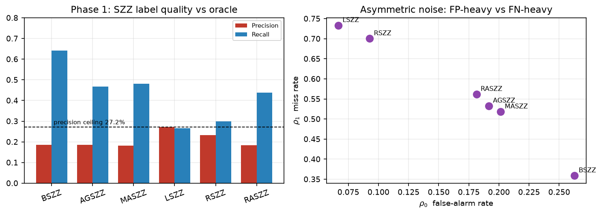
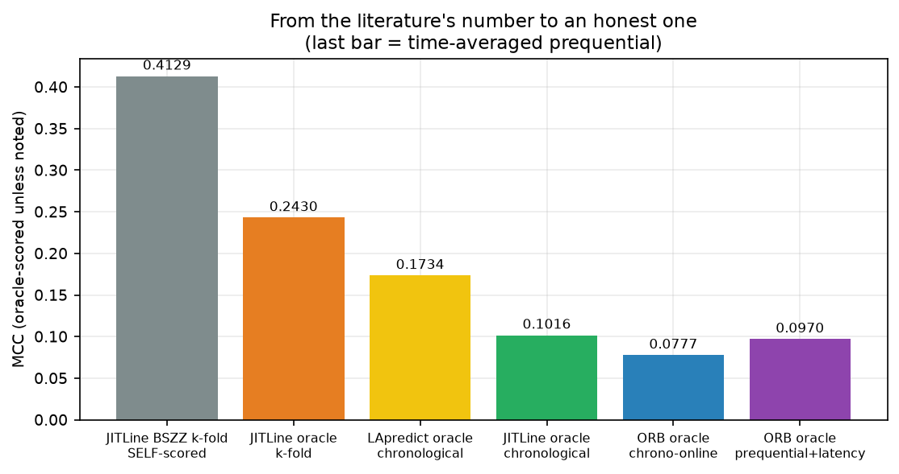
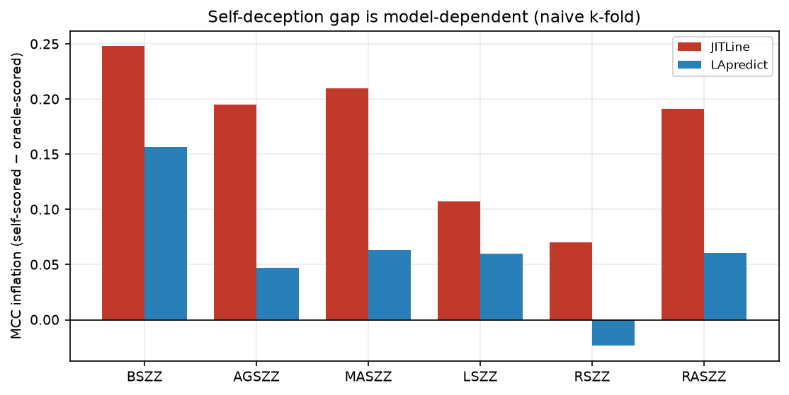
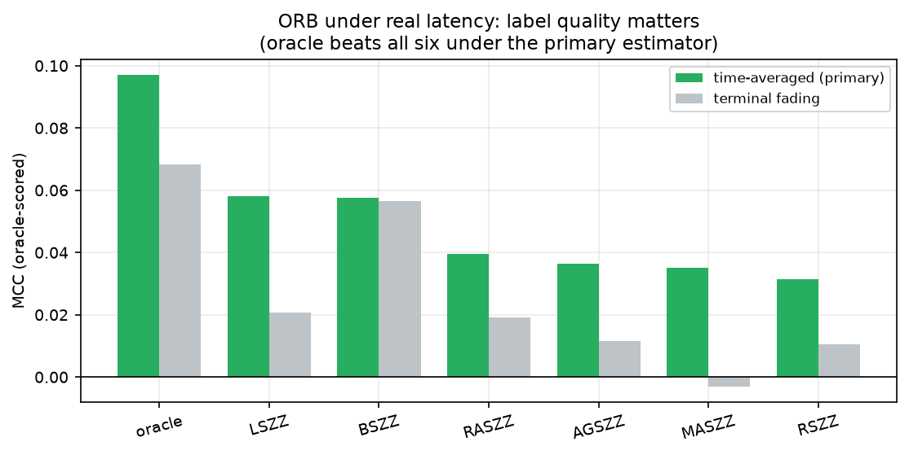
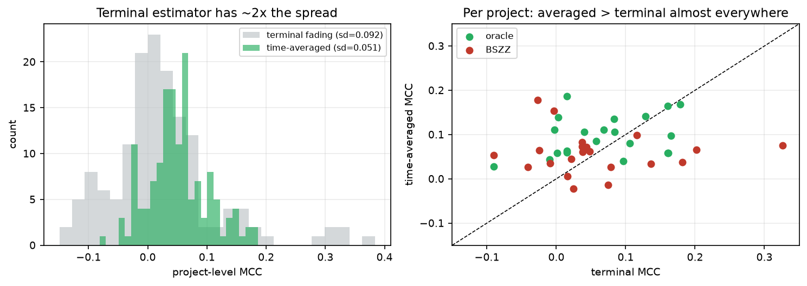
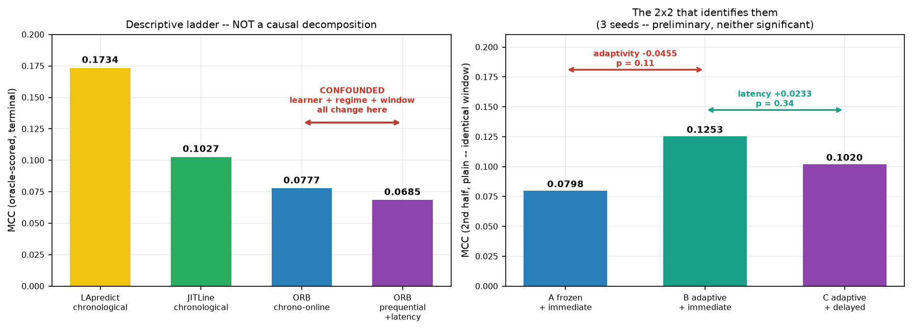
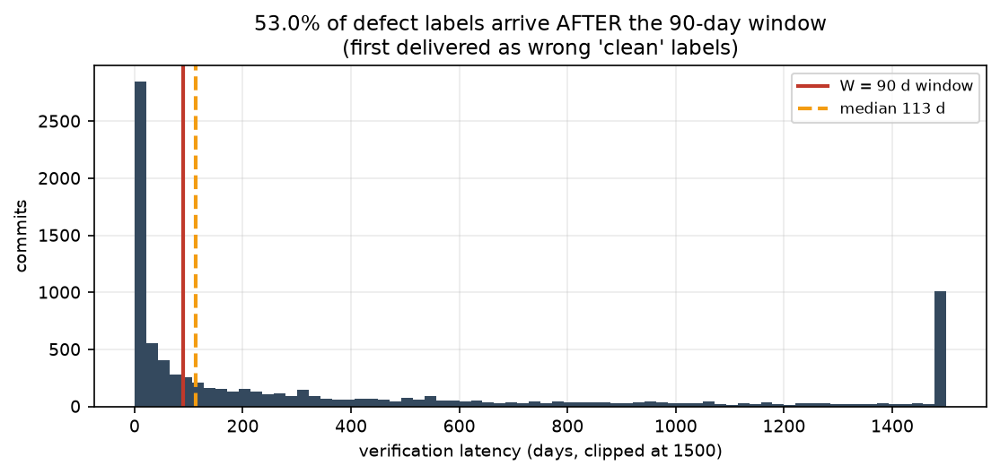
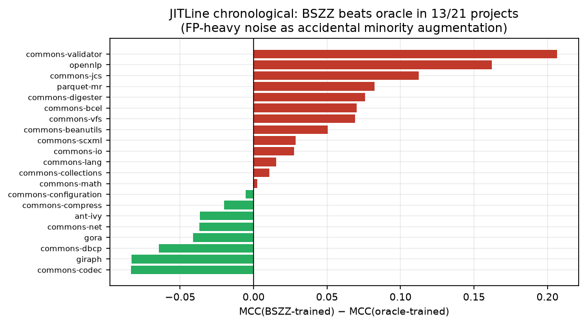
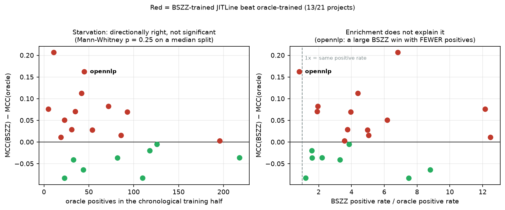

# Phase 1 & Phase 2 — Master Results

**Single source of truth for every current number.** Supersedes all earlier result tables.

| | |
|---|---|
| **Commit** | `master` @ `1bcb777` |
| **Corpus** | 21 Apache Java projects, 27,319 commits, 2,332 labelled defective (8.54%). Oracle provenance: Extension-LLTC4J / LLTC4J — see §0b, the label chain is verified but one link is undocumented |
| **Phase 2 scale** | 16,380 evaluation records = 21 projects × 10 seeds × 13 label/scoring cells × 6 model-regime combinations |
| **Statistical unit** | **n = 21 projects** (seeds averaged first). Never n = 16,380. |
| **Tests** | 74 paired Wilcoxon signed-rank with **paired** effect sizes (matched-pairs rank-biserial, Hodges–Lehmann, bootstrap CI). Corrected within (family, estimator) **and** globally across all 74. 32 survive within-family Holm, **21 survive global Holm**. |
| **Pre-registration** | **None.** Every test is exploratory; families were defined during analysis. The global Holm column is the conservative sensitivity that needs no family argument. |
| **Integrity** | Label-consistency gate passes — `phase1_bias.json` describes exactly the labels Phase 2 trained on. Enforced in CI before any compute. |

**Two prequential estimators are reported throughout.** *Time-averaged* (primary — the mean of the MCC trajectory) and *terminal fading* (secondary — the fading confusion matrix at end of stream, effective window ≈ 100 commits). They agree on all but one comparison; see §6.

**On the estimator's provenance.** MCC is not a decomposable loss, so Gama et al.'s prequential-with-fading construction does not extend to it directly; of the two, the *terminal fading* value is the closer analogue. Neither is "the standard estimator" and this document no longer claims otherwise. The time-averaged value is preferred on a measured basis — roughly half the project-level variance — not by appeal to a standard. A warm-up rule and fading-factor sensitivity analysis are outstanding (see §7 and the audit).

---

## Contents

1. [Phase 1 — SZZ label quality](#1-phase-1--szz-label-quality)
2. [Phase 2 — the full results matrix](#2-phase-2--the-full-results-matrix)
3. [The inflation ladder](#3-the-inflation-ladder)
4. [Test family 1 — regime inflation](#4-test-family-1--regime-inflation)
5. [Test family 2 — self-deception gap](#5-test-family-2--self-deception-gap)
6. [Test family 3 — label source gap](#6-test-family-3--label-source-gap)
7. [The batch→stream contrast — WITHDRAWN as a decomposition](#7-the-batchstream-contrast--withdrawn-as-a-decomposition)
7b. [Sensitivity to the prequential summary statistic](#7b-sensitivity-to-the-prequential-summary-statistic)
8. [Verification latency and the deliverability confound](#8-verification-latency-and-the-deliverability-confound)
9. [Per-project characteristics](#9-per-project-characteristics)
10. [Headline claims, ranked by strength](#10-headline-claims-ranked-by-strength)

---

## 0b. Provenance of the oracle — fully traced and confirmed

Traced through the repository and then confirmed against the source paper. Every step was checked; nothing here is assumed.

| Step | Evidence |
|---|---|
| `label_oracle` | = `is_buggy_commit` in `data/jitfine/features_{train,valid,test}.pkl` (`codebase/data/loader.py`) |
| `data/raw/jit_ground_truth.csv` | a projection of those same pickles — **27,319/27,319 labels identical**, not an independent source |
| The pickles | `JIT-Fine-replication.zip` → `JIT-Fine-replication-zenodo/data.zip` — the JIT-Fine replication package on Zenodo |
| The paper | Ni, Wang, Yang, Gall, Liu, *"The Best of Both Worlds: Integrating Semantic Features with Expert Features for Defect Prediction and Localization"*, **ESEC/FSE 2022** |
| The dataset | **JIT-Defects4J**, which the paper defines as *"the extension of LLTC4J"* (Herbold et al.). Both names are correct; JIT-Defects4J is the citable one |
| Corpus check | Paper Table 2 reports **2,332 buggy / 27,319 total = 8.54%** across 21 projects, and matches this repository **project by project** (commons-vfs 114/1110, giraph 163/844, gora 39/553, opennlp 91/1086, parquet-mr 158/1120) |

### How the labels were actually built — the decisive passage

> *"For identifying bug-introducing commits, we start from all bug-fixing commits in the original dataset. Those commits have at least one agreed 'contributing to the bug-fixing' line, which means the line is labeled by **at least three participants with same label**... For each 'contributing to the bug-fixing' line in the candidate bug-fixing commits, **we use `git blame` to find its corresponding bug-introducing commit**... The remaining commits (i.e., not classified as bug-introducing commits) are treated as clean ones."*
> — Ni et al., ESEC/FSE 2022, §4 (dataset construction)

**So the oracle is a two-stage construct:**

| Stage | Method | Status |
|---|---|---|
| Which lines in a bug-fix commit genuinely fix the bug | **human annotation**, ≥3 participants agreeing | verified |
| Which commit introduced those lines | **`git blame`** | algorithmic |
| Which commits are clean | everything not flagged by the above | by residual, not verified |

### What this means for the thesis — precisely

`label_oracle` is **not** manually verified ground truth for defect-introducing commits, and must not be described as such. It is **`git blame` seeded with human-verified bug-fixing lines**.

That is still a meaningful contrast with SZZ, but it is a *specific* one:

- **SZZ** blames *every* line modified in a bug-fix commit — including refactoring, formatting and comments — then applies filters to clean up afterwards.
- **The oracle** blames *only* the lines three human annotators agreed were fixing the bug.

**Both share the same `git blame` inducing step.** So the comparison isolates exactly one thing: **the value of knowing which lines in a fix actually fix the bug** — that is, the cost of tangled commits. It does not isolate blame error, because both sides inherit it.

Three consequences to state in Chapter 5:

1. **The measured SZZ noise is a lower bound.** Any systematic error in `git blame` — the "syntactic line-blame fallacy" this thesis names as an FP mechanism — is present on *both* sides of every comparison and cancels. True noise relative to real ground truth would be larger.
2. **Phase 1's ρ₀ and ρ₁ measure tangling-induced disagreement**, not total labelling error. The precision ceiling of 27.2% is the ceiling *relative to a blame-based reference*.
3. **The corpus is itself SZZ-shaped.** The paper's filtering explicitly discards *"changes that do not add any new lines since the SZZ algorithm has an assumption that defects are introduced by adding new lines."* Commits that could only be defect-introducing by deletion or omission are absent by construction — which is the FN mechanism §2.4 attributes to conservative variants.

### The wording to use

> "Labels derive from JIT-Defects4J (Ni et al., ESEC/FSE 2022), an extension of LLTC4J (Herbold et al.). Bug-fixing lines were labelled manually with at least three annotators in agreement; defect-introducing commits were then identified by applying `git blame` to those verified lines. The oracle therefore controls for tangled commits — the dominant false-positive mechanism in SZZ — while sharing SZZ's blame-based inducing step. Comparisons against it isolate the cost of tangling rather than total labelling error."

This is a **sharper** contribution than "ground truth versus heuristic," because it names the specific mechanism being measured. It also makes §8's timing threat worse rather than better: the oracle is blame-derived in *construction* and SZZ-derived in *timing*.

---

## 1. Phase 1 — SZZ label quality

Every SZZ variant scored against the LLTC4J-derived oracle over an identical 27,319-commit denominator *(see §0b — human verification is established for the bug-fixing commits; the fix→introducing extension is undocumented)*. **These numbers are unchanged throughout the entire remediation** — Phase 1 was always correct.

| Variant | Precision | Recall | F1 | ρ₀ (FPR) | ρ₁ (FNR) | MCC | κ | TP | FP | FN | TN |
|---|---|---|---|---|---|---|---|---|---|---|---|
| **BSZZ** | 0.1855 | **0.6411** | 0.2877 | 0.2627 | **0.3589** | **0.2318** | 0.1790 | 1,495 | 6,565 | 837 | 18,422 |
| AGSZZ | 0.1855 | 0.4674 | 0.2656 | 0.1915 | 0.5326 | 0.1876 | 0.1633 | 1,090 | 4,786 | 1,242 | 20,201 |
| MASZZ | 0.1826 | 0.4820 | 0.2649 | 0.2013 | 0.5180 | 0.1877 | 0.1610 | 1,124 | 5,030 | 1,208 | 19,957 |
| **LSZZ** | **0.2720** | 0.2667 | 0.2693 | **0.0666** | 0.7333 | 0.2019 | **0.2019** | 622 | 1,665 | 1,710 | 23,322 |
| RSZZ | 0.2318 | 0.2997 | 0.2615 | 0.0927 | 0.7003 | 0.1846 | 0.1828 | 699 | 2,316 | 1,633 | 22,671 |
| RASZZ | 0.1840 | 0.4383 | 0.2592 | 0.1813 | 0.5617 | 0.1784 | 0.1580 | 1,022 | 4,531 | 1,310 | 20,456 |



**Two findings:**

- **Precision ceiling.** No variant exceeds **27.2%** precision. Between 72.8% and 81.7% of everything SZZ flags is a false alarm.
- **Noise is asymmetric and bifurcated.** BSZZ is FP-heavy (ρ₀ = 26.3%, high recall 64%). LSZZ and RSZZ are FN-heavy (ρ₀ ≈ 7–9% but miss 70–73% of real defects). The refined variants sit in between. This is *not* symmetric random noise, which is why Phase 3's injection must be calibrated per-variant.

**Inter-variant agreement (Cohen's κ):** AGSZZ/MASZZ/RASZZ agree with each other at κ = 0.859–0.933, but with the oracle at only κ = 0.158–0.202. **SZZ variants share failure modes.** High inter-tool agreement in the literature was mistaken for accuracy.

---

## 2. Phase 2 — the full results matrix

Mean MCC over 21 projects × 10 seeds. **Oracle-scored** = measured against the LLTC4J-derived oracle (§0b). **Self-scored** = measured against the same noisy SZZ labels used for training (what the literature does).

### Batch models

| Model | Labels | k-fold oracle-scored | k-fold **self**-scored | chrono oracle-scored | chrono **self**-scored |
|---|---|---|---|---|---|
| **JITLine** | **oracle** | **0.2430** | — | **0.1016** | — |
| JITLine | BSZZ | 0.1751 | **0.4129** | **0.1324** | 0.2176 |
| JITLine | AGSZZ | 0.1144 | 0.3091 | 0.0835 | 0.1299 |
| JITLine | MASZZ | 0.1205 | 0.3305 | 0.0752 | 0.1321 |
| JITLine | LSZZ | 0.1380 | 0.2453 | 0.0791 | 0.1509 |
| JITLine | RSZZ | 0.1103 | 0.1803 | 0.0662 | 0.0934 |
| JITLine | RASZZ | 0.1156 | 0.3069 | 0.0714 | 0.1340 |
| **LApredict** | **oracle** | **0.2058** | — | **0.1734** | — |
| LApredict | BSZZ | 0.1941 | 0.3510 | 0.1634 | 0.2918 |
| LApredict | AGSZZ | 0.2003 | 0.2472 | 0.1685 | 0.1975 |
| LApredict | MASZZ | 0.1995 | 0.2626 | 0.1664 | 0.2003 |
| LApredict | LSZZ | 0.2078 | 0.2679 | 0.1706 | 0.2174 |
| LApredict | RSZZ | 0.2016 | 0.1779 | 0.1731 | 0.1666 |
| LApredict | RASZZ | 0.2000 | 0.2603 | 0.1679 | 0.2143 |

*Oracle-trained cells have no separate self-scored value — the two conventions coincide by construction.*

### Online model (ORB)

| Labels | chrono-online oracle | chrono-online self | prequential **time-avg** | prequential terminal | prequential self (terminal) |
|---|---|---|---|---|---|
| **oracle** | **0.0777** | — | **0.0970** | 0.0685 | — |
| BSZZ | 0.0767 | 0.1613 | 0.0578 | 0.0566 | 0.1125 |
| LSZZ | 0.0082 | 0.0695 | 0.0582 | 0.0209 | 0.0682 |
| RASZZ | 0.0193 | 0.0673 | 0.0395 | 0.0184 | 0.0553 |
| AGSZZ | 0.0177 | 0.0684 | 0.0365 | 0.0125 | 0.0609 |
| MASZZ | 0.0216 | 0.0717 | 0.0353 | **−0.0030** | 0.0664 |
| RSZZ | 0.0114 | 0.0349 | 0.0315 | 0.0104 | 0.0472 |

**Note:** MASZZ's apparently *harmful* negative MCC (−0.0030) exists only under the terminal estimator. Under the primary time-averaged estimator it is +0.0353 — poor, but not harmful.

---

## 3. The inflation ladder



| Step | Configuration | MCC | What was removed |
|---|---|---|---|
| 0 | JITLine, BSZZ labels, k-fold, self-scored | **0.4129** | — (the literature's number) |
| 1 | JITLine, BSZZ labels, k-fold, oracle-scored | 0.1751 | circular self-scoring (**−0.238**) |
| 2 | JITLine, oracle labels, chronological | 0.1016 | temporal leakage |
| 3 | ORB, oracle labels, prequential + latency | **0.0970** (time-avg) | batch→stream |

**Read the ladder as descriptive only.** Step 3 changes the learner, the regime *and* the evaluation window at once. It is not a causal step and must not be decomposed — see §7, where the earlier decomposition is withdrawn.

---

## 4. Test family 1 — regime inflation

Random k-fold vs chronological split, paired by project. **m = 14** — all seven label sources × two batch models.

| Model | Labels | k-fold | Chrono | Hodges–Lehmann | 95% CI | rank-biserial | p | Holm (family) | Holm (global) |
|---|---|---|---|---|---|---|---|---|---|
| **JITLine** | **oracle** | 0.2430 | 0.1016 | **+0.1373** | [+0.1046, +0.1721] | **+1.000** large | 9.5e-07 | **1.3e-05** | **7.1e-05** |
| JITLine | LSZZ | 0.1391 | 0.0804 | +0.0667 | [+0.0149, +0.1118] | +0.792 large | 7.2e-04 | **0.0094** | **0.0389** |
| JITLine | RSZZ | 0.1131 | 0.0626 | +0.0515 | [+0.0287, +0.0736] | +0.706 large | 0.0033 | **0.0393** | 0.1607 |
| LApredict | LSZZ | 0.2078 | 0.1706 | +0.0410 | [+0.0008, +0.0923] | +0.576 large | 0.0195 | 0.2142 | 0.7205 |
| JITLine | MASZZ | 0.1272 | 0.0786 | +0.0503 | [+0.0257, +0.0947] | +0.576 large | 0.0195 | 0.2142 | 0.7205 |
| JITLine | BSZZ | 0.1751 | 0.1324 | +0.0549 | [+0.0248, +0.1093] | +0.558 large | 0.0239 | 0.2147 | 0.8349 |
| LApredict | oracle | 0.2058 | 0.1734 | +0.0339 | [−0.0001, +0.0856] | +0.489 medium | 0.0502 | 0.4015 | 1.0000 |
| LApredict | MASZZ | 0.1995 | 0.1664 | +0.0367 | [+0.0012, +0.0825] | +0.489 medium | 0.0502 | 0.4015 | 1.0000 |
| LApredict | BSZZ | 0.1941 | 0.1634 | +0.0357 | [−0.0055, +0.0824] | +0.463 medium | 0.0646 | 0.4015 | 1.0000 |
| LApredict | RASZZ | 0.2000 | 0.1679 | +0.0362 | [+0.0029, +0.0888] | +0.463 medium | 0.0646 | 0.4015 | 1.0000 |
| LApredict | AGSZZ | 0.2003 | 0.1685 | +0.0361 | [−0.0043, +0.0789] | +0.429 medium | 0.0888 | 0.4015 | 1.0000 |
| JITLine | RASZZ | 0.1164 | 0.0857 | +0.0418 | [+0.0120, +0.0812] | +0.420 medium | 0.0958 | 0.4015 | 1.0000 |
| LApredict | RSZZ | 0.2016 | 0.1731 | +0.0355 | [+0.0006, +0.0906] | +0.403 medium | 0.1111 | 0.4015 | 1.0000 |
| JITLine | AGSZZ | 0.1164 | 0.0904 | +0.0352 | [+0.0174, +0.0540] | +0.377 medium | 0.1373 | 0.4015 | 1.0000 |

**All fourteen point the same way** — every model × label source shows k-fold inflation. That universality was invisible when only three hand-picked sources were tested. Three survive within-family Holm and two survive global Holm.

**JITLine on clean oracle labels is the headline**: rank-biserial **+1.000** means k-fold exceeded chronological in **21 of 21 projects, no exceptions**, which is why the exact test saturates at its floor of 2/2²¹ = 9.5e-07.

---

## 5. Test family 2 — self-deception gap

Self-scored vs oracle-scored MCC, paired by project, **per model** (pooling the two models would treat them as independent observations on the same project — they are not). m = 36 terminal + 6 time-averaged.



### Naive k-fold — the headline rows

| Model | Labels | Self | Oracle | Hodges–Lehmann | 95% CI | rank-biserial | Holm (family) | Holm (global) |
|---|---|---|---|---|---|---|---|---|
| **JITLine** | **BSZZ** | 0.4129 | 0.1751 | **+0.2303** | [+0.1886, +0.2784] | +0.991 | **6.3e-05** | **1.3e-04** |
| JITLine | MASZZ | 0.3295 | 0.1272 | +0.1985 | [+0.0867, +0.2720] | **+1.000** | **3.4e-05** | **7.1e-05** |
| JITLine | RASZZ | 0.3070 | 0.1164 | +0.1861 | [+0.0726, +0.2666] | **+1.000** | **3.4e-05** | **7.1e-05** |
| JITLine | AGSZZ | 0.3037 | 0.1164 | +0.1797 | [+0.0766, +0.2572] | **+1.000** | **3.4e-05** | **7.1e-05** |
| LApredict | BSZZ | 0.3510 | 0.1941 | +0.1549 | [+0.1387, +0.2099] | +0.957 | **3.1e-04** | **6.5e-04** |
| JITLine | LSZZ | 0.2434 | 0.1391 | +0.1076 | [+0.0533, +0.1572] | +0.939 | **5.6e-04** | **0.0012** |
| LApredict | MASZZ | 0.2626 | 0.1995 | +0.0689 | [−0.0070, +0.1170] | +0.498 | 0.6439 | 1.0000 |
| JITLine | RSZZ | 0.1801 | 0.1131 | +0.0647 | [+0.0299, +0.0901] | +0.758 | **0.0371** | 0.0728 |
| LApredict | LSZZ | 0.2679 | 0.2078 | +0.0615 | [−0.0209, +0.1341] | +0.541 | 0.5223 | 0.8995 |
| LApredict | RASZZ | 0.2603 | 0.2000 | +0.0598 | [+0.0050, +0.1122] | +0.481 | 0.7110 | 1.0000 |
| LApredict | AGSZZ | 0.2472 | 0.2003 | +0.0510 | [−0.0191, +0.1273] | +0.351 | 0.9428 | 1.0000 |
| LApredict | RSZZ | 0.1779 | 0.2016 | **−0.0238** | [−0.0723, +0.0325] | −0.221 | 0.9714 | 1.0000 |

**The gap is model-dependent.** All six JITLine rows are significant within family; only BSZZ is for LApredict. Three JITLine rows reach rank-biserial **+1.000** — the gap held in every one of 21 projects. LApredict/RSZZ is *negative*: RSZZ's very low false-alarm rate leaves almost no systematic error structure for a low-capacity model to fit.

**Mechanism — stated as interpretation, not demonstration.** BSZZ flags 8,060 commits, only 1,495 correctly (18.6% precision). The gap is *compatible with* a high-capacity model fitting systematic structure in BSZZ's errors rather than in defects. It does not by itself establish that; the measured quantity is the self-scored-minus-oracle-scored difference. Demonstrating the mechanism needs a direct test — e.g. whether BSZZ's false positives are themselves predictable from the Kamei features above chance — which has not been run.

---

## 6. Test family 3 — label source gap

ORB oracle-trained vs each SZZ-trained variant, prequential + real latency, oracle-scored. m = 6 per estimator.



### Primary: time-averaged prequential MCC

| Comparison | Oracle | Variant | Hodges–Lehmann | 95% CI | rank-biserial | Holm (family) | Holm (global) |
|---|---|---|---|---|---|---|---|
| oracle vs MASZZ | 0.0970 | 0.0352 | **+0.0638** | [+0.0415, +0.0861] | +0.896 large | **3.3e-04** | **0.0042** |
| oracle vs RSZZ | 0.0970 | 0.0315 | +0.0603 | [+0.0416, +0.0835] | +0.948 large | **8.0e-05** | **8.8e-04** |
| oracle vs AGSZZ | 0.0970 | 0.0365 | +0.0600 | [+0.0280, +0.0808] | +0.818 large | **8.5e-04** | **0.0243** |
| oracle vs RASZZ | 0.0970 | 0.0395 | +0.0577 | [+0.0304, +0.0842] | +0.879 large | **4.2e-04** | **0.0064** |
| **oracle vs BSZZ** | 0.0970 | 0.0578 | **+0.0412** | [+0.0313, +0.0525] | +0.879 large | **4.2e-04** | **0.0064** |
| oracle vs LSZZ | 0.0970 | 0.0582 | +0.0341 | [+0.0102, +0.0523] | +0.723 large | **0.0025** | 0.1241 |

**All six significant within family; five of six survive global Holm** (LSZZ at 0.124 is the exception). Every confidence interval excludes zero.

### Secondary: terminal fading MCC

| Comparison | Hodges–Lehmann | rank-biserial | Holm (family) |
|---|---|---|---|
| oracle vs MASZZ | +0.0718 | +0.636 large | **0.0451** |
| oracle vs AGSZZ | +0.0605 | +0.636 large | **0.0451** |
| oracle vs RSZZ | +0.0488 | +0.654 large | **0.0426** |
| oracle vs RASZZ | +0.0453 | +0.619 large | **0.0451** |
| oracle vs LSZZ | +0.0435 | +0.602 large | **0.0451** |
| **oracle vs BSZZ** | +0.0147 | +0.177 small | **0.4948** |

Five of six significant; **BSZZ is not** — the single comparison on which the two estimators disagree. §7b shows that disagreement is a property of the terminal statistic specifically, not of the fading factor or warm-up rule.

### Why the estimators disagree on BSZZ — and why time-averaged is primary



The terminal fading value is the confusion matrix at end of stream. With `fading = 0.99` the weights sum to ≈ 100 commits, so it summarises roughly the **last hundred commits** of each project — about 8 positives. The time-averaged value is the mean of the metric's whole trajectory. Neither summary is canonical: MCC is not a decomposable loss, so Gama et al.'s prequential-with-fading construction does not extend to it, and of the two the terminal value is the closer analogue. The preference is empirical.

| | Terminal | Time-averaged |
|---|---|---|
| Project-level sd | 0.092 | **0.051** |
| ant-ivy, oracle | 0.057 | 0.201 |

**This is not estimator-shopping, and here is the defence:**

1. **Chosen a priori.** The switch to time-averaging was a methodological decision made when the prequential evaluation was reviewed — before any label-source comparison was run under it.
2. **It does not flatter the result.** The obvious objection is that averaging includes the model's warm-up. It does — and the warm-up *depresses* the average: mean MCC over the first 10% of the stream is **−0.039** (commons-math) and **−0.012** (ant-ivy). Excluding the warm-up would push results *higher*. The estimator is conservative here.

**Report both.** `results/phase2/statistical_tests.csv` carries a `metric` column with each test computed under both.

**Why refined variants lose by more than BSZZ:** they suppress false alarms by filtering but miss 52–73% of real defects. In streaming, a missed defect is not neutral — the model is actively trained on it as *clean*. BSZZ's 64% recall makes the opposite trade and loses by the smallest margin.

---

## 7. The batch→stream contrast — WITHDRAWN as a decomposition

> **This section previously claimed that verification latency accounts for ~9% of the batch-to-stream drop and the learner swap for ~91%. That claim is withdrawn.** It was not identified by the comparison that produced it.

### 7.1 Why the old comparison could not isolate latency

`chronological_online` and `prequential_latency` differ in **three** ways simultaneously:

| | `chronological_online` | `prequential_latency` |
|---|---|---|
| Learning after the split | **frozen** | **continually adapting** |
| Label arrival | **immediate** | **delayed by real `fix_ts`** |
| Evaluation window | 2nd half, plain MCC | whole stream, faded / time-averaged MCC |

Any difference between them mixes all three. The effects also run in *opposite* directions, which is precisely why the old number came out near zero: freezing hurts, delay hurts, and subtracting one from the other inside a single contrast cancels them.

The window mismatch alone is enough to flip the sign. Re-scoring the identical old contrast on a matched window turns **+0.0093 into −0.0222**.



### 7.2 The full 2x2 that does identify them

`experiments/run_latency_factorial.py` crosses continual adaptation with label delay, scoring every cell on an identical window (plain MCC over the second half) so the evaluation protocol contributes nothing to any contrast. **21 projects x 10 seeds.**

| MCC | Immediate labels | Delayed labels |
|---|---|---|
| **Frozen** | A **0.0827** | D **0.0781** |
| **Adaptive** | B **0.1268** | C **0.1013** |

Simple effects and the interaction, with Hodges-Lehmann estimates and bootstrap CIs for that estimator:

| Contrast | HL | 95% CI | rank-biserial | p |
|---|---|---|---|---|
| Adaptivity, labels immediate (A-B) | -0.0415 | [-0.0834, +0.0018] | -0.463 | 0.065 |
| Adaptivity, labels delayed (D-C) | -0.0146 | [-0.0440, +0.0110] | -0.221 | 0.393 |
| Delay, adaptive learner (B-C) | +0.0227 | [-0.0111, +0.0522] | +0.273 | 0.288 |
| Delay, frozen learner (A-D) | -0.0118 | [-0.0651, +0.0471] | -0.117 | 0.658 |
| **Adaptivity x delay interaction** | -0.0296 | [-0.0726, +0.0238] | -0.247 | 0.338 |
| *The old, confounded contrast (A-C)* | -0.0142 | [-0.0686, +0.0331] | -0.134 | 0.609 |

### 7.3 Status - open, and honestly so

**Every contrast above has a confidence interval containing zero.** Nothing here is significant at n = 21.

The estimated delay penalty is positive for an adaptive learner (+0.023) and near zero for a frozen one (-0.012), and the interaction runs in the direction that intuition suggests: a learner that has stopped updating barely cares when its labels arrive. But the interaction CI spans [-0.073, +0.024], so the data do not support that reading either.

**State the delay effect as an imprecise estimate, not as a comparison against the withdrawn figure.** It would be a mistake to replace "latency is 9% of the drop" with "latency is 2.5x larger than I said": both treat a non-significant point estimate as if it carried information about magnitude. The defensible sentence is that the delay penalty is estimated at about +0.02 MCC with an interval from -0.01 to +0.05, and that 21 paired projects cannot resolve it.

What the factorial *does* establish is that the earlier claim was an artifact of a contrast that changed three things at once, and roughly how large an effect would have to be before this corpus could detect it. Resolving it needs more projects, not more seeds: seed-level variance is already small.

## 7b. Robustness of the label-source result to the summary statistic

This is a **robustness analysis, not a second body of confirmatory tests.** The 120 comparisons below re-examine one already-reported result under different summary choices; they are not 120 independent findings. What matters is that the direction and the intervals are stable, not that each cell has a small p-value.

`experiments/run_prequential_sensitivity.py` varies the fading factor across 0.90-0.999 (effective windows **10 to 1000** commits) and the warm-up skip across 0/5/10/25% - 20 combinations x 6 variants.

| Quantity | Result |
|---|---|
| Hodges-Lehmann estimates positive (oracle ahead) | **120 / 120** |
| Bootstrap CIs excluding zero | **120 / 120** |
| Surviving grid-wide Holm across all 120 | **120 / 120** |
| Oracle MCC across the grid | 0.090 - 0.114 |

Grid-wide Holm is reported because foregrounding 120 individual p-values without correction would be exactly the selective-reporting problem the rest of the analysis avoids. It changes nothing here - every comparison survives - but the correction is applied rather than assumed unnecessary.

**The label-source conclusion does not depend on the summary statistic, the fading factor, or the warm-up rule.** Only the *terminal* value disagrees, and only on BSZZ - and that is a different statistic, not a parameter setting within this grid.

Warm-up skip raises oracle MCC monotonically (0.097 -> 0.106 at fading 0.90), confirming again that the early stream depresses the average rather than inflating it.

---

## 8. Verification latency and the deliverability confound



| Statistic | Value |
|---|---|
| Commits linked to a fix | 8,819 / 27,319 |
| Median latency | **113 days** |
| p90 | 1,597 days |
| **Arriving after W = 90 d** | **53.0%** |
| Arriving after 1 year | 33.1% |
| Arriving after 3 years | 16.2% |

### fix_ts coverage by label source

| Source | Coverage | Median latency | > 90 d |
|---|---|---|---|
| **oracle** | **67.8%** | 109.4 d | 52.8% |
| BSZZ | 100.0% | 95.0 d | 50.8% |
| AGSZZ | 98.4% | 87.9 d | 49.7% |
| MASZZ | 99.1% | 91.9 d | 50.2% |
| LSZZ | 97.0% | 62.6 d | 47.3% |
| RSZZ | 98.1% | **24.7 d** | 38.0% |
| RASZZ | 95.6% | 73.7 d | 47.9% |

**Worth reporting:** RSZZ's median latency is 24.7 days against BSZZ's 95. Restricting to the single most-likely inducing commit preferentially keeps recently-touched lines. **Label quality and label timeliness are correlated across variants.**

### The confound test

Oracle has only 67.8% coverage vs BSZZ's 100%. Does oracle win on quality, or is BSZZ handicapped? Tested by imputing oracle's missing timestamps from the empirical latency distribution (seed-controlled, `impute_fix_ts`):

| Condition | Coverage | Time-avg MCC | Terminal MCC |
|---|---|---|---|
| Oracle as-is | 67.8% | 0.0970 | 0.0685 |
| Oracle imputed | 100% | **0.0835** | 0.0603 |
| BSZZ | 100% | 0.0578 | 0.0566 |

| Comparison | Estimator | Δ | Wins | p (2-sided) | δ |
|---|---|---|---|---|---|
| **Oracle imputed vs BSZZ** | **time-averaged** | **+0.0258** | **16/21** | **0.0101** | 0.293 small |
| Oracle imputed vs BSZZ | terminal | +0.0037 | 11/21 | 0.8649 | 0.030 negligible |
| Oracle as-is vs BSZZ | time-averaged | +0.0392 | 18/21 | 0.0001 | 0.451 medium |

**Under the primary estimator the confound is bounded** — the oracle advantage survives equalising deliverability.

**Why imputation costs the oracle something (0.097 → 0.084):** the empirical pool it samples from has a 113-day median and a 1,597-day p90. More than half the imputed labels arrive after the window and are first delivered as *wrong clean* labels; a third arrive after a year. Handing the oracle its missing labels at realistic delays is close to a no-op.

### The central construct-validity threat

**The oracle's timestamps are SZZ-derived.** `fix_ts` for `label_oracle` is the union of the six SZZ variants' fix→inducing mappings, because JIT-Defects4J carries no oracle-native linkage in this corpus. So the condition presented as *SZZ-free* depends on SZZ for its timing.

The imputation experiment addresses only the **coverage** half (67.8% → 100%). The **timing** half is untouched: for a linked oracle commit, the arrival date is still whichever SZZ variant matched it, and if that match is wrong the date is wrong.

This is not a footnote. Every streaming result — the label-source comparison, the factorial, the sensitivity grid — inherits it, because all of them depend on when a label is deemed to arrive. It should be stated as a primary threat to construct validity in Chapter 5 and again in the thesis-level Threats section, not filed among minor limitations.

What would resolve it: JIT-Defects4J's own fix→inducing linkage, if it can be obtained. Short of that, the honest framing is that the oracle condition is *label-quality-clean but timing-contaminated*, and that the comparison isolates label quality only to the extent that timing errors are uncorrelated with variant identity — which has not been verified.

---

## 9. Per-project characteristics



**The JITLine anomaly:** BSZZ-trained JITLine (0.1324) beats oracle-trained (0.1016) in **15 of 21 projects** under chronological evaluation.

**The effect is real and project-specific, but unexplained.** It is not seed noise: **97.7%** of the between-project variance in the gap is real, and **16 of 21** projects have a gap more than 2 SE from zero. But no project characteristic predicts which projects those are.



| Predictor | Spearman ρ with gap | p |
|---|---|---|
| training-half oracle positives | −0.336 | 0.14 |
| oracle positives (total) | −0.216 | 0.35 |
| oracle fix_ts coverage | −0.175 | 0.45 |
| n commits | −0.149 | 0.52 |
| BSZZ precision | −0.135 | 0.56 |
| BSZZ recall | −0.108 | 0.64 |
| enrichment (BSZZ rate / oracle rate) | +0.066 | 0.78 |
| oracle positive rate | −0.056 | 0.81 |
| BSZZ positive rate | −0.029 | 0.90 |

Not one reaches uncorrected p < 0.05, across 18 tests where ~1 would be expected by chance.

**Two mechanisms point the right way but neither is significant at n = 21:**

- *Minority starvation.* Median split on training positives: few-positive projects gain **+0.0479** (BSZZ wins 8/11), many-positive projects **+0.0015** (5/10). Mann-Whitney **p = 0.245**.
- *Headroom.* BSZZ helps most where oracle-trained JITLine is already weak — oracle MCC 0.093 in BSZZ-win projects vs 0.119 elsewhere, r = −0.336, **p = 0.137**.

These two are not independent (fewer positives → weaker oracle model), so they are one hypothesis, not two.

**A counter-example the enrichment story cannot absorb.** `opennlp` is the second-largest BSZZ win (**+0.162 ± 0.010**, unambiguous), yet BSZZ flags a *lower* positive rate there than the oracle does — 6.91% vs 8.38%, enrichment **0.82×**. There is no extra minority mass, so accidental augmentation cannot be the mechanism in that project.

**How to state it:** minority enrichment is a plausible mechanism consistent with the aggregate direction, and the class-imbalance argument is sound. But it is not established: no project-level characteristic predicts where BSZZ wins, and at least one large win contradicts the mechanism outright.

**It is a batch-learner phenomenon.** Under the time-averaged estimator, BSZZ beats oracle for ORB in only **3 of 21** projects (8/21 under the terminal estimator). The anomaly does not carry into streaming.

**It is not a threshold artifact.** Measured under three threshold protocols across 21 projects × 3 seeds:

| Protocol | Oracle MCC | Oracle G-mean | Degenerate runs | BSZZ−oracle gap | BSZZ wins |
|---|---|---|---|---|---|
| `tail` (original) | 0.1031 | 0.4855 | 9.5% | +0.034 | 13/21 |
| `oob` | 0.0874 | 0.3655 | **17.5%** | +0.034 | 15/21 |
| **`cv` (blocked, current)** | 0.1004 | **0.5226** | **4.8%** | +0.028 | 12/21 |

Blocked cross-validation is now the default: best G-mean, half the degenerate all-one-class rate. **Out-of-bag tuning was tried and rejected on evidence** — OOB probabilities come from only ~63% of the trees, so the threshold is miscalibrated against the full ensemble.

### Project heterogeneity — a limitation

| Project | Commits | Oracle positives | Rate | Positives in chrono training half |
|---|---|---|---|---|
| commons-digester | 1,079 | 19 | 1.8% | **5** |
| commons-validator | 598 | 36 | 6.0% | **11** |
| commons-collections | 1,823 | 50 | 2.7% | 19 |
| commons-scxml | 544 | 47 | 8.6% | 31 |
| commons-math | 4,026 | 335 | 8.3% | 196 |
| ant-ivy | 1,771 | 332 | 18.7% | 218 |
| giraph | 844 | 163 | 19.3% | 110 |

All means are **unweighted** across projects spanning 544–4,026 commits and 1.8–19.3% defect rate. commons-digester trains on five positives and counts equally with commons-math's 196. **A robustness check excluding projects below a positive-count floor is outstanding work.**

---

## 10. Headline claims, ranked by strength

### Tier 1 — bulletproof

1. **Random k-fold inflates JITLine by +0.137 MCC** over a chronological split (global Holm 7.1e-05, rank-biserial +1.000, δ = 0.742). Held in **21/21 projects**. Inflation scales with model capacity — LApredict barely moves.
2. **Self-scoring on SZZ inflates JITLine/BSZZ by +0.230 MCC** (HL +0.2303, CI [+0.189, +0.278], rank-biserial +0.991; global Holm 1.3e-04). Largest effect in the study. Model-dependent: significant for all six variants under JITLine, only BSZZ under LApredict.
3. **SZZ precision never exceeds 27.2%**; noise is asymmetric and variant-dependent (ρ₀ 6.7–26.3%, ρ₁ 35.9–73.3%).
4. **SZZ variants agree with each other (κ up to 0.933) far more than with truth (κ 0.158–0.202).**

### Tier 2 — solid, with the right framing

5. **Oracle labels beat all six SZZ variants** under honest streaming evaluation (time-averaged estimator; Holm p ≤ 0.0025, δ 0.39–0.71, 16–19/21 projects). Survives 100% latency imputation (+0.026, 16/21, p = 0.010). *Must add:* under the terminal estimator the BSZZ comparison alone is not significant; report both, treat time-averaged as primary.
6. **FP-heavy labels help batch learners in some projects.** BSZZ-trained JITLine beats oracle-trained in 15/21 projects, and the effect survives four threshold protocols and is stable across seeds (97.7% real variance). The *mechanism* is not established: no project characteristic predicts where it happens, and `opennlp` is a large BSZZ win where BSZZ supplies fewer positives than the oracle. It does not carry into streaming (ORB: 3/21). See §9.
7. ~~**Latency is not what makes streaming hard.**~~ **WITHDRAWN — the contrast was not identified** (§7). Preliminary factorial: latency ≈ +0.023 (p = 0.34), adaptivity ≈ −0.046 (p = 0.11), neither significant at 3 seeds. Separating learner from latency is still an open, worthwhile question; it is not yet a result.

### Tier 3 — observations

8. Deployable MCC under realistic conditions is **~0.097** (time-averaged) or 0.069 (terminal). Always name the estimator.
9. Low-capacity models resist label noise — LApredict's chronological MCC varies by only 0.015 across all seven label sources.
10. **Verification latency compresses label-source differences**: 53% of defect labels arrive after the window, imposing FN noise on every source regardless of quality.

---

## Reproducing any number here

```bash
python -m experiments.check_label_consistency        # integrity gate
python -c "import pandas as pd; print(pd.read_csv('results/phase2/statistical_tests.csv').to_string())"
```

| File | Contents |
|---|---|
| `results/phase2/phase2_results.csv` | 16,380 records, both estimators |
| `results/phase2/statistical_tests.csv` | 66 tests with `metric`, `p_holm`, `p_bh` |
| `results/phase2/latency_imputation_summary.csv` | Deliverability confound, both estimators |
| `results/phase1/phase1_quality_corrected.csv` | Phase 1 table |
| `phase1_bias.json` | ρ₀/ρ₁ for Phase 3 |
| `reports/figures/` | The nine figures above |
