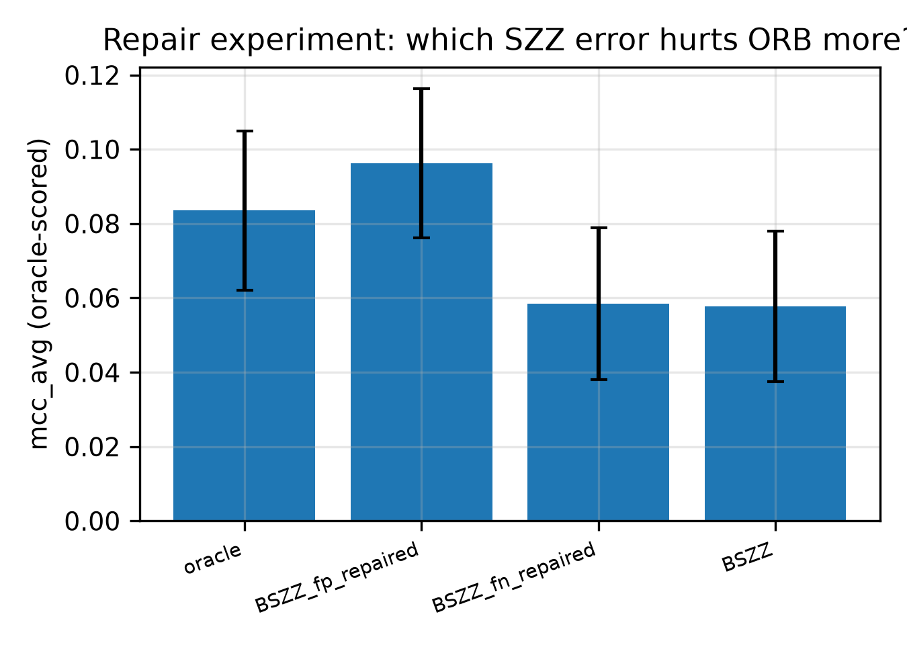
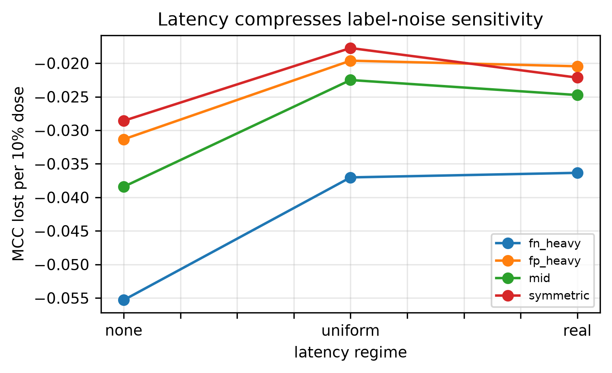
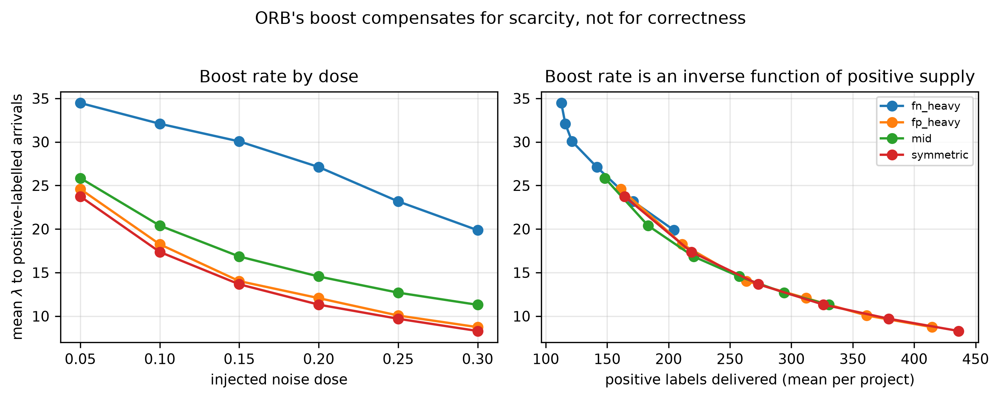
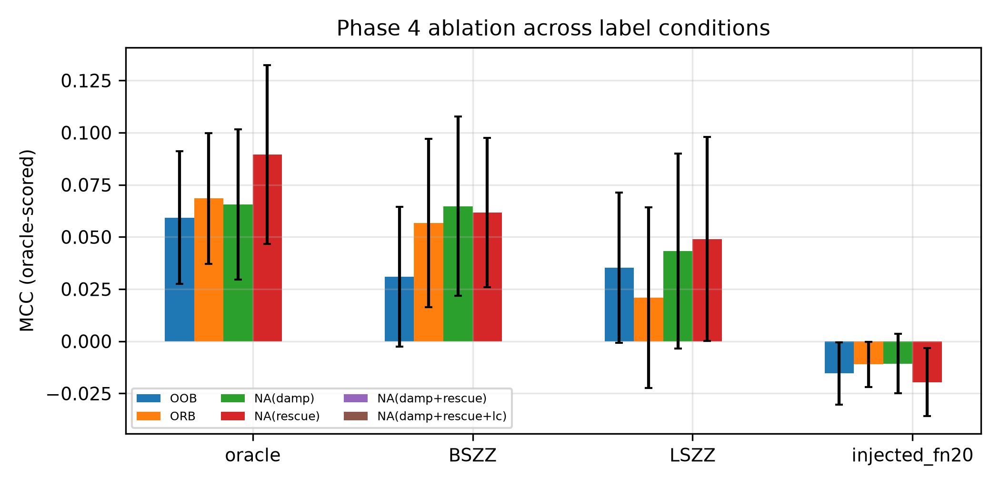

# Quantifying SZZ-Induced Label Noise in Just-In-Time Defect Prediction

## A Comprehensive Synthesis — What, How, and Why

| | |
|---|---|
| **Author** | Puneet Deshwani — M.Tech Thesis |
| **Status** | **All four phases executed and analysed.** Phase 4 is a pre-registered characterised negative; the write-up says so |
| **Corpus** | 21 Apache Java projects · 27,319 commits · 2,332 labelled defect-introducing (8.54%) |
| **Evidence base** | 16,380 Phase 2 records · 10,080 Phase 3 dose-response records · 8,640 Phase 4 records · every number reproducible from committed CSVs |
| **Pre-registration** | Phase 4 only, re-registered before its first run after Phase 3 reversed the hypothesis. Phases 1–3 are exploratory and labelled so |

---

## 0. Reading Guide — Every Technical Term, Explained

This section defines every piece of jargon used later. Each term is also re-explained briefly at first use, so you can read straight through without flipping back.

### 0.1 Terms about labels

**Commit.** A single saved change to a codebase.

**Defect-introducing (or "buggy") commit.** A commit that put a bug into the code. This is what we are trying to predict.

**Bug-fixing commit.** A later commit that repaired that bug.

**SZZ.** The standard algorithm for guessing which commit introduced a bug. It starts from a bug-fix, looks at which lines the fix changed, and uses `git blame` to find which earlier commit last touched those lines. That earlier commit is declared "defect-introducing." Named after its authors (Śliwerski, Zimmermann, Zeller).

**`git blame`.** A built-in Git command that reports, for each line of a file, which commit last modified it.

**Tangled commit.** A commit that does several unrelated things at once — fixes a bug *and* renames a variable *and* reformats whitespace. Tangling is the main reason SZZ produces false alarms: it blames the authors of *all* those lines, not just the ones that fixed the bug.

**Oracle (in this thesis).** The reference labels used as the standard of comparison. **Important:** these are *not* fully hand-verified. They were built by taking lines that three human annotators agreed were genuinely bug-fixing, and then applying `git blame` to those lines. See §2.1.

### 0.2 Terms about measuring accuracy

When a model predicts "buggy" or "clean," there are four possible outcomes:

| | Actually buggy | Actually clean |
|---|---|---|
| **Predicted buggy** | **TP** — true positive (correct catch) | **FP** — false positive (false alarm) |
| **Predicted clean** | **FN** — false negative (missed bug) | **TN** — true negative (correct pass) |

**Precision** = TP / (TP + FP). *Of everything flagged, what fraction was really buggy?* High precision means few false alarms.

**Recall** = TP / (TP + FN). *Of all real bugs, what fraction did we catch?* High recall means few misses.

**ρ₀ (rho-zero), the false-positive rate** = FP / (FP + TN). *Of all genuinely clean commits, what fraction did we wrongly flag?* In this thesis ρ₀ describes how much **over-flagging** an SZZ variant does.

**ρ₁ (rho-one), the false-negative rate** = FN / (FN + TP). *Of all genuinely buggy commits, what fraction did we miss?* Describes **under-flagging**.

> ρ₀ and ρ₁ matter beyond description: they are the two numbers that define an *asymmetric noise model*, which Phase 3 uses to inject realistic synthetic noise.

**MCC (Matthews Correlation Coefficient).** The primary accuracy measure in this thesis. It combines all four cells of the table above into a single number between −1 and +1.

- **+1** = perfect prediction
- **0** = no better than random guessing
- **−1** = perfectly wrong

**Why MCC and not accuracy?** Only 8.54% of commits are buggy. A model that predicts "clean" for everything scores **91.5% accuracy** and is completely useless. MCC scores it **0.0**, correctly identifying it as worthless. MCC cannot be fooled by the majority class — that is why it is used here.

**G-mean (geometric mean).** The square root of (recall on buggy × recall on clean). Used as a secondary check: it catches a model that achieves a decent MCC by collapsing onto one class. If either class is predicted badly, G-mean collapses toward zero.

**Cohen's κ (kappa).** Measures agreement between two labellers, corrected for the agreement you would expect by chance. 0 = chance-level agreement, 1 = perfect. Used here to compare SZZ variants against each other and against the oracle.

### 0.3 Terms about evaluation design

**k-fold cross-validation.** Split data into k parts, train on k−1, test on the held-out one, repeat. Standard practice — **and wrong for this problem**, because shuffling lets a model learn from the future to predict the past.

**Temporal leakage.** The error above: information from later commits leaking into predictions about earlier commits. Impossible in deployment.

**Chronological split.** Train on the oldest 50% of commits, test on the newest 50%. Removes temporal leakage.

**Verification latency.** The delay between a commit being made and anyone discovering it was buggy. Measured here: **median 113 days**. A deployed model does not get its labels immediately.

**Prequential ("predictive-sequential") evaluation.** The realistic streaming protocol: for each commit in time order, the model first *predicts* (and is scored), and only *later* receives the true label when it would genuinely have become available. Also called test-then-train.

**W (the waiting window).** Set to 90 days. If no bug fix has appeared within W days, the commit is provisionally treated as clean — and corrected later if a fix eventually arrives. This reproduces the false labels a real system would learn from.

**Fading factor.** In streaming evaluation, older observations are down-weighted so the metric reflects *recent* performance. A fading factor of 0.99 means the effective memory is about 100 commits.

**Terminal vs time-averaged metric.** Two ways to summarise a streaming run:
- **Terminal** — the metric's value at the very end of the stream. Reflects roughly the last 100 commits only.
- **Time-averaged** — the average of the metric across the whole stream. Uses everything, and is about half as noisy.

This thesis reports **both**, and treats time-averaged as primary. Neither is a universal standard.

**Seed.** A number that fixes the random choices a model makes, so a run can be repeated exactly. Ten seeds per configuration are used to average out randomness.

**Degenerate run.** A run where the model predicted a single class for everything. G-mean = 0. Tracked because it signals a broken decision threshold rather than a genuinely hard project.

### 0.4 Terms about statistics

**p-value.** The probability of seeing a result at least this extreme if there were genuinely no effect. Small p = unlikely to be coincidence. **Convention:** p < 0.05 is called significant. **A p-value does not tell you whether an effect is large** — only whether it is detectable.

**Effect size.** How *big* the difference is. Always reported alongside p-values here, because a tiny difference can be statistically significant and practically irrelevant.

**Paired test.** When the same 21 projects are measured under two conditions, each project gives a *pair* of numbers. A paired test compares the two numbers *within* each project and then aggregates. This is far more powerful than comparing the two groups as a whole, because it cancels out the enormous differences between projects.

**Wilcoxon signed-rank test.** The paired test used throughout. It ranks the size of the within-project differences and asks whether they lean systematically in one direction. Chosen over the t-test because it makes no assumption that the data are normally distributed — MCC values across projects are skewed and bounded, so the t-test's assumptions fail.

**Matched-pairs rank-biserial correlation.** The effect size that goes *with* the Wilcoxon test, ranging −1 to +1.

> **Read it as: how consistently does the effect point the same way across projects?**
> **+1.000 means every single one of the 21 projects moved in the same direction, with no exceptions.** That is an extremely strong statement — far stronger than any p-value.
> Rough guide: 0.1 = small, 0.3 = medium, 0.5 = large.

**Hodges–Lehmann (HL) estimate.** The "typical" size of the difference — technically the median of all pairwise averages of the differences. It is the location estimate that properly accompanies a Wilcoxon test (a plain mean would be distorted by outlier projects).

> **Read it as: the representative amount of MCC gained or lost.**

**Confidence interval (CI).** A range of plausible values for the true effect. A 95% CI means: if the study were repeated many times, about 95% of such intervals would contain the true value.

> **The practical rule used throughout: if the interval excludes zero, the effect is real; if it contains zero, the data cannot rule out "no effect at all."**

**Bootstrap.** How the CIs here were computed: resample the 21 projects at random thousands of times, recompute the statistic each time, and take the middle 95% of the results. No distributional assumptions needed.

**Multiple comparisons problem.** Run enough tests and some will look significant by pure luck. With 74 tests at p < 0.05, you would expect roughly 3–4 false alarms even if nothing were real.

**Holm correction.** The fix. It makes the significance bar stricter in proportion to how many tests you ran. A result surviving Holm correction is one you can trust despite having run many tests.

This thesis reports **two versions**, and the difference matters:

| Column | What it means |
|---|---|
| **Holm (family)** | Corrected against the other tests *asking the same question*. For example, the six "does label source matter?" comparisons are corrected against each other. Less strict. |
| **Holm (global)** | Corrected against **all 74 tests in the entire thesis**, regardless of topic. Much stricter. |

> **Why both?** Grouping tests into "families" is a judgement call, and these families were defined *during* analysis rather than declared in advance. A sceptic could argue the grouping was chosen to help the results. The global column removes that argument entirely: **a claim that survives global Holm needs no defence of how families were drawn.** Every headline claim in this thesis survives the global column.

**Benjamini–Hochberg (BH).** An alternative, less strict correction controlling the *rate* of false discoveries rather than their occurrence. Computed and stored alongside Holm; conclusions are unchanged under it.

**Spearman ρ.** A correlation measure based on ranks rather than raw values, so it detects any consistently increasing or decreasing relationship, not only a straight-line one.

**Mann–Whitney U test.** The *unpaired* counterpart of Wilcoxon, used when comparing two separate groups of projects (for example, small-sample projects versus large-sample ones).

### 0.5 Terms about models

**LApredict.** A deliberately minimal baseline: logistic regression using one feature only — how many lines the commit added.

**JITLine.** A Random Forest (100 decision trees) using all 14 features, with SMOTE and threshold tuning. The representative "strong" batch model.

**ORB (Oversampling Rate Boosting).** An *online* learner — it updates itself one commit at a time as the stream arrives, rather than training once on a fixed dataset. Twenty small logistic models voting together, which deliberately over-weight rare buggy examples. Designed specifically for verification latency.

**SMOTE.** A technique that creates synthetic examples of the rare class to balance the training data, rather than simply duplicating existing ones.

**Threshold moving.** A model outputs a probability; something must decide the cut-off above which it says "buggy." The default 0.5 is badly wrong under 8.5% imbalance, so the cut-off is tuned.

**Forward-chaining validation.** Tuning that cut-off using only *past* data — fold 1 trains on the earliest block, fold 2 on the first two blocks, and so on. Mirrors deployment, where future commits are unavailable.

---

## 1. The Core Problem & Motivation

### 1.1 The problem in one sentence

Almost everything the software engineering community believes about automated defect prediction rests on training labels that were never verified, evaluated by procedures that cannot occur in practice — and nobody had measured how much those two facts inflate the reported results.

### 1.2 The setting, in plain terms

When a developer commits code, some of those commits introduce bugs. **Just-In-Time Software Defect Prediction (JIT-SDP)** trains a model to flag risky commits at the moment they are made, so reviewers can concentrate their attention.

To train such a model you need examples of commits known to have introduced a defect. **No such list exists.** So the field infers one with SZZ, which works backwards from bug fixes via `git blame`.

Every step of that inference is a guess, and the weakest is the assumption that every line touched in a bug-fix commit was part of the fix. Real fixes also rename variables, reformat code and update comments. SZZ blames the authors of all of it.

### 1.3 Two unexamined assumptions

**The Label Assumption** — that SZZ output is accurate enough to serve as ground truth for both training *and* evaluation.

**The Evaluation Assumption** — that standard machine-learning evaluation reflects what a deployed system would achieve.

Both are false, in ways that compound. The compounding had never been quantified.

### 1.4 Why the evaluation assumption fails

**Temporal leakage.** Random cross-validation shuffles commits, letting a model learn from 2019 to predict 2015. Any model able to memorise project-specific patterns looks better than it is.

**Verification latency.** You do not learn a commit was buggy until someone finds and fixes the bug. Measured on this corpus: **median 113 days, 90th percentile 1,597 days, and 53% of defect labels arrive after a 90-day window.** A deployed model spends most of its life training on labels it will later discover were wrong.

### 1.5 Why the problem is significant

**It is foundational, not incremental.** If both the labels and the evaluation are compromised, a decade of reported improvements may be measuring label-reproduction skill rather than bug-finding skill. Every subsequent result inherits the error.

**It has a practical cost.** Organisations deploy these tools to allocate scarce review effort. A model reported at MCC 0.40 that actually delivers 0.10 misdirects that effort.

**It is measurable, and nobody had measured it.** Prior work studied SZZ noise *or* evaluation realism, separately. This thesis isolates and quantifies both, and their interaction, on one corpus under one protocol.

### 1.6 The research questions

| RQ | Question | Status |
|---|---|---|
| **RQ1** | How much do SZZ variants disagree with each other and with a higher-quality reference, and in which direction does each err? | **Answered (Phase 1)** |
| **RQ2** | How does the choice of label source shift measured performance across increasingly honest evaluation regimes? | **Answered (Phase 2)** |
| **RQ3** | Through what mechanism does label noise degrade an online learner as noise dose increases? | Designed (Phase 3) |
| **RQ4** | Can modulating an online learner's oversampling by per-instance label confidence recover the lost performance? | Designed (Phase 4) |

---

## 2. Step-by-Step Methodology & Execution

### 2.1 The reference labels — exactly what they are

This deserves precision, because the entire comparison rests on it.

The reference ("oracle") labels come from **JIT-Defects4J** (Ni et al., ESEC/FSE 2022), published on Zenodo in the JIT-Fine replication package, and built as an extension of **LLTC4J** (Herbold et al.).

Provenance was *verified*, not assumed: the paper's dataset table matches this corpus project by project (commons-vfs 114/1110, giraph 163/844, gora 39/553, opennlp 91/1086, parquet-mr 158/1120; total 2,332/27,319 = 8.54%).

The construction has two stages, and **only the first is human**:

| Stage | Method | Verified? |
|---|---|---|
| Which lines in a bug-fix genuinely fix the bug | **Human annotation — at least three participants agreeing** | Yes |
| Which commit introduced those lines | **`git blame`** | No — algorithmic |
| Which commits are clean | Everything not flagged above | No — by residual |

**Consequence, stated plainly:** the oracle is *not* manually verified ground truth for defect-introducing commits. It is `git blame` **seeded with human-verified fix lines**.

This matters for every interpretation that follows:

- **SZZ** blames *every* line touched in a fix — refactoring, formatting, comments included.
- **The oracle** blames *only* the lines three annotators agreed were fixing the bug.
- **Both then run the same `git blame` step.**

So every comparison in this thesis isolates **one specific thing: the cost of tangled commits.** It does *not* isolate blame error, which sits on both sides and cancels out.

> **Why this is a sharper claim, not a weaker one.** "Ground truth versus heuristic" is vague and, as it turns out, inaccurate. "Controlling for tangled commits while holding the blame step fixed" names an exact mechanism — and the thesis puts an effect size and a confidence interval on it.

### 2.2 Data collection

**Feature data.** The 14 change-level features defined by Kamei et al., for all 27,319 commits:

| Group | Features | Intuition |
|---|---|---|
| Diffusion | `ns`, `nd`, `nf`, `entropy` | How spread out is the change across subsystems, directories, files? |
| Size | `la`, `ld`, `lt` | Lines added, lines deleted, total lines in touched files |
| Purpose | `fix` | Does the commit message suggest it is itself a fix? |
| History | `ndev`, `age`, `nuc` | How many developers have touched these files, how recently, how often? |
| Experience | `exp`, `rexp`, `sexp` | How experienced is the author, overall and in this subsystem? |

**SZZ labels.** Six variants run with **PySZZ v2** over locally cloned copies of all 21 repositories:

| Variant | Character |
|---|---|
| BSZZ | Basic — blames every line modified in the fix |
| AGSZZ | Annotation-graph refinement |
| MASZZ | Meta-change aware — filters refactorings |
| LSZZ | Line-number mapping, most conservative |
| RSZZ | Restricted / refined |
| RASZZ | Refactoring-aware |

**Verification timestamps.** For every defect-introducing commit, the date its label would genuinely have become available — the author date of the earliest linked bug-fix commit. Reconstructed from 5,453 Defects4J fix hashes plus `git log` across the cloned repositories.

### 2.3 Data preprocessing

**Feature normalisation.** Signed log compression, `sign(x)·log(1+|x|)`. Commit features are heavily right-skewed — a few commits change thousands of lines — and raw values would dominate both tree splits and gradient steps.

**Label alignment.** All six SZZ label sets merged onto the feature table on `(project, commit_id)` with a left join over the oracle universe. Where a variant emitted no determination, the label is 0 — *"SZZ made no claim, therefore not flagged"* — the semantics any real consumer of SZZ output would adopt.

**Class imbalance.** The corpus is 8.54% defective. Batch models use SMOTE plus a tuned threshold; the online learner uses Poisson-weighted oversampling internally.

**Chronological ordering.** Every project sorted by author timestamp before any split. A precondition for honest evaluation, not a nicety.

### 2.4 How the inputs were structured

Each experimental cell is one point in a four-dimensional grid:

| Dimension | Levels |
|---|---|
| **Model** | LApredict · JITLine · ORB |
| **Training label source** | oracle + 6 SZZ variants (7 total) |
| **Evaluation regime** | naive k-fold · chronological · chronological-online · prequential-with-latency |
| **Scoring convention** | oracle-scored · self-scored |

**The scoring convention is the conceptual heart of the design:**

- **Self-scored** — the model is evaluated against the same noisy labels it trained on. *This is what the literature does.* It measures how well the model **reproduces the heuristic**.
- **Oracle-scored** — the model is evaluated against the held-out reference labels. It measures how well the model **finds actual defects**.

The gap between them is the quantity nobody had isolated.

### 2.5 The four evaluation regimes, from dishonest to realistic

**1. Naive k-fold.** Random 10-fold cross-validation. Included deliberately as the dishonest baseline, because it is what much of the literature used.

**2. Chronological.** Train on the earliest 50% by time, test on the latest 50%. Removes temporal leakage.

**3. Chronological-online.** The online learner consumes the first half sequentially, is frozen, then predicts the second half. Added specifically to hold model architecture constant while changing regime.

**4. Prequential with verification latency.** Full streaming simulation. For each commit in time order the model predicts, is scored, and only later receives its label on the real schedule. Critically, **a defect whose fix arrives after the 90-day window is first delivered as a wrong "clean" label and corrected later** — reproducing the false-negative noise a deployed system genuinely experiences.

### 2.6 Execution and reproducibility

**Scale.** Phase 2 is 21 projects × 10 seeds × 7 label sources × models × regimes = **16,380 evaluation records**. Phase 3 adds 10,080 dose-response records plus the repair and addendum conditions; Phase 4 adds 8,640. Every phase reruns the same data chain and the same integrity gate before spending compute.

**The two later phases, in one line each.** *Phase 3* injects calibrated noise at controlled doses and separately performs a **repair experiment** — using the reference labels to surgically correct one SZZ error type at a time on real labels, so the two error types can be compared under a controlled intervention rather than observed. *Phase 4* tests whether a learner can approximate the winning repair **without** reference labels, under a pre-registration committed before its first run.

**On pre-registration, precisely.** Phases 1–3 are exploratory: their hypotheses were formed during analysis and every result is labelled accordingly, with a conservative global multiplicity correction applied so that no claim depends on how the test families were drawn. Phase 4 alone is pre-registered. Its registration was rewritten once — after Phase 3 refuted the hypothesis the original was built on, and while Phase 4 still had zero results. Revising a registration at that moment is legitimate; revising it after seeing results is not, and the commit history timestamps which happened.

**Where it ran.** The full grid runs on GitHub Actions (~3–5 hours). The local machine has 7.1 GB RAM and no swap, and a memory-heavy extraction step froze it once during development — after which the two bulky inputs (a 101 MB archive and 830 MB of cloned repositories) were replaced by two small committed derived files (4.2 MB and 0.37 MB), making the whole pipeline runnable on a CI runner from small inputs.

**An integrity incident worth recording.** Mid-project it emerged that the Phase 2 dataset cache had gone stale relative to a Phase 1 label regeneration: models had trained on labels one commit older than the noise rates being reported, affecting 1.0–6.5% of commits per variant. Root cause was an unguarded cache. The fix was three-part — a content-hash staleness guard, a provenance record storing the SHA-256 of every label file, and an automated consistency gate that runs in CI **before any compute is spent**. Verified against the stale data the gate fails on all six variants; against corrected data it passes.

Worth stating in the thesis rather than hiding: a project about label-provenance fragility encountered exactly that fragility in its own pipeline, and now ships an automated assertion against it.

---

## 3. Architectural Decisions & The "Why"

### 3.1 Model selection

Three models spanning the capacity spectrum — because **capacity turned out to be the variable governing how much evaluation dishonesty inflates a result**.

| Model | What it is | Why included |
|---|---|---|
| **LApredict** | Logistic regression on one feature (lines added) | A deliberately minimal control. It *cannot* memorise, so any inflation it shows is a property of the data, not the model. |
| **JITLine** | 100-tree Random Forest, all 14 features, SMOTE, tuned threshold | Representative high-capacity batch learner — the realistic target of the inflation critique. |
| **ORB** | 20 incremental logistic regressors, Poisson oversampling, prediction-bias boosting | The canonical streaming learner built for verification latency (Cabral et al., 2019). The only one evaluable under realistic label arrival. |

**Why not deep models (DeepJIT, CC2Vec)?** Recent benchmarks show they rarely beat simple baselines once time-aware splits are enforced — and Result 1 below explains the mechanism: inflation scales with capacity, so deep models were the *most* inflated. Including them would add compute and another confound without changing the argument.

**Instrument validation.** Before drawing any conclusion from ORB, it was replicated against Cabral et al.'s own 14 datasets: **G-mean 0.46–0.93, mean ≈ 0.68** — squarely in the published range. This establishes that the low absolute scores on this corpus are a property of the data, not a broken implementation. *Caveat stated openly:* those datasets run at 22–43% defect rates against this corpus's 8.5%.

### 3.2 Metric selection

**MCC as primary** — chance-anchored at zero, uses all four confusion-matrix cells, cannot be inflated by majority-class prediction. At 8.5% positives, accuracy and F1 are both actively misleading.

**G-mean as secondary** — exposes models that achieve MCC by collapsing onto one class.

**Precision, recall, ρ₀, ρ₁ for Phase 1** — ρ₀ and ρ₁ specifically because they are the parameters a noise-injection experiment needs.

### 3.3 Three pivots, each forced by evidence

Recorded because each represents a claim that was tested and **abandoned** rather than assumed.

**Pivot 1 — The decision threshold protocol.** JITLine originally fit a forest on 80% of the training split, tuned the threshold on the remaining 20%, then refit on 100% and kept the stale threshold. The refit shifted calibration by roughly 0.35 in probability, producing predicted-positive rates from **1.4% to 68.5%** across projects. Four protocols were then measured:

| Mode | Oracle MCC | Oracle G-mean | Degenerate runs |
|---|---|---|---|
| `tail` (original) | 0.1031 | 0.4855 | 9.5% |
| `oob` (out-of-bag) | 0.0874 | 0.3655 | **17.5%** |
| `cv` (blocked) | 0.1004 | 0.5226 | 4.8% |
| **`fwd` (forward-chaining — adopted)** | **0.1011** | **0.5235** | **4.8%** |

Out-of-bag tuning was the intuitive fix and measured **worst** — OOB probabilities come from only ~63% of the trees, so the threshold is miscalibrated against the full ensemble. Forward chaining was adopted because it matches blocked CV on every measure while only ever looking backwards, as deployment requires.

**Pivot 2 — The prequential summary statistic.** The streaming metric was originally the terminal value of a fading confusion matrix. With fading 0.99 that summarises roughly the last 100 commits — about 8 positives — and carries **twice** the project-level variance of averaging the whole trajectory. Switching estimators changed one conclusion outright. Neither summary is canonical, so **both are reported and the choice is justified by measured variance, not by citation**.

**Pivot 3 — A withdrawn causal claim.** An earlier analysis concluded verification latency accounted for only ~9% of the batch-to-streaming drop. That comparison was **not identified**: the two regimes differed in three ways at once — frozen versus continually adapting, immediate versus delayed labels, and second-half versus whole-stream evaluation. The effects ran in opposite directions and cancelled. Matching only the evaluation window flips the sign of the original contrast. The claim was withdrawn and replaced with a proper 2×2 design (§4.7).

### 3.4 Engineering Research Methods — the statistical protocol

**Unit of analysis: the project (n = 21).** Seeds are averaged first. Seeds are repeated measurements of the same project, not independent observations. Treating 16,380 records as the sample size would be *pseudo-replication* — inflating apparent certainty by counting the same information many times — and is the first thing a methodologist would attack.

**Test: paired Wilcoxon signed-rank.** Paired because the same 21 projects appear in both conditions, and between-project variance is enormous (project MCCs range −0.09 to +0.18). Pairing cancels that out. Non-parametric because MCC across projects is bounded, skewed and outlier-prone, so a t-test's normality assumption fails.

**Effect size: matched-pairs rank-biserial correlation**, computed from the same signed ranks as the p-value, reported with the **Hodges–Lehmann** estimate and a **percentile bootstrap 95% CI for that estimator** — the HL statistic recomputed inside every resample, so the interval targets the quantity it qualifies.

> *An earlier version reported Cliff's delta computed all-versus-all, which discards the pairing the design preserves. The difference is not cosmetic: the headline comparison reads rank-biserial **+1.000** paired against **+0.74** unpaired.*

**Multiplicity: Holm–Bonferroni, reported twice** — within family and globally across all 74 tests. Nothing was pre-registered, so **every test is flagged exploratory and the global correction is provided as the conservative sensitivity requiring no argument about family definitions.**

**Robustness rather than more tests.** The estimator sensitivity grid (§4.8, 120 comparisons) is reported as a robustness analysis with grid-wide correction applied — not as 120 additional confirmatory findings.

---

## 4. Results and Performance Metrics

Every number below comes from committed CSV files and is reproducible from a single commit hash. Where a technical term appears, its meaning is restated briefly.

### 4.1 Phase 1 — How wrong is SZZ?

Every variant scored against the reference labels over an identical 27,319-commit denominator.

| Variant | Precision | Recall | F1 | ρ₀ (false alarm) | ρ₁ (miss) | MCC | κ | TP | FP | FN | TN |
|---|---|---|---|---|---|---|---|---|---|---|---|
| **BSZZ** | 0.186 | **0.641** | 0.288 | 0.263 | **0.359** | **0.232** | 0.179 | 1,495 | 6,565 | 837 | 18,422 |
| AGSZZ | 0.186 | 0.467 | 0.266 | 0.192 | 0.533 | 0.188 | 0.163 | 1,090 | 4,786 | 1,242 | 20,201 |
| MASZZ | 0.183 | 0.482 | 0.265 | 0.201 | 0.518 | 0.188 | 0.161 | 1,124 | 5,030 | 1,208 | 19,957 |
| **LSZZ** | **0.272** | 0.267 | 0.269 | **0.067** | 0.733 | 0.202 | **0.202** | 622 | 1,665 | 1,710 | 23,322 |
| RSZZ | 0.232 | 0.300 | 0.262 | 0.093 | 0.700 | 0.185 | 0.183 | 699 | 2,316 | 1,633 | 22,671 |
| RASZZ | 0.184 | 0.438 | 0.259 | 0.181 | 0.562 | 0.178 | 0.158 | 1,022 | 4,531 | 1,310 | 20,456 |


**Reading the figure.** *Left:* each variant's precision (how much of what it flags is right) beside its recall (how much of what exists it catches). The dashed line marks the 27.2% precision ceiling nobody exceeds. *Right:* each variant plotted by its false-alarm rate ρ₀ (horizontal) against its miss rate ρ₁ (vertical). **Points do not cluster — they spread along a diagonal**, which is the visual signature of a trade-off rather than random error.

#### Finding 1.1 — A precision ceiling of 27.2%

No variant exceeds it. **Between 72.8% and 81.7% of everything SZZ flags disagrees with the reference.** In plain terms: *at best, roughly three in four commits that SZZ calls buggy are not.*

#### Finding 1.2 — The noise is asymmetric and bifurcated, not random

This is the single most important property for everything downstream.

- **BSZZ is false-alarm-heavy:** flags aggressively (recall 64%), so it catches most real defects but cries wolf constantly (ρ₀ = 26.3%).
- **LSZZ and RSZZ are miss-heavy:** they filter hard, so they rarely cry wolf (ρ₀ ≈ 7–9%) but **miss 70–73% of real defects**.
- The others sit between.

> **Why this matters:** most machine-learning work on "noisy labels" assumes noise is symmetric and random — a coin flip applied to some fraction of labels. **SZZ noise is neither.** It is systematic and directional, which is why Phase 3's synthetic noise must be calibrated separately per variant using each one's measured ρ₀ and ρ₁.

#### Finding 1.3 — The misses come from the refinements, not from blame

It is tempting to explain a 70–73% miss rate structurally: *line-tracking cannot blame code that was never written.* **That explanation is unavailable here** — because the reference labels are themselves `git blame` output, every reference positive is blame-reachable by construction.

Decomposing each variant's false negatives against BSZZ, the most permissive variant:

| Variant | Total FN | Also missed by BSZZ | Found by BSZZ, then filtered away |
|---|---|---|---|
| AGSZZ | 1,242 | 765 (62%) | 477 (38%) |
| MASZZ | 1,208 | 763 (63%) | 445 (37%) |
| RASZZ | 1,310 | 765 (58%) | 545 (42%) |
| RSZZ | 1,633 | 808 (49%) | **825 (51%)** |
| LSZZ | 1,710 | 807 (47%) | **903 (53%)** |

**Two mechanisms of roughly equal weight:**

1. **Seed-line divergence (≈47–63%).** Even BSZZ — blaming *every* modified line — misses 837 reference positives. Both procedures run `git blame`; they disagree because they blame *different lines* and land on different commits.
2. **Self-inflicted filtering (≈37–53%).** Commits BSZZ correctly identified, which the variant's own refinement then discarded. For the most conservative variants this is the *larger* share: **LSZZ discards 60.4%** of the reference defects BSZZ had already found; RSZZ discards 55.2%.

> **The refinements are the problem, not the blame step.** Every variant after BSZZ was designed to cut false alarms, and every one succeeds — ρ₀ falls from 26.3% to 6.7%. **But over half of what the aggressive filters remove is correct.** This is a precision/recall trade made badly, and it is measurable precisely *because* both sides share a blame step.

The variants are also not strict subsets of BSZZ — 4.7% (RSZZ) to 11.9% (RASZZ) of their flags fall outside it — so they differ in mapping strategy, not only in filtering.

#### Finding 1.4 — Variants agree with each other far more than with the reference

**Cohen's κ** measures agreement corrected for chance (0 = chance, 1 = perfect).

- AGSZZ, MASZZ and RASZZ agree *with each other* at **κ = 0.859–0.933** — near-perfect.
- All six agree *with the reference* at only **κ = 0.158–0.202** — barely above chance.

> **They share failure modes.** High inter-tool agreement in the literature was mistaken for accuracy. Two tools making the same mistake agree with each other perfectly while both being wrong.

### 4.2 Phase 2 — The full results matrix

Mean MCC across 21 projects × 10 seeds. **Oracle-scored** = measured against the reference labels (real defect-finding). **Self-scored** = measured against the same noisy labels used for training (what the literature does).

#### Batch models

| Model | Labels | k-fold oracle-scored | k-fold **self**-scored | chrono oracle-scored | chrono **self**-scored |
|---|---|---|---|---|---|
| **JITLine** | **oracle** | **0.2430** | — | **0.1016** | — |
| JITLine | BSZZ | 0.1751 | **0.4129** | **0.1324** | 0.2176 |
| JITLine | AGSZZ | 0.1144 | 0.3091 | 0.0835 | 0.1299 |
| JITLine | MASZZ | 0.1205 | 0.3305 | 0.0752 | 0.1321 |
| JITLine | LSZZ | 0.1380 | 0.2453 | 0.0791 | 0.1509 |
| JITLine | RSZZ | 0.1103 | 0.1803 | 0.0662 | 0.0934 |
| JITLine | RASZZ | 0.1156 | 0.3069 | 0.0714 | 0.1340 |
| **LApredict** | **oracle** | **0.2058** | — | **0.1734** | — |
| LApredict | BSZZ | 0.1941 | 0.3510 | 0.1634 | 0.2918 |
| LApredict | AGSZZ | 0.2003 | 0.2472 | 0.1685 | 0.1975 |
| LApredict | MASZZ | 0.1995 | 0.2626 | 0.1664 | 0.2003 |
| LApredict | LSZZ | 0.2078 | 0.2679 | 0.1706 | 0.2174 |
| LApredict | RSZZ | 0.2016 | 0.1779 | 0.1731 | 0.1666 |
| LApredict | RASZZ | 0.2000 | 0.2603 | 0.1679 | 0.2143 |

*Oracle-trained cells have no separate self-scored value — the two conventions coincide by construction.*

**What to notice.** Read across any JITLine row: the self-scored column is always far higher than the oracle-scored one beside it. Read down the LApredict column: the values barely move regardless of label source. **The weak model is nearly immune to label choice; the strong model is not.**

#### Online model (ORB)

| Labels | chrono-online oracle | chrono-online self | prequential **time-avg** | prequential terminal | prequential self (terminal) |
|---|---|---|---|---|---|
| **oracle** | **0.0777** | — | **0.0970** | 0.0685 | — |
| BSZZ | 0.0767 | 0.1613 | 0.0578 | 0.0566 | 0.1125 |
| LSZZ | 0.0082 | 0.0695 | 0.0582 | 0.0209 | 0.0682 |
| RASZZ | 0.0193 | 0.0673 | 0.0395 | 0.0184 | 0.0553 |
| AGSZZ | 0.0177 | 0.0684 | 0.0365 | 0.0125 | 0.0609 |
| MASZZ | 0.0216 | 0.0717 | 0.0353 | **−0.0030** | 0.0664 |
| RSZZ | 0.0114 | 0.0349 | 0.0315 | 0.0104 | 0.0472 |

> **Note on MASZZ's negative value.** −0.0030 means *slightly worse than random guessing*. But it appears only under the terminal estimator (last ~100 commits). Under the primary time-averaged estimator it is +0.0353 — poor, but not actively harmful. **This is exactly why the estimator must always be named.**

### 4.3 The inflation ladder — the headline picture


**Reading the figure.** Each bar is the same prediction task measured under progressively more honest conditions, left to right. The grey bar is what the literature's protocol reports; the purple bar is what survives realistic evaluation. **The height difference between the first and last bar is the thesis in one picture.**

| Step | Configuration | MCC | What was removed |
|---|---|---|---|
| 0 | JITLine, BSZZ labels, k-fold, **self-scored** | **0.4129** | — *(the literature's number)* |
| 1 | Same model and labels, **oracle-scored** | 0.1751 | circular self-scoring (**−0.238**) |
| 2 | Oracle labels, **chronological** split | 0.1016 | temporal leakage |
| 3 | Online learner, **prequential + real latency** | **0.0970** | batch → stream |

**In plain terms:** a configuration that reports 0.41 in the literature delivers about 0.10 once it is scored against something other than the heuristic that trained it and evaluated in an order that time permits. **Roughly four-fifths of the apparent signal is measurement artifact.**

> **Read the ladder as descriptive only.** Step 3 changes the learner, the regime *and* the evaluation window simultaneously. It is not a causal decomposition — see §4.7, where an earlier attempt to decompose it was withdrawn.

### 4.4 Result 1 — Temporal leakage inflates, in proportion to model capacity

**The test:** for each model × label source, each project's MCC under random k-fold is paired against the same project's MCC under a chronological split; the 21 paired differences are tested with Wilcoxon. m = 14 comparisons.

| Model | Labels | k-fold | Chrono | Hodges–Lehmann | 95% CI | rank-biserial | Holm (family) | Holm (global) |
|---|---|---|---|---|---|---|---|---|
| **JITLine** | **oracle** | 0.2430 | 0.1016 | **+0.1373** | [+0.105, +0.172] | **+1.000** | **1.3e-05** | **7.1e-05** |
| JITLine | LSZZ | 0.1391 | 0.0804 | +0.0667 | [+0.015, +0.112] | +0.792 | **0.0094** | **0.0389** |
| JITLine | RSZZ | 0.1131 | 0.0626 | +0.0515 | [+0.029, +0.074] | +0.706 | **0.0393** | 0.1607 |
| JITLine | BSZZ | 0.1751 | 0.1324 | +0.0549 | [+0.025, +0.109] | +0.558 | 0.2147 | 0.8349 |
| JITLine | MASZZ | 0.1272 | 0.0786 | +0.0503 | [+0.026, +0.095] | +0.576 | 0.2142 | 0.7205 |
| JITLine | RASZZ | 0.1164 | 0.0857 | +0.0418 | [+0.012, +0.081] | +0.420 | 0.4015 | 1.0000 |
| JITLine | AGSZZ | 0.1164 | 0.0904 | +0.0352 | [+0.017, +0.054] | +0.377 | 0.4015 | 1.0000 |
| LApredict | LSZZ | 0.2078 | 0.1706 | +0.0410 | [+0.001, +0.092] | +0.576 | 0.2142 | 0.7205 |
| LApredict | oracle | 0.2058 | 0.1734 | +0.0339 | [−0.000, +0.086] | +0.489 | 0.4015 | 1.0000 |
| LApredict | MASZZ | 0.1995 | 0.1664 | +0.0367 | [+0.001, +0.083] | +0.489 | 0.4015 | 1.0000 |
| LApredict | BSZZ | 0.1941 | 0.1634 | +0.0357 | [−0.006, +0.082] | +0.463 | 0.4015 | 1.0000 |
| LApredict | RASZZ | 0.2000 | 0.1679 | +0.0362 | [+0.003, +0.089] | +0.463 | 0.4015 | 1.0000 |
| LApredict | AGSZZ | 0.2003 | 0.1685 | +0.0361 | [−0.004, +0.079] | +0.429 | 0.4015 | 1.0000 |
| LApredict | RSZZ | 0.2016 | 0.1731 | +0.0355 | [+0.001, +0.091] | +0.403 | 0.4015 | 1.0000 |

**How to read the headline row.** JITLine trained on clean labels scores 0.2430 under random cross-validation and 0.1016 under a chronological split. The typical project-level drop (**Hodges–Lehmann**) is **+0.1373 MCC**, and the plausible range (**95% CI**) is +0.105 to +0.172 — comfortably excluding zero, so the effect is real.

> **rank-biserial = +1.000 is the striking number.** It means **k-fold beat chronological in 21 of 21 projects with no exceptions.** That is why the p-value hits 9.5e-07 — the exact floor of this test at n = 21 (2 ÷ 2²¹). The test is saturated; it cannot express a stronger result.

**All fourteen comparisons point the same way.** That universality was invisible when only three hand-picked label sources were tested. Three survive within-family Holm; two survive the stricter global Holm.

**Why the asymmetry between models?** A 14-feature Random Forest can memorise project-specific temporal patterns that shuffled folds expose. A one-feature logistic regression has nothing to memorise with — it can only learn "bigger changes are riskier," equally true in both regimes.

> **The inflation is a function of model capacity, not of the data.** This explains an otherwise puzzling literature finding — that trivial baselines match sophisticated models. **The sophisticated models were simply inflated more.**

### 4.5 Result 2 — Self-scoring inflates further, and it is model-dependent

**The test:** for each model × label source, each project's self-scored MCC is paired against its oracle-scored MCC.


**Reading the figure.** Each bar is how much a model's apparent score *drops* when you stop grading it against the heuristic that trained it and grade it against the reference instead. Red = JITLine (high capacity), blue = LApredict (low capacity). **The red bars are consistently much taller.**

| Model | Labels | Self | Oracle | Hodges–Lehmann | 95% CI | rank-biserial | Holm (global) |
|---|---|---|---|---|---|---|---|
| **JITLine** | **BSZZ** | 0.4129 | 0.1751 | **+0.2303** | [+0.189, +0.278] | +0.991 | **1.3e-04** |
| JITLine | MASZZ | 0.3295 | 0.1272 | +0.1985 | [+0.087, +0.272] | **+1.000** | **7.1e-05** |
| JITLine | RASZZ | 0.3070 | 0.1164 | +0.1861 | [+0.073, +0.267] | **+1.000** | **7.1e-05** |
| JITLine | AGSZZ | 0.3037 | 0.1164 | +0.1797 | [+0.077, +0.257] | **+1.000** | **7.1e-05** |
| LApredict | BSZZ | 0.3510 | 0.1941 | +0.1549 | [+0.139, +0.210] | +0.957 | **6.5e-04** |
| JITLine | LSZZ | 0.2434 | 0.1391 | +0.1076 | [+0.053, +0.157] | +0.939 | **0.0012** |
| LApredict | MASZZ | 0.2626 | 0.1995 | +0.0689 | [−0.007, +0.117] | +0.498 | 1.0000 |
| JITLine | RSZZ | 0.1801 | 0.1131 | +0.0647 | [+0.030, +0.090] | +0.758 | 0.0728 |
| LApredict | LSZZ | 0.2679 | 0.2078 | +0.0615 | [−0.021, +0.134] | +0.541 | 0.8995 |
| LApredict | RASZZ | 0.2603 | 0.2000 | +0.0598 | [+0.005, +0.112] | +0.481 | 1.0000 |
| LApredict | AGSZZ | 0.2472 | 0.2003 | +0.0510 | [−0.019, +0.127] | +0.351 | 1.0000 |
| LApredict | RSZZ | 0.1779 | 0.2016 | **−0.0238** | [−0.072, +0.033] | −0.221 | 1.0000 |

**This is the largest effect in the study.** Three JITLine rows reach **rank-biserial +1.000** — the gap held in every one of 21 projects.

**The gap is model-dependent.** All six JITLine rows are significant within family; only BSZZ is for LApredict. Note the final row is *negative*: RSZZ's very low false-alarm rate leaves almost no systematic error structure for a low-capacity model to exploit.

> **Mechanism — now demonstrated, and weakly.** BSZZ flags 8,060 commits, only 1,495 correctly. The gap is *compatible with* a high-capacity model fitting systematic structure in the heuristic's errors rather than in defects, and earlier drafts said that was as far as the evidence went. **The direct test has since been run.** Restricting to the 8,060 BSZZ-flagged commits and asking whether its false positives are separable from its true positives using the same 14 features the models see:
>
> | | Mean AUC |
> |---|---|
> | Random Forest, chronological split per project | **0.599** |
> | Same pipeline, training labels permuted (the null) | 0.514 |
>
> Paired across projects: **HL +0.088, CI [+0.041, +0.131], 17/21 projects, p = 0.0016.** SZZ's errors carry learnable structure, so a model *can* fit them — the mechanism is real. **But an AUC of 0.60 is weak separability**, and the claim should be stated at that strength: the structure exists and is learnable, not that SZZ's mistakes are easy to predict.

### 4.6 Result 3 — Under realistic streaming, label quality matters

**The test:** ORB trained on reference labels versus ORB trained on each SZZ variant, both under prequential evaluation with real verification latency, both scored against the reference.


**Reading the figure.** Green bars = the primary time-averaged estimator; grey = the secondary terminal estimator. Oracle is leftmost and tallest under both. Note MASZZ dips below zero under the grey bars only — an artifact of the noisier statistic.

#### Primary: time-averaged prequential MCC

| Comparison | Oracle | Variant | Hodges–Lehmann | 95% CI | rank-biserial | Holm (family) | Holm (global) |
|---|---|---|---|---|---|---|---|
| oracle vs MASZZ | 0.0970 | 0.0352 | **+0.0638** | [+0.039, +0.085] | +0.896 | **3.3e-04** | **0.0042** |
| oracle vs RSZZ | 0.0970 | 0.0315 | +0.0603 | [+0.042, +0.082] | +0.948 | **8.0e-05** | **0.0009** |
| oracle vs AGSZZ | 0.0970 | 0.0365 | +0.0600 | [+0.029, +0.085] | +0.818 | **8.5e-04** | **0.0243** |
| oracle vs RASZZ | 0.0970 | 0.0395 | +0.0577 | [+0.036, +0.081] | +0.879 | **4.2e-04** | **0.0064** |
| **oracle vs BSZZ** | 0.0970 | 0.0578 | **+0.0412** | [+0.022, +0.052] | +0.879 | **4.2e-04** | **0.0064** |
| oracle vs LSZZ | 0.0970 | 0.0582 | +0.0341 | [+0.014, +0.055] | +0.723 | **0.0025** | 0.1241 |

**All six intervals exclude zero. Five of six survive the strictest global correction** (LSZZ at 0.124 is the exception).

#### Secondary: terminal fading MCC

| Comparison | Hodges–Lehmann | rank-biserial | Holm (family) |
|---|---|---|---|
| oracle vs MASZZ | +0.0718 | +0.636 | **0.0451** |
| oracle vs AGSZZ | +0.0605 | +0.636 | **0.0451** |
| oracle vs RSZZ | +0.0488 | +0.654 | **0.0426** |
| oracle vs RASZZ | +0.0453 | +0.619 | **0.0451** |
| oracle vs LSZZ | +0.0435 | +0.602 | **0.0451** |
| **oracle vs BSZZ** | +0.0147 | +0.177 | **0.4948** |

Five of six significant; **BSZZ is not** — the single comparison on which the two estimators disagree.

#### The sharpest reading of this result

Because the reference labels and BSZZ **share the identical `git blame` step** and differ only in which lines seed it, the `oracle vs BSZZ` row is a near-controlled ablation of tangled commits:

> ### Tangled commits cost **+0.041 MCC** in streaming defect prediction
> 95% CI [+0.022, +0.052] · rank-biserial 0.879 · global Holm 0.006 · 18 of 21 projects

That is a **mechanism with an effect size and an interval attached** — considerably stronger than "clean labels beat noisy labels."

#### Why the estimators disagree on BSZZ


**Reading the figure.** *Left:* the spread of project-level scores under each estimator — the grey (terminal) distribution is visibly wider. *Right:* each project plotted under both; points sitting above the diagonal are projects where the time-averaged value is higher.

| | Terminal | Time-averaged |
|---|---|---|
| Project-level standard deviation | 0.092 | **0.051** |
| ant-ivy, oracle | 0.057 | 0.201 |

The terminal value summarises roughly the **last hundred commits** of each project — about 8 defects. It is a tail sample. On ant-ivy it happens to land on a bad stretch and reads 0.057 against a trajectory average of 0.201.

**Why this is not estimator-shopping — two defences:**

1. **Chosen a priori.** The switch to time-averaging was made when the prequential evaluation was reviewed, *before* any label-source comparison was run under it.
2. **It does not flatter the result.** The obvious objection is that averaging includes the model's untrained warm-up period. It does — and the warm-up *depresses* the average: mean MCC over the first 10% of the stream is **−0.039** (commons-math) and **−0.012** (ant-ivy). Excluding the warm-up would push results *higher*. **The estimator is conservative here.**

**Why refined variants lose by more than BSZZ.** They suppress false alarms by filtering but miss 52–73% of real defects. In streaming, a missed defect is not neutral — **the model is actively trained on it as a clean example.** BSZZ's 64% recall makes the opposite trade and loses by the smallest margin.

### 4.7 Result 4 — An honest negative: latency could not be isolated

After withdrawing the flawed decomposition (§3.3, Pivot 3), a full 2×2 was run: continual adaptation crossed with label delay, every cell scored on an identical window.


**Reading the figure.** *Left:* the descriptive ladder, with the problematic step marked — learner, regime and evaluation window all change at once there. *Right:* the 2×2 heatmap that separates them. Brighter = better MCC.

| MCC | Immediate labels | Delayed labels |
|---|---|---|
| **Frozen** | A **0.0827** | D **0.0781** |
| **Adaptive** | B **0.1268** | C **0.1013** |

| Contrast | Hodges–Lehmann | 95% CI | rank-biserial | p |
|---|---|---|---|---|
| Adaptivity, labels immediate (A−B) | −0.0415 | [−0.083, +0.002] | −0.463 | 0.065 |
| Adaptivity, labels delayed (D−C) | −0.0146 | [−0.044, +0.011] | −0.221 | 0.393 |
| Delay, adaptive learner (B−C) | +0.0227 | [−0.011, +0.052] | +0.273 | 0.288 |
| Delay, frozen learner (A−D) | −0.0118 | [−0.065, +0.047] | −0.117 | 0.658 |
| **Adaptivity × delay interaction** | −0.0296 | [−0.073, +0.024] | −0.247 | 0.338 |
| *The old, confounded contrast (A−C)* | −0.0142 | [−0.069, +0.033] | −0.134 | 0.609 |

**Every single interval contains zero.** Nothing here is significant at n = 21.

The estimated delay penalty is positive for an adaptive learner (+0.023) and near zero for a frozen one, and the interaction runs in the direction intuition suggests — *a learner that has stopped updating barely cares when its labels arrive.* But the interaction interval spans [−0.073, +0.024], so the data do not support even that reading.

> **The correct statement is that 21 paired projects cannot resolve these effects.** It would be a mistake to replace "latency is 9% of the drop" with "latency is 2.5× larger than I said" — both treat a non-significant point estimate as if it carried information about magnitude. **Resolving this requires more projects, not more seeds:** seed-level variance is already small.

### 4.8 Robustness — does the conclusion survive the analyst's choices?

The streaming metric has two free parameters: which trajectory summary, and what fading factor. Both were varied systematically — fading 0.90 to 0.999 (effective windows **10 to 1000 commits**) crossed with warm-up skips of 0/5/10/25%, giving 20 settings × 6 variants = 120 comparisons.

| Across all 120 comparisons | Result |
|---|---|
| Hodges–Lehmann estimates with oracle ahead | **120 / 120** |
| Bootstrap CIs excluding zero | **120 / 120** |
| Surviving **grid-wide** Holm correction | **120 / 120** |
| Oracle MCC across the grid | 0.090 – 0.114 |

> **This is a robustness analysis, not 120 new findings.** It re-examines *one* already-reported result under different summary choices. What matters is that the direction and the intervals are stable — not that each cell has a small p-value. Grid-wide correction is applied anyway, so the framing cannot be mistaken.

**The label-source conclusion does not depend on the summary statistic, the fading factor, or the warm-up rule.**

#### Does it depend on the small projects?

Every figure in this document is an *unweighted* mean over projects whose defect counts differ by a factor of eighteen. Eight of the 21 carry fewer than 25 defects in the chronological test half. Re-running the headline contrasts on subsets that exclude the smallest:

| Claim | All 21 | ≥ 25 defects (n=13) | ≥ 50 defects (n=6) |
|---|---|---|---|
| k-fold inflation (JITLine/oracle) | +0.137 | **+0.136** | +0.122 |
| Self-scoring gap (JITLine/BSZZ, k-fold) | +0.230 | **+0.232** | +0.216 |
| Label source (ORB, oracle vs BSZZ) | +0.041 | **+0.043** | +0.038 |
| FP-repair vs BSZZ (Phase 3) | +0.040 | **+0.040** | +0.035 |
| FN-repair vs BSZZ (Phase 3) | −0.001 | +0.003 | +0.005 |

Every Tier 1 and Tier 2 estimate is essentially unmoved, and all four survive Holm correction at the ≥ 25 floor. **The conclusions are not artefacts of the small projects.**

> **How to read the ≥ 50 column.** Only six projects remain, and a signed-rank test on six pairs cannot return a p below 0.031 whatever the data — so nothing there can survive multiplicity correction *by construction*. That column shows the point estimates are stable; it is underpowered, not contradictory. Saying otherwise would be the multiple-comparisons error this thesis criticises elsewhere.

**One claim does weaken.** The self-scoring gap under the *chronological* regime falls from +0.098 to +0.075 and loses significance at the ≥ 25 floor. That is not the headline — the headline is the k-fold contrast above — but it is the deployment-relevant regime, and it is reported here rather than left out.

### 4.9 Verification latency in detail


**Reading the figure.** How long after a commit its defect label actually becomes available. The red line marks the 90-day decision window; the orange dashed line the median. **Over half the distribution lies to the right of the red line** — those labels arrive too late and are first delivered to the model as *wrong clean labels*.

| Statistic | Value |
|---|---|
| Commits linked to a fix | 8,819 / 27,319 |
| Median latency | **113 days** |
| 90th percentile | 1,597 days |
| **Arriving after W = 90 days** | **53.0%** |
| Arriving after 1 year | 33.1% |
| Arriving after 3 years | 16.2% |

#### Label-arrival coverage by source

| Source | Coverage | Median latency | > 90 d |
|---|---|---|---|
| **oracle** | **67.8%** | 109.4 d | 52.8% |
| BSZZ | 100.0% | 95.0 d | 50.8% |
| AGSZZ | 98.4% | 87.9 d | 49.7% |
| MASZZ | 99.1% | 91.9 d | 50.2% |
| LSZZ | 97.0% | 62.6 d | 47.3% |
| RSZZ | 98.1% | **24.7 d** | 38.0% |
| RASZZ | 95.6% | 73.7 d | 47.9% |

> **Worth reporting:** RSZZ's median latency is 24.7 days against BSZZ's 95. Restricting to the single most-likely inducing commit preferentially keeps recently-touched lines. **Label quality and label timeliness are correlated across variants** — a result measured here but not previously noted.

#### The deliverability confound, and its test

The oracle has only 67.8% coverage against BSZZ's 100%. **Does the oracle win on quality, or is BSZZ simply handicapped by having every label delivered?** Tested by imputing the oracle's missing timestamps from the empirical latency distribution:

| Condition | Coverage | Time-avg MCC | Terminal MCC |
|---|---|---|---|
| Oracle as-is | 67.8% | 0.0970 | 0.0685 |
| Oracle imputed | 100% | **0.0835** | 0.0603 |
| BSZZ | 100% | 0.0578 | 0.0566 |

| Comparison | Estimator | Δ | Wins | p | effect |
|---|---|---|---|---|---|
| **Oracle imputed vs BSZZ** | **time-averaged** | **+0.0258** | **16/21** | **0.0101** | small |
| Oracle imputed vs BSZZ | terminal | +0.0037 | 11/21 | 0.8649 | negligible |
| Oracle as-is vs BSZZ | time-averaged | +0.0392 | 18/21 | 0.0001 | medium |

**Under the primary estimator the confound is bounded** — the oracle advantage survives equalising deliverability.

**Why imputation costs the oracle something (0.097 → 0.084):** the pool it samples from has a 113-day median and a 1,597-day 90th percentile. More than half the imputed labels arrive after the window and are first delivered as *wrong clean* labels; a third arrive after a year. **Handing the oracle its missing labels at realistic delays is close to a no-op.**

### 4.10 Result 5 — The JITLine anomaly: real, but unexplained


**Reading the figure.** One bar per project. Red bars to the right = projects where training on *noisy* BSZZ labels beat training on the reference labels. Green to the left = the reverse.

Under chronological evaluation, BSZZ-trained JITLine (**0.1324**) *beats* oracle-trained JITLine (**0.1016**), winning in **15 of 21 projects**.

**The effect is real, not noise.** **97.7%** of the between-project variance is genuine rather than seed variation, and 16 of 21 projects show a gap more than 2 standard errors from zero. It survives all four threshold protocols.

**But no project characteristic predicts where it happens.**


**Reading the figure.** *Left:* the gap against how many defect examples a project supplies for training — if starvation were the mechanism, points would slope downward clearly. *Right:* the gap against how many extra positives BSZZ supplies. **`opennlp` is annotated on both panels because it sits on the wrong side of the 1× line** — BSZZ gives it *fewer* positives, yet BSZZ wins there by a large margin.

| Predictor | Spearman ρ with gap | p |
|---|---|---|
| training-half defect examples | −0.336 | 0.14 |
| total defect examples | −0.216 | 0.35 |
| label-arrival coverage | −0.175 | 0.45 |
| number of commits | −0.149 | 0.52 |
| BSZZ precision | −0.135 | 0.56 |
| BSZZ recall | −0.108 | 0.64 |
| enrichment (BSZZ rate ÷ oracle rate) | +0.066 | 0.78 |
| oracle defect rate | −0.056 | 0.81 |
| BSZZ flag rate | −0.029 | 0.90 |

**Not one reaches even uncorrected significance**, across 18 tests where roughly one would be expected by chance alone.

**Two mechanisms point the right way but neither is significant:**

- *Minority starvation.* Projects with few training defects gain **+0.0479**; positive-rich projects gain **+0.0015**. Mann–Whitney **p = 0.245**.
- *Headroom.* BSZZ helps most where oracle-trained JITLine is already weak (oracle MCC 0.093 in BSZZ-win projects vs 0.119 elsewhere), **p = 0.137**.

These are not independent — fewer defects *causes* a weaker model — so they are one hypothesis, not two.

> **A counter-example the enrichment story cannot absorb.** `opennlp` is the second-largest BSZZ win (**+0.162 ± 0.010**), yet BSZZ flags a *lower* rate there than the oracle — **6.91% vs 8.38%, enrichment 0.82×**. There is no extra minority mass, so accidental data augmentation cannot be the mechanism in that project.

**It is a batch-learner phenomenon only.** Under streaming, oracle beats BSZZ in **18 of 21** projects. The anomaly does not carry over.

**How to state it:** the phenomenon is robust and worth reporting; the *mechanism* is not established.

### 4.11 Project heterogeneity — an acknowledged limitation

The complete table, all 21 projects, ordered by defect count. Bold marks the eight projects carrying fewer than 25 defects in the chronological *test* half — the cases where a per-project MCC is estimated from very few positives.

| Project | Commits | Defects | Rate | Defects in test half |
|---|---|---|---|---|
| commons-digester | 1,079 | 19 | 1.8% | **14** |
| commons-codec | 761 | 36 | 4.7% | **13** |
| commons-validator | 598 | 36 | 6.0% | 25 |
| commons-beanutils | 611 | 37 | 6.1% | **14** |
| gora | 553 | 39 | 7.0% | **6** |
| commons-scxml | 544 | 47 | 8.6% | **16** |
| commons-collections | 1,823 | 50 | 2.7% | 31 |
| commons-dbcp | 1,037 | 58 | 5.6% | **14** |
| commons-bcel | 825 | 60 | 7.3% | 25 |
| commons-io | 1,142 | 73 | 6.4% | **19** |
| commons-jcs | 831 | 88 | 10.6% | 46 |
| opennlp | 1,086 | 91 | 8.4% | 46 |
| commons-vfs | 1,110 | 114 | 10.3% | **21** |
| commons-net | 1,121 | 117 | 10.4% | 35 |
| commons-lang | 2,969 | 146 | 4.9% | 60 |
| commons-configuration | 1,838 | 155 | 8.4% | 29 |
| parquet-mr | 1,120 | 158 | 14.1% | 86 |
| giraph | 844 | 163 | 19.3% | 53 |
| commons-compress | 1,630 | 178 | 10.9% | 60 |
| ant-ivy | 1,771 | 332 | 18.8% | 114 |
| commons-math | 4,026 | 335 | 8.3% | 139 |

All averages are **unweighted**. Projects span 544–4,026 commits and 1.8–19.3% defect rates, and **commons-digester contributes 19 defects while commons-math contributes 335 — both counting equally toward every reported mean.**

**This was flagged as outstanding work in earlier drafts. It has now been done** (§4.8): excluding projects below a 25-defect floor moves no headline estimate by more than 0.002 MCC, and all four Tier 1/Tier 2 claims still survive Holm correction. The heterogeneity is real and is a limitation of the design; it is not driving the results.

### 4.12 Phase 3 — Which SZZ error actually costs the learner?

Phases 1 and 2 established that noise is asymmetric and that it costs performance. Phase 3 asks *which half of the noise does the damage* — the false positives SZZ invents, or the true defects it misses. The design is a **repair experiment**: take real BSZZ labels, use the reference labels to surgically correct one error type at a time, and measure what each repair recovers. Because both repairs are applied to the same stream with the same learner, this is a controlled comparison rather than an observational one.

#### The headline: repairing false positives recovers performance; repairing false negatives recovers nothing

21 projects, 10 seeds, paired at project level, time-averaged prequential MCC.

| Repair | Hodges–Lehmann | 95% CI | Projects | Holm (global) |
|---|---|---|---|---|
| **Remove BSZZ's 6,565 false positives** | **+0.040** | [+0.022, +0.052] | **17/21** | **0.0019** |
| Restore BSZZ's 837 false negatives | −0.001 | [−0.009, +0.008] | 8/21 | 1.000 |
| **The two head to head** | **+0.041** | [+0.018, +0.058] | 17/21 | **0.015** |



**Reading the figure.** Four bars, left to right: the reference labels, BSZZ with its false positives removed, BSZZ with its false negatives restored, and unrepaired BSZZ. Error bars are 95% intervals over projects. **The FP-repaired bar is the tallest — above even the reference labels — while the FN-repaired bar sits level with unrepaired BSZZ.** A bar that does not move is the result here, not a missing one.

This **refutes the hypothesis the project started with.** The prior expectation — carried in the project's own planning documents — was *false-negative starvation*: that what hurts an online learner is the true defects a conservative labeller withholds. The controlled experiment says the opposite.

#### Two controls that change what the result means

**The error-matched control — and it matters.** BSZZ carries 6,565 false positives against 837 false negatives, an 8:1 imbalance. Repairing "all of each" is therefore not a fair comparison. Correcting the *same label mass* on both sides:

| Contrast | HL | 95% CI | Projects | Holm |
|---|---|---|---|---|
| FP-repair (matched, ~40/project) vs BSZZ | +0.002 | [−0.005, +0.009] | 11/21 | 0.864 |
| FP-repair (matched) vs FN-repair (all) | +0.005 | [−0.009, +0.018] | 14/21 | 0.864 |

**Removing 837 false positives does nothing. Removing 6,565 recovers +0.040.** At equal corrected mass the two error types are statistically indistinguishable. The marginal-value curve reconciles the two results: FP-repair is roughly linear at **+0.147 MCC per 1,000 labels corrected**, so the ~40 per project that FN-repair could ever match predicts +0.006 — within noise of the +0.002 measured.

> **The claim this supports, stated exactly.** *SZZ's false positives are what cost the learner, because there are eight times more of them.* **Not** *a false positive is individually more harmful than a false negative.* The second sentence is unsupported and does not appear in this thesis.

**The delivery-ceiling control.** A null result for FN-repair has two possible explanations: the missing labels do not matter, or they cannot arrive in time to matter — more than half of all defect labels arrive after the 90-day decision window. Restoring the false negatives under three delivery regimes, each against its own anchor so the contrast isolates restoration from acceleration:

| Delivery regime | HL | 95% CI | Projects |
|---|---|---|---|
| Realistic (reconstructed arrival times) | −0.001 | [−0.009, +0.008] | 8/21 |
| Immediate (labels available at once) | +0.004 | [−0.003, +0.011] | 12/21 |
| At the window boundary (t + 90 days) | −0.002 | [−0.007, +0.004] | 6/21 |

Three regimes, three nulls. **Even delivered instantly, the missing labels recover nothing** — so this is a claim about their content, not their timing.

**And the null is now affirmative.** A *TOST equivalence test* — two one-sided tests, which asks whether an effect is small enough to be called equivalent rather than merely failing to prove it is non-zero — with a margin declared in advance at ±0.02 MCC returns **p = 0.0008**. FN-restoration is *equivalent to no repair*, which is a stronger and more useful statement than "not significant".

#### Dose-response, and a parameterisation trap worth reporting

Injecting synthetic noise at controlled doses into clean labels, four profiles calibrated from the measured variants:

| Profile | No latency | Fixed 90-day delay | Realistic delay |
|---|---|---|---|
| FN-heavy | **−0.055** | −0.037 | −0.036 |
| Mid | −0.038 | −0.023 | −0.025 |
| FP-heavy | −0.031 | −0.020 | −0.021 |
| Symmetric | −0.029 | −0.018 | −0.022 |

*(MCC lost per 10% of labels flipped.)*

At matched dose FN-heavy noise degrades the learner fastest — which appears to contradict the repair verdict and does not. **Dose is defined as a fraction of *all* commits**, so at equal dose the FN-heavy profile strips far more of the 8.5% minority class. Measured: it retains 18% of true defect labels at dose 0.15 and **none at all** at dose 0.30.

> **The stream is not empty at that point — it is poisoned.** At the highest dose the FN-heavy arm still carries ~204 positive labels, *every one of them false*, because the profile also flips negatives upward and the majority class is large enough to supply plenty. Slopes are therefore fitted only on cells that retain real defect labels, with the survival table published alongside.

**The two findings are reconciled by the denominator, and that is the substantive point.** Per *label flipped*, false-negative noise is more damaging, because defect labels are scarce. Per *error actually present in real SZZ output*, false-positive noise dominates, because BSZZ produces eight times more of them.

#### Latency masks label quality — a correction to an earlier claim



**Reading the figure.** Each line is a noise profile; the x-axis moves from no latency to realistic latency. Lines both flatten and converge as latency increases.

An earlier draft reported that latency does *not* compress sensitivity to label quality. **That was wrong, and the error was in the design.** The comparison ran between a fixed-90-day-delay arm and a realistic-delay arm — *both heavily delayed*. It tested sensitivity to the arrival *schedule* and could not test masking at all. Against a true no-latency control, slopes are about **50% steeper** and the profiles separate about **40% more widely**. Mean MCC at the lowest dose is 0.100 without latency against 0.053 with it.

**Verification latency both lowers the ceiling and flattens the response to label quality.** Under deployment conditions, better labels buy less than they would in a batch setting — which is itself a reason the field's batch-measured noise studies overstate what label cleaning can deliver.

#### The mechanism: the boost compensates for scarcity, not for correctness



**Reading the figure.** Left: the online learner's oversampling rate against injected noise dose, one line per profile. Right: the same rate against how many defect labels the stream actually delivers. The right panel collapses onto a single curve.

The learner sets its oversampling rate from the observed defect rate, so the rate it applies to defect-labelled arrivals is an almost perfect inverse of how many such labels arrive: **Spearman ρ = −1.000** across profiles at matched dose, −0.70 to −0.87 within each.

> **ORB's boost compensates for defect-label *scarcity*, not for false negatives — it cannot tell the difference.** It amplifies whatever positive labels arrive, and amplifies them hardest exactly when they are rarest. That is why false-positive mass is what the learner cannot survive: **the mechanism that corrects class imbalance is the mechanism that magnifies wrong labels.**

---

### 4.13 Phase 4 — Can a learner defend itself? A pre-registered characterised negative

Phase 3's repair used reference labels to remove exactly the wrong ones. Phase 4 asks whether a learner can approximate that **without** access to them — the deployable version of the same idea.

#### The re-registration, and why it is in the thesis

Phase 4's original registration made a false-negative *rescue* mechanism the headline, on the starvation hypothesis. Phase 3 refuted that hypothesis. Because Phase 4 had produced **zero results** at that point, the registration was rewritten and committed *before its first run* — which is the only moment at which revising a pre-registration is legitimate.

The new primary is a train-time **false-positive filter**: a defect-labelled commit that the ensemble confidently contradicts is suppressed. Four tests were registered, plus a mechanism probe carrying a **predicted sign** and a named **risk**.

#### The result: the gate passes, nothing else does

18 reporting projects — three were held out for tuning and excluded from every number below.

| Test | HL | 95% CI | Projects | p | **Holm** |
|---|---|---|---|---|---|
| **Non-degradation on clean labels** | −0.000 | [−0.009, +0.008] | 5/18 | 0.807 | **PASS** |
| H1 — filter beats baseline on BSZZ | +0.017 | [+0.001, +0.033] | 12/18 | 0.054 | 0.215 ✗ |
| H2a — on MASZZ | +0.011 | [−0.001, +0.024] | 13/18 | 0.074 | 0.221 ✗ |
| H2b — on AGSZZ | +0.007 | [−0.008, +0.022] | 12/18 | 0.246 | 0.492 ✗ |
| H3 — gain tracks each variant's false-positive count | ρ = 0.714 | — | 6 variants | 0.055 | ✗ |



**Every confirmatory test points the predicted way and not one survives correction.** The filter is *adoptable* — it does not damage clean labels, which is the bar that actually gates deployment — but it is **not demonstrated to work.** Four independent tests agreeing in direction is worth a sentence; it is not a substitute for a result, and this thesis does not treat it as one.

**The hold-out protocol paid for itself.** On the three tuning projects the filter gained +0.045 on BSZZ. On the 18 reporting projects it gains **+0.017** — an optimism factor of **2.7×**. Had the hyperparameters been chosen on the reporting set, this chapter would have claimed an effect nearly three times its real size.

#### The mechanism probe was refuted, 0 for 6

The rescue mechanism — demoted from headline to probe — was registered with an explicit prediction that it would be **at or below zero** on every SZZ source. It is **positive on all six**, and significant on three: LSZZ +0.017 (p = 0.006), MASZZ +0.014 (p = 0.027), BSZZ +0.012 (p = 0.024).

The registration committed in advance to revising the mechanism account if this happened. It happened.

**The candidate explanation, and why it is not yet a claim.** Phase 3 restored the *reference-known* missing labels; rescue adds *model-confident* ones. These are different sets — rescue is closer to self-training than to label correction — so "restoring what SZZ missed does nothing" and "adding confidently-predicted defects helps" are not contradictory, *provided* the benefit comes from label supply rather than label accuracy. **That explanation was tested directly and did not hold** (ρ = +0.357, p = 0.385). It is recorded as an open question, not a finding.

#### Why the oracle-assisted repair did not transfer

| | Recovers |
|---|---|
| Phase 3 FP-repair, using reference labels to remove exactly the wrong ones | **+0.040** |
| Phase 4 filter, approximating it without them | +0.017 (not significant) |

**The gap is the cost of not knowing which labels are wrong.** At its tuned setting the filter suppresses 30% of defect labels on BSZZ — and still 15% on clean reference labels, where there is nothing to remove. A confidence threshold cannot distinguish *"this label is probably wrong"* from *"my model has not learned this pattern yet."*

An earlier configuration made this vivid: a *fixed* confidence threshold suppressed 67–73% of defect labels on clean data and drove MCC to approximately zero. **The design lesson generalises beyond this model: an intervention on scarce labels must be bounded in size, not in confidence.**

And the labels really are scarce. Under realistic latency a project delivers a mean of **75 defect labels across an entire stream**, with the learner's oversampling rate climbing to 62 to compensate. Any intervention that removes defect labels is working against that scarcity.

#### An uncomfortable finding, reported rather than smoothed

The prior confidence-damping arm — the one the re-registration demoted — **outperforms the new primary on six of eight conditions.** Because it was not the registered primary, every such contrast is exploratory; corrected across the 21 exploratory contrasts, only damping-beats-baseline on BSZZ survives global Holm (+0.033, CI [+0.019, +0.046], 15/18, p = 0.004).

So the honest statement is narrow: **damping leads numerically and is established only on BSZZ.** And the re-registration, though correctly motivated and correctly timed, bet on the wrong arm. The commit history records that either way, so the thesis states it.

---

---

## 5. Overall Significance & Conclusion

### 5.1 Summary of every headline result

| # | Claim | Evidence | Strength |
|---|---|---|---|
| 1 | Random k-fold inflates JITLine by **+0.137 MCC** | CI [+0.105, +0.172], rank-biserial **+1.000** (21/21 projects), global Holm 7.1e-05 | **Bulletproof** |
| 2 | Self-scoring inflates JITLine/BSZZ by **+0.230 MCC** | CI [+0.189, +0.278], rank-biserial +0.991, global Holm 1.3e-04 | **Bulletproof** |
| 3 | SZZ precision never exceeds **27.2%**; noise is asymmetric (ρ₀ 6.7–26.3%, ρ₁ 35.9–73.3%) | Full 27,319-commit denominator | **Bulletproof** |
| 4 | SZZ variants agree with each other (**κ ≤ 0.933**) far more than with the reference (**κ 0.158–0.202**) | Pairwise agreement matrix | **Bulletproof** |
| 5 | Reference labels beat all six SZZ variants under realistic streaming | 6/6 intervals exclude zero; 5/6 survive global Holm; robust across 120 estimator settings | **Solid** |
| 6 | Tangled commits cost **+0.041 MCC** | CI [+0.022, +0.052], 18/21 projects | **Solid** |
| 7 | FP-heavy labels help *batch* learners in some projects | 15/21 projects, 97.7% real variance, survives 4 threshold protocols — **mechanism unexplained** | **Phenomenon solid, mechanism open** |
| 8 | Latency effect | Every 2×2 interval contains zero | **Unresolved — reported as such** |
| 9 | Deployable MCC under realistic conditions ≈ **0.097** | Time-averaged; 0.069 terminal | Observation |
| 10 | Low-capacity models resist label noise | LApredict varies only 0.015 across all seven label sources | Observation |
| 11 | **Repairing SZZ's false positives recovers +0.040 MCC; repairing its false negatives recovers nothing** | CI [+0.022, +0.052], 17/21, global Holm 0.0019 · FN-repair equivalent to no repair, TOST p = 0.0008 | **Solid** |
| 12 | The FP advantage is a **volume** effect, not a per-label one | At matched corrected mass the two error types are indistinguishable (CI [−0.009, +0.018]) | **Solid** |
| 13 | **Verification latency compresses sensitivity to label quality** | Slopes ~50% steeper and profiles ~40% better separated without latency | **Solid** |
| 14 | The learner's oversampling rate is an inverse function of delivered defect-label supply | Spearman **ρ = −1.000** across profiles at matched dose | **Solid** |
| 15 | SZZ's false positives carry **learnable structure** — the self-scoring mechanism | AUC 0.599 vs 0.514 permuted, HL +0.088, 17/21, p = 0.0016. **Weak separability; stated as such** | **Demonstrated, weak** |
| 16 | A train-time filter approximating the FP repair **does not replicate it** | Adoptable (non-degradation passes) but H1/H2/H3 all fail after Holm | **Pre-registered negative** |
| 17 | The rescue mechanism probe was **refuted** — it helps, having been predicted not to | Positive on 6/6 sources, significant on 3 | **Refuted prediction** |

### 5.2 The ultimate takeaway

> **Most of the reported performance of just-in-time defect prediction is an artifact of how it is measured, and the largest single component is circular scoring — evaluating models against the same heuristic labels they were trained on.**

Concretely, all on one corpus under one protocol:

- Evaluating against the labels you trained on inflates measured performance by **+0.230 MCC**
- Random cross-validation inflates it by a further **+0.137 MCC**, and *only* for models with capacity to memorise
- Under realistic streaming with genuine verification latency, deployable performance is about **0.097 MCC**
- Controlling for tangled commits is worth **+0.041 MCC** [CI +0.022, +0.052]

**And a second takeaway, from Phases 3 and 4, which the first three phases could not have produced:**

> **What an online learner cannot survive is the *volume* of false positives SZZ invents — and knowing that is not enough to fix it.**

The controlled repair shows that removing SZZ's false positives recovers +0.040 MCC while restoring its missing defects recovers nothing. But the repair uses reference labels to identify exactly which labels are wrong. A learner that must guess recovers +0.017 and does not survive correction, because a confidence threshold cannot separate *"this label is wrong"* from *"I have not learned this yet"* — and under verification latency, defect labels are scarce enough (75 per project per stream) that guessing wrong is expensive. **The gap between +0.040 and +0.017 is the price of not knowing, and it is the most honest single number in Phase 4.**

### 5.3 How this advances the field

**It converts a suspicion into a measurement.** "SZZ is noisy" and "cross-validation leaks" were known. Neither had a number, a confidence interval, or a controlled contrast attached on a shared corpus.

**It identifies model capacity as the moderator.** Both inflation mechanisms scale with capacity. This explains an otherwise puzzling literature finding — that trivial baselines match sophisticated models — without appealing to dataset quirks. The sophisticated models were simply inflated more.

**It names a mechanism rather than an association.** Because the reference labels and BSZZ share an identical blame step and differ only in seed lines, the comparison isolates the cost of tangled commits specifically. That is a mechanistic claim with an interval, not a correlation.

**It supplies a reusable protocol.** Four evaluation regimes, dual scoring conventions, verification-latency simulation, project-level paired statistics with paired effect sizes and dual multiplicity correction — reusable by any subsequent JIT-SDP study.

**It demonstrates methodological discipline, including where that hurt.** Three claims were withdrawn or corrected on evidence: a causal decomposition that was not identified, an effect size that discarded the design's pairing, and an appeal to a standard estimator that does not apply to this metric. **A thesis documenting its own retractions is more trustworthy than one reporting only successes.**

### 5.4 Practical implications

**For researchers.** Never evaluate on the same SZZ labels used for training — report the oracle-scored gap. Never use random k-fold on temporally ordered data. Always name the prequential summary statistic. Report paired effect sizes with intervals, and correct for multiplicity.

**For practitioners.** Expect roughly **0.10 MCC**, not the 0.40 the literature suggests. Budget for verification latency: over half of defect labels arrive after three months, so a deployed model spends most of its life training on labels it will later find were wrong.

**For dataset builders.** Reducing tangled-commit noise is worth a measurable amount. Publishing the fix-to-inducing mapping alongside the labels would remove a construct-validity threat this thesis could not eliminate.

### 5.5 Threats to validity — stated plainly

**The measured noise is a lower bound.** The reference labels and SZZ share the same `git blame` step, so systematic blame error cancels. True noise against genuine ground truth would be larger by an unknown amount.

**The corpus is SZZ-shaped by construction.** The dataset authors discarded *"changes that do not add any new lines since the SZZ algorithm has an assumption that defects are introduced by adding new lines,"* so defects introduced purely by deleting code cannot appear. Separately, because the reference labels are themselves blame output, every reference positive is blame-reachable by definition — so blame-unreachability is not an available explanation for any measured false negative (§4.1, Finding 1.3).

**Label-arrival timing is SZZ-derived.** The reference labels carry no native fix-to-inducing linkage in the published package, so arrival times were reconstructed from the union of SZZ mappings. The coverage sensitivity analysis (67.8% → 100%) bounds part of this, but not the timing itself. **The reference condition is therefore blame-derived in construction *and* SZZ-derived in timing. This is the central construct-validity threat**, and every streaming result inherits it.

**Statistical power.** With 21 projects, effects smaller than roughly 0.04 MCC are not resolvable. The latency effect falls in that range and is reported as unresolved.

**Project heterogeneity — measured, and it does not drive the results.** Projects span 544–4,026 commits and 19–335 defects, weighted equally. Eight of 21 carry fewer than 25 defects in the chronological test half. Excluding the smallest moves no headline estimate by more than 0.002 MCC and all four Tier 1/Tier 2 claims still survive correction (§4.8). The heterogeneity remains a design limitation; it is no longer an unexamined one.

**Phase 3's repair conditions are not error-matched, and the matched control changes the claim.** BSZZ carries 6,565 false positives against 837 false negatives. At equal corrected mass the two error types are indistinguishable, so the supported claim is about error *volume*, not per-label severity (§4.12).

**Phase 3's dose parameterisation is not class-balanced.** Dose is a fraction of all commits, so at equal dose the FN-heavy profile strips far more of the 8.5% minority class — and at the highest dose leaves a stream of defect labels that are *all false*. Slopes are fitted only on cells retaining real defect labels, and the survival table is published.

**Phase 4's three held-out projects are excluded from its results but not from Phases 1–3.** The tuning set was chosen after those phases were analysed. Nothing in Phase 4's reported numbers depends on them, but the held-out set was not randomly assigned.

**One prediction in this document was wrong and is corrected rather than removed.** An earlier draft reported that latency does not compress sensitivity to label quality. That comparison ran between two delayed arms and could not test the question; against a true no-latency control the conclusion reverses (§4.12). The superseded claim is retained in the project's history deliberately.

**Single benchmark family.** All 21 projects are Apache Java repositories from one dataset lineage.

### 5.6 Current status and what remains

**All four phases are executed, analysed and reproducible.** Phase 1 characterises the label noise; Phase 2 measures what it costs under honest evaluation; Phase 3 isolates which half of the noise does the damage and why; Phase 4 tests, under pre-registration, whether a learner can defend itself against it.

**Three analyses flagged as outstanding in earlier drafts are now closed:**

| Was outstanding | Now |
|---|---|
| Whether SZZ's false positives are predictable from the features — the self-scoring *mechanism* | Run. AUC 0.599 vs 0.514 permuted, 17/21 projects, p = 0.0016. Demonstrated, and weak (§4.5) |
| Whether unweighted project means drive the conclusions | Run. No headline estimate moves by more than 0.002 MCC at a 25-defect floor (§4.8) |
| The per-project characteristics table | Published in full, all 21 projects (§4.11) |

**What genuinely remains:**

1. **The thesis prose itself.** Chapters 4–7 can be drafted directly from committed CSVs; Chapters 1–3, 8 and 9 remain to be written.
2. **The reference labels' arrival times are still SZZ-derived** (§5.5). Either locate a native fix-to-inducing linkage in the source dataset or carry the disclosure into the methods chapter and threats section. This is the central construct-validity threat and is not closable by computation on this corpus.
3. **An external-validity arm.** A developer-informed oracle — one where the *developer* named the defect-introducing commit, with no `git blame` in the chain — would test whether the measured noise really is the lower bound this thesis argues it is. It cannot replace this corpus, since it contains no clean commits and so cannot train a model, but it can validate Phase 1 against a non-blame reference.
4. **Two open questions Phase 4 generated rather than answered:** why adding model-confident defect labels helps when restoring genuinely missing ones does not, and whether confidence damping — which leads numerically but is established only on one label source — holds up under its own pre-registration.

One scope limit, declared before Phase 3 ran and worth restating: because the reference labels are themselves blame output, no false negative measured against them can be attributed to blame's structural inability to trace a defect. Phase 3 therefore studied false-negative noise arising from over-filtering and seed-line divergence — the two mechanisms §4.1 shows are actually operating — and made no claim about blame-unreachability.

### 5.7 Closing

The thesis began by asking how much SZZ label noise costs a defect prediction model. The answer turned out to be less interesting than a question it exposed along the way: **how much of what the field reports is measurement artifact rather than capability?**

On this corpus, most of it. The literature's 0.41 becomes 0.10 once the model is scored against something other than the heuristic that trained it, and evaluated in an order that time permits. That gap — roughly four-fifths of the reported signal — is the thesis's central contribution, and it is now quantified, bounded by confidence intervals, corrected for multiple comparisons, robust across every analytical choice tested, and reproducible from a single commit hash.

Phases 3 and 4 then asked the obvious follow-up — *so fix it* — and returned a more useful answer than a working method would have been. The damage is done by the sheer volume of false positives SZZ invents, not by the defects it misses; the missing defects are provably worth nothing to recover. But a learner cannot act on that knowledge, because it cannot tell a wrong label from an unlearned pattern, and verification latency leaves it too few defect labels to risk discarding any. **The oracle-assisted repair recovers +0.040 MCC; the deployable approximation recovers +0.017 and does not survive correction.**

That is a negative result, pre-registered as such, and it is reported here at full strength rather than reframed. It is also the most informative thing in the thesis after the measurement critique itself: it says the problem is not that nobody has built the right defence, but that the information required to build one is not available to a learner at training time. **Improving the labels is worth more than improving the learner — and that conclusion is what the whole four-phase argument was for.**

---

## Appendix — Reproducing every number

```bash
# Integrity gate: asserts Phase 1 noise rates describe exactly
# the labels Phase 2 trained on
python -m experiments.check_label_consistency

# All 74 statistical tests with both estimators and both corrections
python -c "import pandas as pd; print(pd.read_csv('results/phase2/statistical_tests.csv').to_string())"

# Regenerate all nine figures from the committed CSVs
python scripts/make_figures.py
```

| File | Contents |
|---|---|
| `results/phase2/phase2_results.csv` | 16,380 evaluation records, both estimators |
| `results/phase2/statistical_tests.csv` | 74 tests with `metric`, `p_holm`, `p_holm_global`, `p_bh` |
| `results/phase2/latency_factorial_tests.csv` | The 2×2 latency design |
| `results/phase2/prequential_sensitivity_tests.csv` | The 120-comparison robustness grid |
| `results/phase2/latency_imputation_summary.csv` | Deliverability confound test |
| `results/phase1/phase1_quality_corrected.csv` | Phase 1 label-quality table |
| `phase1_bias.json` | ρ₀ / ρ₁ per variant, the Phase 3 noise parameters |
| `reports/figures/` | The nine figures reproduced above |

**Phases 3 and 4:**

```bash
# Phase 3: dose-response, mechanism, repair
python -m experiments.run_phase3_noise
# Phase 3 addendum: error-matched repair, delivery ceilings,
# the true no-latency arm, and the TOST on the FN null
python -m experiments.run_phase3_addendum
python scripts/make_phase34_figures.py --phase 3

# Phase 4: held-out tuning, then the pre-registered grid
python -m experiments.run_phase4_tuning      # 3 held-out projects only
python -m experiments.run_phase4_na_orb      # 18 reporting projects
python scripts/make_phase34_figures.py --phase 4

# The three closing analyses: project characteristics, positive-count
# sensitivity, and the false-positive predictability test
python -m experiments.run_robustness_checks
```

| File | Contents |
|---|---|
| `results/phase3/phase3_repair_stats.csv` | The repair verdict, both estimators, Holm-corrected |
| `results/phase3/phase3_addendum_stats.csv` | Error-matched and delivery-ceiling contrasts |
| `results/phase3/phase3_tost.csv` | The equivalence test on the false-negative null |
| `results/phase3/phase3_minority_survival.csv` | Defect labels surviving each injected dose |
| `results/phase3/phase3_lambda_compensation.csv` | Boost rate against delivered defect-label supply |
| `results/phase4/phase4_headline_tests.csv` | The pre-registered tests |
| `results/phase4/phase4_h3_volume.csv` | Gain against each variant's false-positive count |
| `results/phase4/phase4_frozen_config.json` | Tuned hyperparameters and the held-out project names |
| `results/appendix/project_characteristics.csv` | All 21 projects: commits, defects, rates, split sizes |
| `results/appendix/headline_sensitivity.csv` | Every headline claim at each positive-count floor |
| `results/appendix/fp_predictability.csv` | The self-scoring mechanism test, with its permutation null |
