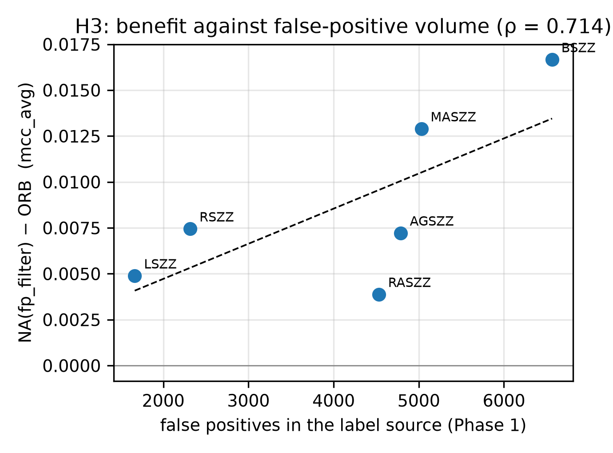
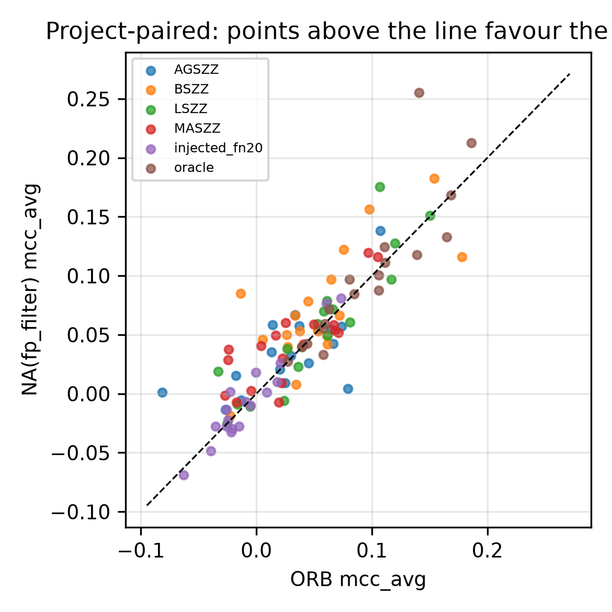

# Chapter 7 — Phases 4 and 5: Noise-Aware ORB, and What Actually Helps

Chapter 6 established what an online learner cannot survive: the volume of false positives SZZ invents, amplified by the very mechanism that corrects class imbalance. It also showed what recovering from that is worth — **+0.040 MCC** — using the reference labels to remove exactly the wrong ones.

This chapter answers **RQ4**: can a learner approximate that repair *without* the reference, and without sacrificing performance when the labels are clean?

It reports two pre-registered experiments. **Phase 4** tests a train-time false-positive filter and returns a characterised negative. **Phase 5**, registered afterwards on data that did not then exist, tests the confidence-damping alternative — and its registered mechanism test, together with one control, produces the chapter's actual answer, which neither phase was designed to find.

**The answer is no, and this chapter reports that at full strength.** The intervention is adoptable — it does not damage clean labels — but no confirmatory test survives multiplicity correction. This is a **pre-registered characterised negative**, and the chapter is organised to explain not merely that it failed but *why*, because the reason is more informative than a success would have been.

---

## 7.1 Pre-registration, and a registration that was rewritten

### 7.1.1 Why Phase 4 is pre-registered and Phases 1–3 are not

Phases 1–3 are exploratory. Their hypotheses were formed during analysis, their test families were defined after seeing the data, and every result is labelled accordingly, with a conservative global multiplicity correction applied so that no claim depends on how the families were drawn.

Phase 4 is different in kind. It proposes a method and asks whether it works — a question that invites the analytic flexibility pre-registration exists to constrain. Its hypotheses, its primary model, its acceptance bar and its multiplicity correction were therefore committed to version control **before the first Phase 4 run**, and the commit history timestamps that claim independently of this chapter's narration.

### 7.1.2 The registration was revised once, and the revision is part of the record

The original registration made a **false-negative rescue** mechanism the headline: when the ensemble confidently disagrees with a clean label, train the commit as a provisional positive. That design followed directly from the starvation hypothesis Phase 4 was planned under.

Chapter 6 refuted that hypothesis. Restoring genuinely missing defect labels is *equivalent to no repair* (TOST *p* = 0.0008). A mechanism that manufactures positives therefore targets an error shown to cost nothing — and worse, every incorrect rescue manufactures exactly the error type Chapter 6 showed to be costly.

Because Phase 4 had produced **zero results** at that point, the registration was rewritten and re-committed. **That is the only moment at which revising a pre-registration is legitimate**: before any outcome is visible. Revising afterwards is the practice pre-registration exists to prevent, and the distinction between the two is entirely a matter of timing, which is why the timing is recorded rather than asserted.

The rescue mechanism was not discarded. It was **demoted to a mechanism probe carrying a predicted sign**, so that it would test Chapter 6's account rather than merely be excluded by it.

### 7.1.3 The registered tests

| Tag | Test | Prediction |
|---|---|---|
| **ND** | Filter vs baseline on reference labels | **No significant drop** (TOST, ±0.02). The acceptance bar |
| **H1** | Filter beats baseline on B-SZZ | Positive (6,565 false positives — the most available) |
| **H2a/b** | Filter beats baseline on MA-SZZ and AG-SZZ | Positive (5,030 and 4,786) |
| **H3** | Benefit rank-correlates with each variant's false-positive count | ρ > 0, one-sided |
| **MP** | Rescue vs baseline on every SZZ source | **≤ 0** on all six |
| **R1** | λ self-antagonism arm | `suppress` underperforms `observed` |

**H3 is the sharpest test in the chapter**, and it exists because of Chapter 6's error-matched control. If the benefit is driven by false-positive *volume*, it should track how many false positives each source contains — a predicted ordering over six variants whose counts were fixed in advance (6565, 5030, 4786, 4531, 2316, 1665). An ordering is far harder to satisfy by chance than a binary comparison.

**ND is the acceptance bar, not H1.** A filter that wins on noisy labels and damages clean ones is not deployable, because a practitioner cannot know in advance which case they are in.

---

## 7.2 Design

### 7.2.1 The intervention

`FPFilterORB` extends ORB with train-time false-positive suppression. A defect-labelled arrival that the ensemble confidently contradicts is treated as a suspected SZZ false positive: trained at weight ε (with ε = 0 discarding it) and excluded from the boost. **Clean-labelled arrivals are untouched**, since Chapter 6 showed that intervening on the negative side recovers nothing.

### 7.2.2 Two decision rules, and why the obvious one fails

The natural rule — and the one originally specified — is a running quantile: suppress a positive whose probability falls in the lowest *q* of recently delivered positives. It requires no calibration, which is its appeal.

**Measured on this corpus that rule is degenerate.** The ensemble's members agree almost completely, so the predicted probability is bimodal at 0 and 1, and the 10th percentile of a trailing window is **0.0000 in nearly every segment of every stream**. A strict comparison against a threshold of zero can never fire: on opennlp/B-SZZ it suppressed **0 of 75** positive arrivals. The rule was not wrong in conception; it was wrong in its comparison operator, and a non-strict comparison repairs it.

The alternative is a fixed threshold τ. §7.4.1 shows it fails for a deeper reason.

```
FPFilterORB.learn_one(x, y):
    if y == 0:
        ORB.learn_one(x, y);  return          # negatives untouched

    p1  ← ensemble_probability(x)
    thr ← τ                    if mode = fixed
          quantile(window, q)  if mode = quantile and |window| ≥ min_pos
          ⊥                    otherwise      # inert during warm-up
    suspect ← (thr ≠ ⊥) and (p1 < thr  if fixed  else  p1 ≤ thr)
    window.append(p1)

    if suspect:
        if rate_update = "observed":
            r₁ ← decay·r₁ + (1−decay)·1       # distrust the LABEL, not the class rate
        if ε > 0:
            k ~ Poisson(ε);  update_members(x, 1, k)
        return                                 # no boost, no full-weight update

    ORB.learn_one(x, y)
```

**Complexity.** One additional ensemble forward pass per defect-labelled arrival and one quantile over a bounded window, so *O*(*M* + log *W*) per positive with *M* ensemble members and window *W*, against ORB's *O*(*M*·λ) update. Since positives are 8.5% of arrivals and λ routinely exceeds 20, the filter's cost is negligible.

**Warm-up is counted in positive labels, not arrivals.** Positives are what is scarce: under realistic latency some projects deliver fewer than 30 across an entire stream, and a quantile over an empty window is undefined. Below `min_pos` the filter is inert and the model is plain ORB — the safe direction.

### 7.2.3 The registered risk: λ self-antagonism

Chapter 6 measured ORB's oversampling rate to be a near-perfect inverse of delivered defect-label supply (ρ = −1.000), and the mechanism is explicit in the update: λ₁ = (1 − r₁)/r₁. **Every positive this filter suppresses therefore raises λ for the positives that survive it.** The filter works against the machinery it is bolted onto.

The `rate_update` switch controls whether it does:

- **`observed`** — r₁ is updated as though the label had been accepted. Suppressing a label expresses distrust of *that label* without telling the ensemble the defect class is rarer than it is. λ is left alone.
- **`suppress`** — the arrival is skipped entirely, r₁ drifts down, λ rises.

**Registered prediction: `suppress` underperforms `observed`, with the gap widening as filter rate rises.** A second risk — that a suppressed positive is never learned, so its probability stays low and it is suppressed again — is instrumented rather than assumed: every decision is traced.

---

## 7.3 Experimental setup

**Models.** OOB and ORB as baselines; `NA(fp_filter)` as the registered primary; `NA(fp_filter/suppress)` as the R1 arm, carrying identical hyperparameters with only the switch flipped; `NA(damp)`, the prior confidence-damping defence, for comparison; `NA(rescue)` as the MP probe.

A composed `NA(fp_filter+damp)` arm appeared in the first draft of the registration but was **never implemented** — the placeholder returned a duplicate of the primary, which would have reported one model under two names and made the ablation look richer than it is. It was dropped before any Phase 4 run, at the same moment and for the same reason the registration itself could legitimately be revised.

**Conditions.** Reference labels (the ND gate), all six SZZ variants, and a 20% injected-noise condition bridging to Chapter 6.

**Held-out projects.** `commons-scxml`, `opennlp` and `commons-math` are excluded from every reported number. Hyperparameters were chosen by looking at them, so including them would leak the tuning set into the results. Reporting is therefore on **18 projects**.

**Statistics.** Project-paired Wilcoxon on `mcc_avg`, Hodges–Lehmann with bootstrap interval, matched-pairs rank-biserial, Holm within the registered family. Both estimators recorded.

---

## 7.4 Results

### 7.4.1 Tuning, and what the acceptance bar caught

Forty-two configurations were evaluated on the held-out projects under a selection rule declared before the sweep: apply the ND gate **first**, then maximise gain on B-SZZ, then prefer the more conservative filter. `rate_update` was deliberately **not** tuned — it is the R1 arm, and optimising it would convert a registered prediction into a fit.

**Twenty-four configurations passed the gate, and every one of them uses the quantile rule.** Every fixed-threshold configuration failed, several catastrophically: on the reference arm, where every positive label is correct and there is nothing to remove, τ = 0.35 suppressed 57% of defect labels and cost **−0.0989** MCC.

> **The reason generalises well beyond this model.** A fixed confidence threshold suppresses however many positives the model happens to be unsure about, with no reference to how many false positives the source actually contains. It cannot distinguish *"this label is probably wrong"* from *"my model has not learned this pattern yet."* A quantile rule removes about *q* by construction, so its worst case is bounded. **An intervention on scarce labels must be bounded in size, not in confidence.**

The frozen configuration is quantile with *q* = 0.30, ε = 0.1, `min_pos` = 30, `rate_update` = `observed`. Extending the sweep to *q* = 0.40 and 0.50 lowered the B-SZZ gain to 0.0402 and 0.0288, confirming *q* = 0.30 as an interior optimum rather than a grid edge.

### 7.4.2 The registered verdict

Eighteen reporting projects.

| Test | HL | 95% CI | Projects | *p* | **Holm** |
|---|---|---|---|---|---|
| **ND** — non-degradation on reference labels | −0.0001 | [−0.0091, +0.0081] | 5/18 | 0.807 | **PASS** |
| H1 — filter beats baseline on B-SZZ | +0.0166 | [+0.0009, +0.0328] | 12/18 | 0.054 | 0.215 ✗ |
| H2a — on MA-SZZ | +0.0110 | [−0.0005, +0.0235] | 13/18 | 0.074 | 0.221 ✗ |
| H2b — on AG-SZZ | +0.0072 | [−0.0075, +0.0221] | 12/18 | 0.246 | 0.492 ✗ |
| H3 — benefit tracks false-positive count | ρ = 0.714 | — | 6 variants | 0.055 | ✗ |

**The gate passes; nothing else does.**


**Figure 7.1 — Reading the figure.** Six models across six label conditions, 18 reporting projects, error bars 95% intervals. Every noise-aware variant sits above the ORB baseline on every SZZ source, and the intervals overlap heavily — which is the visual form of "consistent in direction, not significant after correction". Note that `NA(damp)` (green), the arm the re-registration demoted, is the tallest bar on B-SZZ, MA-SZZ and AG-SZZ.



**Figure 7.2 — Reading the figure.** Each point is one SZZ variant, positioned by how many false positives Chapter 4 measured in it and by the filter's mean gain over the baseline. The dashed line is the fitted trend. **The ordering is broadly as predicted** — the gain rises with false-positive volume — but with six variants and one inversion (RA-SZZ), ρ = 0.714 does not reach significance.



**Figure 7.3 — Reading the figure.** One point per project per condition; points above the dashed diagonal are projects where the filter beat the baseline. The cloud sits slightly above the line and straddles it — a majority of projects improve, not enough of them to establish the effect.
 Every confirmatory test points in the predicted direction and not one survives correction.

The honest reading is narrow. The filter is **adoptable** — it does not damage clean labels, which is the property that gates deployment — but it is **not demonstrated to work**. Four independent tests agreeing in direction is worth a sentence; it is not a result, and this thesis does not treat it as one. H1's interval barely excludes zero and its raw *p* of 0.054 would not have survived even without correction.

**The hold-out protocol paid for itself.** On the three tuning projects the filter gained **+0.045** on B-SZZ. On the 18 reporting projects it gains **+0.017** — an optimism factor of **2.7×**. Had the hyperparameters been selected on the reporting set, this chapter would have claimed an effect nearly three times its real size, and would have been wrong.

### 7.4.3 The mechanism probe was refuted, 0 for 6

Rescue was registered with an explicit prediction that it would be **at or below zero** on every SZZ source. It is **positive on all six**:

| Source | Rescue − baseline | 95% CI | Projects | *p* |
|---|---|---|---|---|
| L-SZZ | **+0.0166** | [+0.0057, +0.0289] | 13/18 | 0.006 |
| MA-SZZ | **+0.0142** | [+0.0013, +0.0266] | 12/18 | 0.027 |
| AG-SZZ | +0.0117 | [−0.0007, +0.0270] | 13/18 | 0.090 |
| B-SZZ | **+0.0116** | [+0.0033, +0.0262] | 13/18 | 0.024 |
| R-SZZ | +0.0068 | [−0.0033, +0.0202] | 12/18 | 0.246 |
| RA-SZZ | +0.0002 | [−0.0164, +0.0213] | 8/18 | 1.000 |

The registration stated that if rescue helped, the mechanism account would need revision. **It helps, and the revision is owed.**

**The candidate reconciliation, and why it is not yet a claim.** Chapter 6 restored the *reference-known* missing positives; rescue adds *model-confident* ones. These are different sets — rescue is closer to self-training on high-confidence commits than to label correction. So "restoring what SZZ missed recovers nothing" and "adding confidently-predicted defects helps" are not contradictory, **provided** the benefit comes from label *supply* rather than label *accuracy*.

That explanation was tested directly. The Spearman correlation between a condition's delivered positive supply and the filter-minus-rescue advantage is **ρ = +0.357, *p* = 0.385**. **The supply account is not supported**, and it is recorded here as an open question rather than presented as an explanation.

### 7.4.4 R1: a clean null in both directions

| Condition | observed − suppress | 95% CI | *p* |
|---|---|---|---|
| B-SZZ | −0.0016 | [−0.0075, +0.0045] | 0.61 |
| Reference | +0.0002 | [−0.0018, +0.0031] | 0.51 |

The registered prediction is not supported, and neither is its converse. λ *does* rise when positives are suppressed — the coupling is real and was measured at ρ = −1.000 — but at this filter rate it has no detectable effect on performance. The trace confirms the feedback loop exists: the two settings produce *different filter rates on identical inputs*. It simply does not matter at this magnitude.

### 7.4.5 An uncomfortable finding, reported rather than smoothed

The prior confidence-damping arm — the one the re-registration demoted — **outperforms the new primary on six of eight conditions**, including B-SZZ (0.0874 against the baseline's 0.0551).

Because damping was not the registered primary, every such contrast is exploratory. Corrected across the 21 exploratory contrasts, only damping-beats-baseline on B-SZZ survives global Holm: +0.0329, CI [+0.0194, +0.0456], 15/18, *p* = 0.0040. **The defensible statement is that damping leads numerically and is established on one label source.**

The re-registration was correctly motivated by Chapter 6 and correctly timed before any run, and it still bet on the wrong arm. The commit history records this either way, so the thesis states it.

---

## 7.5 Phase 5 — the registered follow-up, and what it overturned

Phase 4's exploratory analysis left one loose end. `NA(damp)` — the arm the
re-registration demoted — outperformed the registered primary on six of eight
conditions. That observation was generated by the Phase 4 data, so testing it
there would confirm a hypothesis on the sample that produced it.

Phase 5 therefore registers the damping hypothesis and tests it on data that
did not exist at registration time: the **noise-injection grid** of four
profiles crossed with six doses, which Chapter 6 ran with plain ORB only and
Phase 4 touched at a single dose. The registration was committed with no
results in the commit; the run follows it in the history.

### 7.5.1 The registered scorecard

34,560 records — 18 reporting projects × 10 seeds × 4 profiles × 6 doses ×
2 latency arms × 4 models.

| Test | Prediction | Result | |
|---|---|---|---|
| **H1** damp > ORB, FP-heavy | positive | **+0.0168** [+0.0092, +0.0272], 15/18, Holm **0.0021** | ✅ |
| **H4** damp > filter, FP-heavy | positive | **+0.0081** [+0.0022, +0.0141], 15/18, Holm **0.018** | ✅ |
| **ND** no degradation | no drop | **+0.0193** [+0.0092, +0.0299], Holm 0.0039 | ✅ |
| **H3** FN-heavy advantage > FP-heavy | positive | **−0.0217** [−0.0341, −0.0118], **2/18**, Holm **0.0021** | ❌ refuted, opposite direction |
| **H2** advantage grows with dose | ρ > 0 | ρ = **−0.486**, *p* = 0.84 | ❌ |

Two pass; two fail — and **the two that fail are the ones about the mechanism.**

H4 is worth isolating, because it settles a question Phase 4 could only
speculate about: **down-weighting a suspect label beats discarding it**, by
+0.0081 with 15 of 18 projects agreeing. Under the label scarcity that
verification latency imposes, the cheaper error is to keep a doubtful label at
reduced influence rather than to throw it away.

**A defect in the registration, recorded rather than quietly repaired.** The ND
gate was registered as a TOST for *equivalence* at ±0.02. It returns "not
equivalent" — because damping is **better** than the baseline by more than the
margin, not worse. The gate's intent is met decisively; the registered
statistic was simply the wrong one, since the correct test for a
non-degradation gate is **non-inferiority**, one-sided against −margin. The
direction is unambiguous either way, so nothing is rescued by substituting it,
and the mis-specification is reported because it was registered.

### 7.5.2 H3's refutation is the informative half

H3 predicted that damping should help *most* under FN-heavy noise at doses
≥ 0.20 — the regime where Chapter 6 measured the stream retaining no genuine
defect labels while still carrying roughly 204 positive labels, **every one of
them false**. If damping suppresses the influence of wrong positives, an
entirely wrong positive stream is where it should shine.

It helps **least** there, significantly so, with only 2 of 18 projects moving
the predicted way. Two candidate explanations, neither tested:

1. **No discriminative signal.** Confidence damping needs a *mixture* of correct
   and incorrect positives to tell them apart. When every positive is wrong
   there is no reference class for what a trustworthy positive looks like.
2. **A lower ceiling.** Every model scores ≈ 0.02 under FN-heavy against ≈ 0.05
   under FP-heavy, leaving less room for any advantage. The relative gap
   (1.19× against 1.57×) suggests this contributes without being sufficient.

### 7.5.3 The control that explains H1 away

ORB is OOB plus a prediction-bias boost; `NA(damp)` is ORB plus confidence
damping. Including plain OOB in the grid separates the two contributions:

| Profile | NA(damp) − ORB | **OOB − ORB** | **NA(damp) − OOB** |
|---|---|---|---|
| FP-heavy | +0.0168 (Holm 0.0047) | **+0.0172 — 18/18, Holm 0.0001** | +0.0019 (9/18, Holm 1.00) |
| symmetric | +0.0181 (Holm 0.0014) | **+0.0199 — 17/18, Holm 0.0002** | +0.0005 (8/18, Holm 1.00) |
| mid | +0.0139 (Holm 0.0023) | **+0.0139 — 15/18, Holm 0.0026** | +0.0020 (10/18, Holm 1.00) |
| FN-heavy | +0.0028 (n.s.) | +0.0075 (15/18, Holm 0.109) | −0.0050 (6/18, Holm 1.00) |

> **Damping adds nothing over simply not boosting.** Against plain OOB it is a
> coin flip in every profile — 8 to 10 wins out of 18, every interval spanning
> zero, every corrected *p* at 1.000. The entire H1 effect is reproduced by
> removing the boost and adding no noise-awareness at all.

**H1 passes and the control explains it away.** This is what pre-registration
is for: the registered effect test confirmed the effect, the registered
mechanism test refuted the explanation, and a control identified the real
cause. Had damping been promoted on Phase 4's exploratory evidence, the thesis
would have reported a noise-aware method that works — and been wrong about why,
in a way no amount of additional significance would have caught.

### 7.5.4 What Phase 5 establishes

**ORB's prediction-bias boost is what costs performance under label noise.**
Eighteen of eighteen projects on the FP-heavy profile — the strongest single
result in Phases 4 and 5. It is independent confirmation of Chapter 6's
amplification account, obtained by **intervention** rather than by measuring the
oversampling rate, and the two lines of evidence are methodologically
independent.

It is also consistent with, though not established by, the clean-label
comparison: on reference labels in Phase 4 the same contrast was +0.0050
(*p* = 0.47, not significant) against +0.0172 under injected FP-heavy noise
here. **The boost appears roughly neutral on correct labels and harmful on
incorrect ones**, which is what the amplification account predicts. The
interaction was not formally tested and is not claimed.

---

## 7.6 Discussion — answering RQ4

**Can a learner recover performance lost to SZZ noise without reference labels?** Not demonstrably, on this corpus, with this intervention.

| | Recovers |
|---|---|
| Chapter 6 FP-repair, using the reference to remove exactly the wrong labels | **+0.040** |
| Chapter 7 filter, approximating it without the reference | +0.017 (not significant) |

**The gap between those numbers is the price of not knowing which labels are wrong**, and it is the most informative quantity in this chapter. Two things make it large.

**A confidence signal cannot separate the two cases that matter.** At its tuned setting the filter suppresses 30% of defect labels on B-SZZ — and still **15% on reference labels, where there is nothing to remove.** Low predicted probability means "this label disagrees with what I have learned", which is equally consistent with a wrong label and with a correct label describing a pattern not yet learned. Under an 8.5% positive rate with a model still learning, the second case is common.

**Defect labels are too scarce for the intervention to be cheap.** Under realistic latency a project delivers a mean of **75 defect labels across an entire stream**, with ORB's λ climbing to 62 to compensate. Every suppressed label is drawn from that budget. Chapter 6's repair could afford to remove 6,565 labels because it removed only wrong ones; a heuristic filter pays for its precision in correct labels discarded.

**When it helps and when it does not.** The direction is consistent — positive on all four registered tests and ordered roughly by false-positive count — so the mechanism identified in Chapter 6 is not contradicted. The effect is simply smaller than the design can resolve at *n* = 18. On the most false-positive-heavy source the point estimate is +0.017 against a baseline near 0.055, which would be practically meaningful if it were established; on the cleanest sources it is indistinguishable from zero, exactly as the volume account predicts.

**What the negative result is worth.** More, in this case, than a positive one. A working filter would have shown that this particular heuristic recovers some of this particular loss. The negative shows something more general: **the information required to build the defence is not available to a learner at training time.** Knowing *which kind* of error hurts — Chapter 6's contribution — does not confer the ability to identify *which instances* are that error. The repair experiment's +0.040 is an upper bound requiring knowledge no deployed system has.

### But the learner does not need that information

Phase 5 supplies the part Phase 4 was missing, and it is not a better defence — it is the absence of one.

Every noise-aware variant tested across the two phases beats the ORB baseline, and **plain OOB — which has no noise-awareness whatever — matches all of them.** Against OOB, confidence damping is a coin flip in every noise profile; against ORB, OOB wins in **18 of 18 projects** on the FP-heavy profile. The difference between ORB and OOB is one component: the boost that raises the oversampling rate when recent predictions look biased against the minority class.

That component is the mechanism Chapter 6 identified from the other direction. λ is an inverse function of delivered defect-label supply, so the boost amplifies whatever positive labels arrive, hardest when they are scarcest — and under SZZ labels most of what arrives is wrong. Chapter 6 measured the coupling; Phase 5 removes the component and recovers the loss. **Two methodologically independent lines of evidence, one measurement and one intervention, converge on the same component.**

So RQ4 has two answers, and they should be stated together.

> **No** — a learner cannot identify which of its labels are wrong, and neither confidence-based defence tested recovers the oracle-assisted repair.
>
> **But it does not have to.** Under SZZ-derived labels the actionable change is to stop amplifying them: switching off the prediction-bias boost recovers as much as any noise-aware method tested, costs nothing to implement, and requires no knowledge of which labels are wrong.

**The practical implication, revised.** Improving the labels is still worth more than improving the learner — Chapter 6's +0.040 oracle-assisted repair remains larger than anything achievable without the reference. But the cheapest available intervention is neither: it is to stop a mechanism designed for clean imbalanced data from doing damage on dirty data. **Imbalance correction and label noise interact, and the standard remedy for the first makes the second worse.**

### 7.6.1 What this chapter licenses, and what it does not

**Licensed.** That train-time false-positive filtering is adoptable but not demonstrated effective on this corpus. That a fixed confidence threshold is actively harmful on clean labels, with the failure mode understood. That the rescue mechanism helps, contradicting a prediction derived from Chapter 6. That held-out tuning was necessary, with a measured optimism factor of 2.7×. That **down-weighting a suspect label beats discarding it** (H4, +0.0081, 15/18, Holm 0.018). And that **removing ORB's prediction-bias boost recovers as much as any noise-aware variant tested**, in 18 of 18 projects under FP-heavy noise.

**Not licensed.** That confidence-based filtering or damping cannot work in principle — two designs were tested, each at one operating point. That confidence damping contributes anything beyond the absence of boosting: against plain OOB it is a coin flip in all four profiles, which is a null rather than a refutation, and the design had power to detect roughly 0.02 MCC. That the boost is *specifically* harmful under noise rather than mildly harmful in general: the clean-label contrast points that way (+0.0050, *p* = 0.47) but the interaction was never tested. Any explanation of why rescue helps: the supply account was tested and failed, and no replacement has been tested. Why damping fails exactly where the positive stream is entirely wrong (H3): two candidate explanations are offered and neither was tested.
