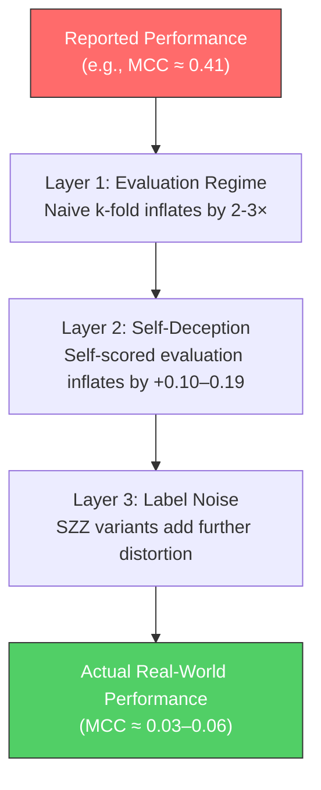

# Phase 2: Downstream Impact Under Honest Evaluation — Detailed Explanation

## 1. What Phase 2 Is Testing

Phase 2 answers one central question: **"How much does SZZ label noise actually hurt defect prediction, and how much of published performance is inflated by dishonest evaluation?"**

It does this by training 3 models × 7 label sources × 3 evaluation regimes × 2 scoring modes across 21 Apache projects and 10 random seeds = **14,700 total experimental records**.

---

## 2. The Three Models — How They Work

### 2.1 LApredict (Simplest Baseline)
> Reference: Zeng et al., 2021

**What it does**: A logistic regression that uses *only a single feature* — **LA (lines added)** — to predict whether a commit is defective.

**How it works internally** ([baselines.py](file:///home/afler/Documents/thesis-later/codebase/models/baselines.py)):
1. Takes the `la` column from the 14 Kamei features
2. Applies `log1p` transformation: `log(1 + lines_added)` to compress the skewed distribution
3. Standardizes with `StandardScaler` (zero mean, unit variance)
4. Fits a logistic regression with `class_weight="balanced"` (upweights minority class)

**Why it matters**: LApredict is intentionally simple — if even this trivial model shows performance differences between SZZ variants and oracle, the noise is definitely real and impactful. It also serves as a "lower-complexity" reference point.

---

### 2.2 JITLine (Standard Batch Classifier)
> Reference: Pornprasit & Tantithamthavorn, 2021

**What it does**: A Random Forest classifier using all **14 Kamei change-level features**.

**How it works internally** ([baselines.py](file:///home/afler/Documents/thesis-later/codebase/models/baselines.py)):
1. Takes all 14 features: `ns, nd, nf, entropy, la, ld, lt, fix, ndev, age, nuc, exp, rexp, sexp`
2. Log-compresses features: `log1p(|x|) × sign(x)` to handle heavy tails
3. **Oversamples the minority class** by duplicating buggy commits with slight Gaussian jitter (noise factor σ=0.02) until classes are balanced
4. Trains a 100-tree RandomForest with `class_weight="balanced_subsample"`

**Why it matters**: JITLine is the most representative model of what the JIT-SDP literature typically uses — a batch learner trained on all features with standard rebalancing. It is the model most susceptible to label noise because:
- The Random Forest memorizes the training distribution
- Minority oversampling **amplifies** any mislabeled buggy commits
- If SZZ produces false positives (clean commits marked buggy), oversampling replicates those errors

---

### 2.3 ORB (Online Streaming Model)
> Reference: Cabral, Minku, Shihab & Mujahid, 2019

**What it does**: An online ensemble learner that processes commits **one by one** in chronological order, learning incrementally — the most realistic deployment scenario.

**How it works internally** ([orb.py](file:///home/afler/Documents/thesis-later/codebase/online/orb.py)):
1. **Base**: An ensemble of 20 online logistic regressors
2. **Online Bagging**: Each base learner receives each training example with a Poisson-distributed weight (simulating bootstrap sampling in a streaming setting)
3. **OOB (Oversampling Online Bagging)**: The Poisson rate λ adapts to the class imbalance — minority class instances get λ > 1, majority class gets λ = 1
4. **ORB Boost**: On top of OOB, ORB adds a **prediction-bias-driven boost factor**:
   - Tracks a moving average of recent predictions (`ma_pred`)
   - If the model is *missing defects* (predicting too few 1s), it exponentially boosts the learning weight for buggy examples
   - If the model is *crying wolf* (predicting too many 1s), it boosts the weight for clean examples
5. Features are standardized online via **Welford's algorithm** (running mean/variance)

**Why it matters**: ORB is the most realistic model because real defect prediction happens in a stream — you can't retrain on the entire project history every time a new commit arrives. It also faces **verification latency**: you only learn a commit's true label *after* the bug-fixing commit is observed (typically 90 days later).

---

## 3. The Three Evaluation Regimes

### 3.1 Naive K-Fold (Temporally Dishonest — Upper Bound)
**What it does** ([regimes.py:L19-58](file:///home/afler/Documents/thesis-later/codebase/evaluation/regimes.py#L19-L58)):
- Randomly shuffles all commits and splits into 10 folds
- Trains on 9 folds, tests on 1, rotates

**Why it's dishonest**: It trains on *future* commits and tests on *past* commits. In reality, you can't see tomorrow's data today. This is the setup most JIT-SDP papers use, and it **artificially inflates** performance.

### 3.2 Chronological Split (Honest Batch Evaluation)
**What it does** ([regimes.py:L61-94](file:///home/afler/Documents/thesis-later/codebase/evaluation/regimes.py#L61-L94)):
- Sorts commits by `author_ts` (timestamp)
- Trains on the first 50%, tests on the last 50%
- No data leakage across time

**Why it's more honest**: Mimics a realistic batch deployment — train on historical data, predict future commits. The performance drop from naive k-fold to chronological reveals how much "evaluation inflation" exists.

### 3.3 Prequential with Verification Latency (Most Realistic)
**What it does** ([regimes.py:L97-156](file:///home/afler/Documents/thesis-later/codebase/evaluation/regimes.py#L97-L156)):
- Processes commits one by one in time order
- **Test-then-train**: predict first, then learn from the true label
- **Verification latency (W=90 days)**: A commit's label only becomes available after the fix commit is observed. If the fix arrives within 90 days, the label is used immediately. If not, the commit is tentatively labeled "clean" and corrected later when the fix finally arrives
- Uses a **fading confusion matrix** (decay=0.99) so recent performance matters more

**Why it's the most realistic**: This is exactly how defect prediction works in practice. The 90-day waiting window means the model must predict with incomplete training data.

---

## 4. Oracle-Scored vs Self-Scored (The "Self-Deception" Gap)

Every experiment runs in two scoring modes:
- **Oracle-scored**: Model's predictions are evaluated against the **true oracle labels** (ground truth from manually verified bug databases)
- **Self-scored**: Model's predictions are evaluated against the **same noisy SZZ labels** it was trained on

> [!IMPORTANT]
> This distinction is critical. When researchers use SZZ labels for *both* training *and* evaluation, the model can appear to perform well simply by learning to reproduce the SZZ tool's biases — not by actually finding real bugs.

---

## 5. Impact of SZZ Variants on Each Model

### 5.1 The 6 SZZ Variants + Oracle

| Label Source | Full Name | Key Characteristic |
|---|---|---|
| **oracle** | Manual ground truth | Perfect labels, the gold standard |
| **BSZZ** | Basic SZZ | Simplest algorithm, blames all lines changed in the fix commit |
| **AGSZZ** | AG-SZZ | Filters annotation-graph based, removes whitespace/comment changes |
| **MASZZ** | MA-SZZ | Adds meta-change awareness (refactoring detection) |
| **LSZZ** | L-SZZ | Line-number-mapping variant |
| **RSZZ** | R-SZZ | Most restrictive — aggressive filtering |
| **RASZZ** | RA-SZZ | RA-SZZ with additional annotation processing |

### 5.2 Headline Results: Oracle-Scored MCC

This is the core results table — **how well each model actually predicts real bugs** when trained on each label source:

#### JITLine (Batch Random Forest)

| Label Source | Chronological | Naive K-Fold | Gap (Inflation) |
|---|---|---|---|
| **oracle** | 0.0673 | 0.2039 | **+0.1366 (↑203%)** |
| BSZZ | 0.1135 | 0.1754 | +0.0619 |
| AGSZZ | 0.0496 | 0.0980 | +0.0484 |
| MASZZ | 0.0666 | 0.1150 | +0.0484 |
| LSZZ | 0.0478 | 0.1167 | +0.0689 |
| RASZZ | 0.0509 | 0.1020 | +0.0511 |
| RSZZ | 0.0337 | 0.0817 | +0.0480 |

> [!WARNING]
> JITLine shows the **largest evaluation inflation**: naive k-fold scores are 2–3× higher than chronological scores. The oracle labels show the biggest gap (203% inflation), meaning the model *appears* to work well under dishonest evaluation but actually has near-random performance (MCC ≈ 0.067) in a realistic setting.

**Key finding**: BSZZ is actually the best SZZ variant for JITLine — it *exceeds* oracle performance under chronological evaluation (0.1135 vs 0.0673). This sounds paradoxical but happens because BSZZ labels more commits as buggy (higher recall, more false positives), which gives the balanced Random Forest more positive training examples to learn from.

#### LApredict (Logistic Regression on Lines Added)

| Label Source | Chronological | Naive K-Fold | Gap (Inflation) |
|---|---|---|---|
| **oracle** | 0.1734 | 0.2058 | +0.0324 |
| BSZZ | 0.1599 | 0.1889 | +0.0290 |
| AGSZZ | 0.1670 | 0.1950 | +0.0280 |
| MASZZ | 0.1708 | 0.2000 | +0.0292 |
| LSZZ | 0.1719 | 0.2074 | +0.0355 |
| RASZZ | 0.1745 | 0.2005 | +0.0260 |
| RSZZ | 0.1740 | 0.2017 | +0.0277 |

**Key finding**: LApredict is **remarkably stable** across all label sources. The difference between the best (RASZZ: 0.1745) and worst (BSZZ: 0.1599) SZZ variant under chronological evaluation is only 0.0146. This is because the model is so simple (single feature) that it can't memorize noise — it only learns the broad correlation between "lines added" and bugginess, which is somewhat robust to label flips.

> [!TIP]
> LApredict's stability illustrates an important principle: **simpler models are more noise-tolerant**. They can't overfit to label noise because they lack the capacity to memorize individual mislabeled examples.

#### ORB (Online Streaming)

| Label Source | Prequential Latency |
|---|---|
| **oracle** | 0.0634 |
| BSZZ | 0.0601 |
| AGSZZ | 0.0184 |
| MASZZ | 0.0214 |
| LSZZ | 0.0351 |
| RASZZ | 0.0099 |
| RSZZ | 0.0286 |

**Key finding**: Under the most realistic evaluation, **all models perform very poorly** (MCC 0.01–0.06). ORB trained on BSZZ comes closest to oracle (0.0601 vs 0.0634), while RASZZ degrades ORB nearly to random (0.0099). This suggests that in real-world streaming deployment, **SZZ label quality is a critical bottleneck** and even with perfect labels, JIT defect prediction offers only marginal predictive power.

---

## 6. Statistical Significance of the Results

### 6.1 Evaluation Inflation (Naive K-Fold vs Chronological)

From [statistical_tests.csv](file:///home/afler/Documents/thesis-later/results/phase2/statistical_tests.csv):

| Model | Labels | Naive − Chrono (MCC diff) | p-value | Effect Size |
|---|---|---|---|---|
| JITLine | oracle | +0.1366 | **3.15×10⁻⁵** | **large** (δ=0.601) |
| JITLine | BSZZ | +0.0619 | **0.017** | **medium** (δ=0.417) |
| JITLine | RSZZ | +0.0480 | **0.003** | **medium** (δ=0.429) |
| LApredict | oracle | +0.0324 | 0.050 | small (δ=0.247) |
| LApredict | BSZZ | +0.0290 | 0.079 | small (δ=0.236) |
| LApredict | RSZZ | +0.0276 | 0.111 | small (δ=0.243) |

> JITLine's inflation is statistically significant and large. LApredict's inflation is borderline significant and small in magnitude.

### 6.2 Self-Deception Gap (Self-Scored vs Oracle-Scored)

| Labels | Regime | Self − Oracle (MCC) | p-value | Effect Size |
|---|---|---|---|---|
| **BSZZ** | naive_kfold | **+0.190** | **6.54×10⁻⁸** | **large** (δ=0.825) |
| BSZZ | chronological | +0.100 | 4.57×10⁻⁶ | large (δ=0.494) |
| MASZZ | naive_kfold | +0.114 | 5.54×10⁻⁶ | large (δ=0.592) |
| RASZZ | naive_kfold | +0.099 | 3.84×10⁻⁵ | large (δ=0.531) |
| **RSZZ** | naive_kfold | **+0.003** | **0.420** | **negligible** (δ=0.036) |
| RSZZ | chronological | +0.007 | 0.263 | negligible (δ=0.090) |

> [!CAUTION]
> **BSZZ has the worst self-deception gap** — training and evaluating on BSZZ labels inflates apparent MCC by 0.190 under naive k-fold. A researcher using BSZZ with random cross-validation would report MCC ≈ 0.37 when the *actual* oracle-scored MCC is only 0.18.
> 
> In contrast, **RSZZ has virtually no self-deception gap** — its aggressive filtering produces labels that, while less complete, are more "honest" (lower false positive rate).

---

## 7. Summary: The Three Layers of Inflation

Your Phase 2 results reveal that published JIT-SDP performance numbers are inflated by **three compounding factors**:

| Layer | What Inflates It | Magnitude |
|---|---|---|
| **Evaluation regime** | Naive k-fold allows temporal leakage | +0.05 to +0.14 MCC |
| **Self-deception** | Evaluating on same noisy labels used for training | +0.003 to +0.19 MCC |
| **Label source** | Different SZZ tools produce different noise profiles | ±0.02 to ±0.05 MCC |

### Bottom Line
Under the most realistic conditions (ORB, prequential with verification latency, oracle-scored), the **best achievable MCC is 0.0634** — barely above random chance. The widely reported high performance numbers in JIT-SDP literature are largely artifacts of evaluation shortcuts and label noise circularity.
