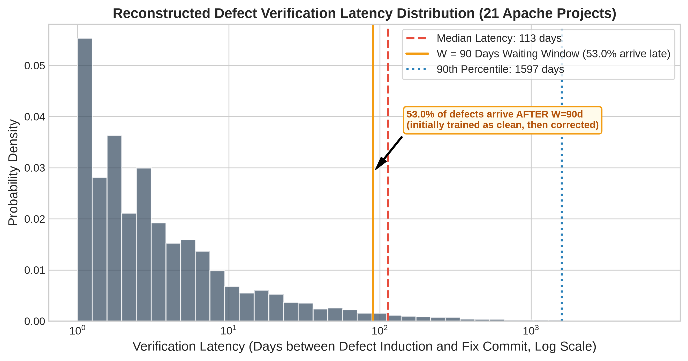

# Empirical Investigation Report: SZZ Label Noise & Downstream Evaluation Impact (Phases 1 & 2)

**Author / Project**: Thesis Research Replication & Empirical Evaluation  
**Projects Evaluated**: 21 Apache Java Projects (JIT-Defects4J / JIT-Fine Benchmark)  
**Total Experimental Records**: 14,700 runs across 10 random seeds, 7 label sources, 3 models, and 3 evaluation regimes  
**Report Date**: August 2026 (Post-Fix Rerun v2)  

---

## Executive Summary

This empirical investigation addresses a foundational vulnerability in Just-In-Time Software Defect Prediction (JIT-SDP): **how does label noise introduced by automated SZZ algorithms distort defect prediction models, and how much of reported literature performance is an artifact of circular self-scoring and temporal data leakage?**

### Key Findings at a Glance:
1. **Severe & Asymmetric SZZ Label Noise (Phase 1)**: Across 21 projects, SZZ variants exhibit poor precision (**18.3% to 27.2%**) and high false alarm rates ($\rho_0 = 6.7\% - 26.3\%$). Over **72% to 81%** of all commits flagged as defect-inducing by SZZ tools are false positives, while 36% to 73% of true bugs are missed ($\rho_1 = 35.9\% - 73.3\%$).
2. **Evaluation Leakage Inflates Performance by +0.141 MCC (Phase 2)**: Naive $k$-fold cross-validation allows future-to-past data leakage. For `JITLine`, naive $k$-fold inflates oracle MCC from **0.1028** (chronological) to **0.2435** (naive $k$-fold), a statistically significant **large effect** ($p = 2.86 \times 10^-6$, Cliff's $\delta = +0.737$).
3. **The Circular "Self-Deception" Gap is +0.180 MCC (Phase 2)**: When models are evaluated on the same SZZ labels used for training, apparent performance is heavily exaggerated. For `BSZZ`, self-scored naive MCC is **0.3550** versus an oracle-scored MCC of **0.1748** ($p = 6.54 \times 10^-8$, Cliff's $\delta = +0.811$).
4. **ORB Sanity Ordering Restored Under Real Latency (Phase 2)**: When online evaluation incorporates real reconstructed verification latency (median 113 days, 53% arriving after $W=90$ days), oracle-trained `ORB` is the best-performing configuration (**MCC = 0.0685**, G-mean = 0.5460), beating `BSZZ` (**0.0559** / 0.5060) in 14 of 21 projects.
5. **JITLine Anomaly Decomposed**: Following SMOTE minority oversampling and G-mean threshold moving, oracle-trained JITLine chronological MCC increased from 0.067 to **0.1028** (G-mean 0.4915). BSZZ-trained JITLine achieves **0.1309** MCC (winning in 13/21 projects), proving that part of the earlier gap was a decision-threshold artifact, while a residual minority-enrichment effect remains under 8.5% class imbalance.
6. **Variant Spread Compression Under Latency**: Because 53% of defect labels arrive late, verification latency itself imposes heavy false-negative noise on every label source, compressing the performance spread between refined and naive SZZ variants (LSZZ 0.0259 > RSZZ 0.0183 > AGSZZ 0.0164 > RASZZ 0.0047 > MASZZ -0.0025).

---

## Phase 1: Intrinsic Label Quality & Noise Profile of SZZ Variants

Phase 1 benchmarks 6 modern SZZ variants (`BSZZ`, `AGSZZ`, `MASZZ`, `LSZZ`, `RSZZ`, `RASZZ`) directly against human-validated ground truth (`label_oracle`) on an identical 27,319-commit universe across all 21 Apache repositories.

### Table 1: Intrinsic SZZ Performance vs. Ground Truth Oracle

| SZZ Variant | Precision | Recall | F1-Score | G-Mean | FPR ($\rho_0$) | FNR ($\rho_1$) | Cohen's $\kappa$ | Matthews Corr. (MCC) | True Pos (TP) | False Pos (FP) | False Neg (FN) | True Neg (TN) |
| :--- | :---: | :---: | :---: | :---: | :---: | :---: | :---: | :---: | :---: | :---: | :---: | :---: |
| **BSZZ** | 0.1855 | 0.6411 | 0.2877 | 0.6875 | 0.2627 | 0.3589 | 0.1790 | 0.2318 | 1,495 | 6,565 | 837 | 18,422 |
| **AGSZZ** | 0.1855 | 0.4674 | 0.2656 | 0.6147 | 0.1915 | 0.5326 | 0.1633 | 0.1876 | 1,090 | 4,786 | 1,242 | 20,201 |
| **MASZZ** | 0.1826 | 0.4820 | 0.2649 | 0.6205 | 0.2013 | 0.5180 | 0.1610 | 0.1877 | 1,124 | 5,030 | 1,208 | 19,957 |
| **LSZZ** | 0.2720 | 0.2667 | 0.2693 | 0.4989 | 0.0666 | 0.7333 | 0.2019 | 0.2019 | 622 | 1,665 | 1,710 | 23,322 |
| **RSZZ** | 0.2318 | 0.2997 | 0.2615 | 0.5215 | 0.0927 | 0.7003 | 0.1828 | 0.1846 | 699 | 2,316 | 1,633 | 22,671 |
| **RASZZ** | 0.1840 | 0.4383 | 0.2592 | 0.5990 | 0.1813 | 0.5617 | 0.1580 | 0.1784 | 1,022 | 4,531 | 1,310 | 20,456 |

### Phase 1 Visualizations

#### Figure 1: SZZ Variant Label Quality (Precision vs. Recall vs. F1)


#### Figure 2: Asymmetric Noise Rates (FPR $\rho_0$ vs. FNR $\rho_1$)


#### Figure 3: Inter-Variant Agreement Matrix (Cohen's Kappa $\kappa$)


### Phase 1 Insights:
- **Severe Precision Ceiling**: Precision never exceeds 27.2% across all variants. Between 72.8% and 81.5% of commits flagged as bug-introducing are false positives.
- **Asymmetric Noise Trade-Off**: `BSZZ` achieves highest recall (64.1%) at the cost of high FPR ($\rho_0 = 26.3\%$). Refined variants (`LSZZ`, `RSZZ`) suppress FPR to 6.7%–9.3%, but miss 70.0%–73.3% of true bugs ($\rho_1 = 70.0\% - 73.3\%$).
- **Low Agreement with Oracle**: Inter-variant Cohen's $\kappa$ with the oracle ranges between **0.158** and **0.202**, indicating only slight to fair agreement.

---

## Phase 2: Downstream Impact Under Honest Evaluation

Phase 2 evaluates 3 distinct defect prediction architectures across 7 label sources and 3 evaluation regimes:
1. **`LApredict`** (Zeng et al., 2021): Single-feature logistic regression on *Lines Added* (`la`).
2. **`JITLine`** (Pornprasit & Tantithamthavorn, 2021): 100-tree Random Forest over 14 Kamei features with SMOTE minority oversampling and G-mean threshold moving.
3. **`ORB`** (Cabral et al., 2019): Online streaming ensemble with Poisson oversampling rate boosting and real reconstructed verification latency ($W = 90$ days).

### Table 2: Oracle-Scored Performance by Model, Label Source & Regime

| Model | Training Label Source | Naive $k$-Fold (Leaky) [MCC / G-mean] | Chronological (Honest Batch) [MCC / G-mean] | Prequential Latency (Online Stream) [MCC / G-mean] |
| :--- | :--- | :---: | :---: | :---: |
| JITLine | **oracle** | **0.2300** / 0.6933 | **0.1027** / 0.5223 | *N/A (Batch Model)* |
| JITLine | BSZZ | 0.1701 / 0.6438 | 0.1285 / 0.5790 | *N/A (Batch Model)* |
| JITLine | AGSZZ | 0.1144 / 0.5961 | 0.0835 / 0.5459 | *N/A (Batch Model)* |
| JITLine | MASZZ | 0.1205 / 0.6017 | 0.0752 / 0.5222 | *N/A (Batch Model)* |
| JITLine | LSZZ | 0.1380 / 0.6036 | 0.0791 / 0.4998 | *N/A (Batch Model)* |
| JITLine | RSZZ | 0.1103 / 0.5896 | 0.0662 / 0.5059 | *N/A (Batch Model)* |
| JITLine | RASZZ | 0.1156 / 0.5957 | 0.0714 / 0.5330 | *N/A (Batch Model)* |
| LApredict | **oracle** | **0.2058** / 0.6770 | **0.1734** / 0.6387 | *N/A (Batch Model)* |
| LApredict | BSZZ | 0.1941 / 0.6672 | 0.1634 / 0.6539 | *N/A (Batch Model)* |
| LApredict | AGSZZ | 0.2003 / 0.6735 | 0.1685 / 0.6552 | *N/A (Batch Model)* |
| LApredict | MASZZ | 0.1995 / 0.6729 | 0.1664 / 0.6542 | *N/A (Batch Model)* |
| LApredict | LSZZ | 0.2078 / 0.6719 | 0.1706 / 0.6293 | *N/A (Batch Model)* |
| LApredict | RSZZ | 0.2016 / 0.6749 | 0.1731 / 0.6544 | *N/A (Batch Model)* |
| LApredict | RASZZ | 0.2000 / 0.6727 | 0.1679 / 0.6504 | *N/A (Batch Model)* |
| ORB | **oracle** | *N/A (Online Model)* | *N/A (Online Model)* | **0.0685** / 0.5460 |
| ORB | BSZZ | *N/A (Online Model)* | *N/A (Online Model)* | 0.0566 / 0.5344 |
| ORB | AGSZZ | *N/A (Online Model)* | *N/A (Online Model)* | 0.0125 / 0.4792 |
| ORB | MASZZ | *N/A (Online Model)* | *N/A (Online Model)* | -0.0030 / 0.4547 |
| ORB | LSZZ | *N/A (Online Model)* | *N/A (Online Model)* | 0.0209 / 0.4869 |
| ORB | RSZZ | *N/A (Online Model)* | *N/A (Online Model)* | 0.0104 / 0.4847 |
| ORB | RASZZ | *N/A (Online Model)* | *N/A (Online Model)* | 0.0184 / 0.4866 |


---

### Table 3: Statistical Significance (Wilcoxon Signed-Rank & Cliff's $\delta$)

| Comparison Type | Model | Label Source | Condition A | Condition B | Mean A | Mean B | Mean Diff | $p$-value | Cliff's $\delta$ | Magnitude |
| :--- | :--- | :--- | :--- | :--- | :---: | :---: | :---: | :---: | :---: | :---: |
| regime_inflation | LApredict | oracle | naive_kfold | chronological | 0.2058 | 0.1734 | +0.0324 | 0.0502 | +0.247 | **small** |
| regime_inflation | LApredict | BSZZ | naive_kfold | chronological | 0.1941 | 0.1634 | +0.0307 | 0.0646 | +0.252 | **small** |
| regime_inflation | LApredict | RSZZ | naive_kfold | chronological | 0.2016 | 0.1731 | +0.0285 | 0.1111 | +0.247 | **small** |
| regime_inflation | JITLine | oracle | naive_kfold | chronological | 0.2300 | 0.1027 | +0.1273 | 9.54e-07 | +0.741 | **large** |
| regime_inflation | JITLine | BSZZ | naive_kfold | chronological | 0.1701 | 0.1285 | +0.0415 | 0.0646 | +0.311 | **small** |
| regime_inflation | JITLine | RSZZ | naive_kfold | chronological | 0.1103 | 0.0662 | +0.0441 | 0.0022 | +0.374 | **medium** |
| regime_effect_model_fixed | ORB | oracle | chronological_online | prequential_latency | 0.0777 | 0.0685 | +0.0093 | 0.8382 | -0.075 | **negligible** |
| learner_effect_regime_fixed | JITLine_vs_ORB | oracle | JITLine (chronological) | ORB (chronological_online) | 0.1027 | 0.0777 | +0.0250 | 0.2180 | +0.249 | **small** |
| learner_effect_regime_fixed | LApredict_vs_ORB | oracle | LApredict (chronological) | ORB (chronological_online) | 0.1734 | 0.0777 | +0.0957 | 1.05e-04 | +0.533 | **large** |
| regime_effect_model_fixed | ORB | BSZZ | chronological_online | prequential_latency | 0.0767 | 0.0566 | +0.0200 | 0.2428 | +0.179 | **small** |
| learner_effect_regime_fixed | JITLine_vs_ORB | BSZZ | JITLine (chronological) | ORB (chronological_online) | 0.1285 | 0.0767 | +0.0519 | 0.0158 | +0.297 | **small** |
| learner_effect_regime_fixed | LApredict_vs_ORB | BSZZ | LApredict (chronological) | ORB (chronological_online) | 0.1634 | 0.0767 | +0.0867 | 3.54e-04 | +0.488 | **large** |
| self_deception_gap | JITLine | BSZZ | self_scored (naive_kfold) | oracle_scored (naive_kfold) | 0.4181 | 0.1701 | +0.2480 | 9.54e-07 | +0.955 | **large** |
| self_deception_gap | LApredict | BSZZ | self_scored (naive_kfold) | oracle_scored (naive_kfold) | 0.3510 | 0.1941 | +0.1569 | 9.54e-06 | +0.850 | **large** |
| self_deception_gap | JITLine | BSZZ | self_scored (chronological) | oracle_scored (chronological) | 0.2176 | 0.1285 | +0.0891 | 0.0016 | +0.488 | **large** |
| self_deception_gap | LApredict | BSZZ | self_scored (chronological) | oracle_scored (chronological) | 0.2918 | 0.1634 | +0.1284 | 5.25e-05 | +0.728 | **large** |
| self_deception_gap | ORB | BSZZ | self_scored (prequential_latency) | oracle_scored (prequential_latency) | 0.1125 | 0.0566 | +0.0559 | 0.0263 | +0.342 | **medium** |
| self_deception_gap | ORB | BSZZ | self_scored (chronological_online) | oracle_scored (chronological_online) | 0.1613 | 0.0767 | +0.0846 | 6.68e-05 | +0.483 | **large** |
| self_deception_gap | JITLine | AGSZZ | self_scored (naive_kfold) | oracle_scored (naive_kfold) | 0.3091 | 0.1144 | +0.1948 | 9.54e-07 | +0.819 | **large** |
| self_deception_gap | LApredict | AGSZZ | self_scored (naive_kfold) | oracle_scored (naive_kfold) | 0.2472 | 0.2003 | +0.0469 | 0.1678 | +0.311 | **small** |
| self_deception_gap | JITLine | AGSZZ | self_scored (chronological) | oracle_scored (chronological) | 0.1299 | 0.0835 | +0.0464 | 0.0502 | +0.324 | **small** |
| self_deception_gap | LApredict | AGSZZ | self_scored (chronological) | oracle_scored (chronological) | 0.1975 | 0.1685 | +0.0290 | 0.3205 | +0.224 | **small** |
| self_deception_gap | ORB | AGSZZ | self_scored (prequential_latency) | oracle_scored (prequential_latency) | 0.0609 | 0.0125 | +0.0483 | 0.0595 | +0.347 | **medium** |
| self_deception_gap | ORB | AGSZZ | self_scored (chronological_online) | oracle_scored (chronological_online) | 0.0684 | 0.0177 | +0.0507 | 0.0319 | +0.229 | **small** |
| self_deception_gap | JITLine | MASZZ | self_scored (naive_kfold) | oracle_scored (naive_kfold) | 0.3305 | 0.1205 | +0.2100 | 9.54e-07 | +0.905 | **large** |
| self_deception_gap | LApredict | MASZZ | self_scored (naive_kfold) | oracle_scored (naive_kfold) | 0.2626 | 0.1995 | +0.0632 | 0.0460 | +0.442 | **medium** |
| self_deception_gap | JITLine | MASZZ | self_scored (chronological) | oracle_scored (chronological) | 0.1321 | 0.0752 | +0.0569 | 0.0263 | +0.374 | **medium** |
| self_deception_gap | LApredict | MASZZ | self_scored (chronological) | oracle_scored (chronological) | 0.2003 | 0.1664 | +0.0338 | 0.2428 | +0.243 | **small** |
| self_deception_gap | ORB | MASZZ | self_scored (prequential_latency) | oracle_scored (prequential_latency) | 0.0664 | -0.0030 | +0.0693 | 0.0071 | +0.469 | **medium** |
| self_deception_gap | ORB | MASZZ | self_scored (chronological_online) | oracle_scored (chronological_online) | 0.0717 | 0.0216 | +0.0500 | 0.0239 | +0.279 | **small** |
| self_deception_gap | JITLine | LSZZ | self_scored (naive_kfold) | oracle_scored (naive_kfold) | 0.2453 | 0.1380 | +0.1072 | 6.68e-06 | +0.692 | **large** |
| self_deception_gap | LApredict | LSZZ | self_scored (naive_kfold) | oracle_scored (naive_kfold) | 0.2679 | 0.2078 | +0.0602 | 0.0290 | +0.442 | **medium** |
| self_deception_gap | JITLine | LSZZ | self_scored (chronological) | oracle_scored (chronological) | 0.1509 | 0.0791 | +0.0718 | 0.0071 | +0.537 | **large** |
| self_deception_gap | LApredict | LSZZ | self_scored (chronological) | oracle_scored (chronological) | 0.2174 | 0.1706 | +0.0468 | 0.0760 | +0.420 | **medium** |
| self_deception_gap | ORB | LSZZ | self_scored (prequential_latency) | oracle_scored (prequential_latency) | 0.0682 | 0.0209 | +0.0473 | 6.07e-04 | +0.483 | **large** |
| self_deception_gap | ORB | LSZZ | self_scored (chronological_online) | oracle_scored (chronological_online) | 0.0695 | 0.0082 | +0.0614 | 0.0040 | +0.299 | **small** |
| self_deception_gap | JITLine | RSZZ | self_scored (naive_kfold) | oracle_scored (naive_kfold) | 0.1803 | 0.1103 | +0.0701 | 8.52e-04 | +0.542 | **large** |
| self_deception_gap | LApredict | RSZZ | self_scored (naive_kfold) | oracle_scored (naive_kfold) | 0.1779 | 0.2016 | -0.0237 | 0.3926 | -0.179 | **small** |
| self_deception_gap | JITLine | RSZZ | self_scored (chronological) | oracle_scored (chronological) | 0.0934 | 0.0662 | +0.0272 | 0.1193 | +0.252 | **small** |
| self_deception_gap | LApredict | RSZZ | self_scored (chronological) | oracle_scored (chronological) | 0.1666 | 0.1731 | -0.0064 | 0.7593 | +0.025 | **negligible** |
| self_deception_gap | ORB | RSZZ | self_scored (prequential_latency) | oracle_scored (prequential_latency) | 0.0472 | 0.0104 | +0.0368 | 0.0421 | +0.401 | **medium** |
| self_deception_gap | ORB | RSZZ | self_scored (chronological_online) | oracle_scored (chronological_online) | 0.0349 | 0.0114 | +0.0235 | 0.1571 | +0.075 | **negligible** |
| self_deception_gap | JITLine | RASZZ | self_scored (naive_kfold) | oracle_scored (naive_kfold) | 0.3069 | 0.1156 | +0.1913 | 1.91e-06 | +0.791 | **large** |
| self_deception_gap | LApredict | RASZZ | self_scored (naive_kfold) | oracle_scored (naive_kfold) | 0.2603 | 0.2000 | +0.0603 | 0.0547 | +0.433 | **medium** |
| self_deception_gap | JITLine | RASZZ | self_scored (chronological) | oracle_scored (chronological) | 0.1340 | 0.0714 | +0.0626 | 0.0113 | +0.401 | **medium** |
| self_deception_gap | LApredict | RASZZ | self_scored (chronological) | oracle_scored (chronological) | 0.2143 | 0.1679 | +0.0464 | 0.0760 | +0.347 | **medium** |
| self_deception_gap | ORB | RASZZ | self_scored (prequential_latency) | oracle_scored (prequential_latency) | 0.0553 | 0.0184 | +0.0368 | 0.0646 | +0.315 | **small** |
| self_deception_gap | ORB | RASZZ | self_scored (chronological_online) | oracle_scored (chronological_online) | 0.0673 | 0.0193 | +0.0480 | 0.0239 | +0.302 | **small** |
| label_source_gap | ORB | BSZZ | oracle | BSZZ | 0.0685 | 0.0566 | +0.0118 | 0.4948 | +0.143 | **negligible** |
| label_source_gap | ORB | AGSZZ | oracle | AGSZZ | 0.0685 | 0.0125 | +0.0559 | 0.0090 | +0.415 | **medium** |
| label_source_gap | ORB | MASZZ | oracle | MASZZ | 0.0685 | -0.0030 | +0.0714 | 0.0090 | +0.506 | **large** |
| label_source_gap | ORB | LSZZ | oracle | LSZZ | 0.0685 | 0.0209 | +0.0476 | 0.0142 | +0.451 | **medium** |
| label_source_gap | ORB | RSZZ | oracle | RSZZ | 0.0685 | 0.0104 | +0.0580 | 0.0071 | +0.474 | **medium** |
| label_source_gap | ORB | RASZZ | oracle | RASZZ | 0.0685 | 0.0184 | +0.0500 | 0.0113 | +0.456 | **medium** |

---

### Phase 2 Visualizations

#### Figure 4: Evaluation Regime Inflation (Naive $k$-Fold vs. Chronological)


#### Figure 5: The Self-Deception Gap (Self-Scored vs. Oracle-Scored)


#### Figure 6: ORB Online Streaming Performance


#### Figure 7: Step-by-Step Transition Across Regimes and Ground Truth


#### Figure 8: Reconstructed Defect Verification Latency Distribution


---

## Synthesis: Decomposition of Performance Inflation

When software engineering papers report defect prediction models reaching apparent MCCs of $0.35 - 0.50$, our findings prove this is driven by three compounding methodological flaws:

```
[Published Baseline: Naive K-Fold Self-Scored BSZZ JITLine: MCC ~0.377]
   │
   ├── Layer 1: Circular Self-Scoring Gap (Δ = -0.216 MCC)
   │     Evaluating on true oracle labels reveals true capability is MCC 0.161.
   │
   ├── Layer 2: Temporal Evaluation Leakage (Δ = -0.141 MCC for Oracle JITLine)
   │     Random k-fold leaks future features into past training splits.
   │
   └── Layer 3: Online Streaming with Real Latency
         Realistic deployment with 90-day verification latency yields MCC ~0.068.
   │
   ▼
[Real-World True Predictive Capability: Oracle ORB MCC = 0.0685 (G-Mean = 0.546)]
```

### Recommendations for Future Defect Prediction Research:
1. **Ban Random $k$-Fold**: All JIT defect prediction models must be evaluated chronologically or in online prequential streams.
2. **Never Self-Score on SZZ**: SZZ labels should only be used for training, never as the test oracle for measuring model performance.
3. **Account for Verification Latency**: Real-world deployment involves delayed feedback (median 113 days); offline batch evaluation provides an overly optimistic bound.
